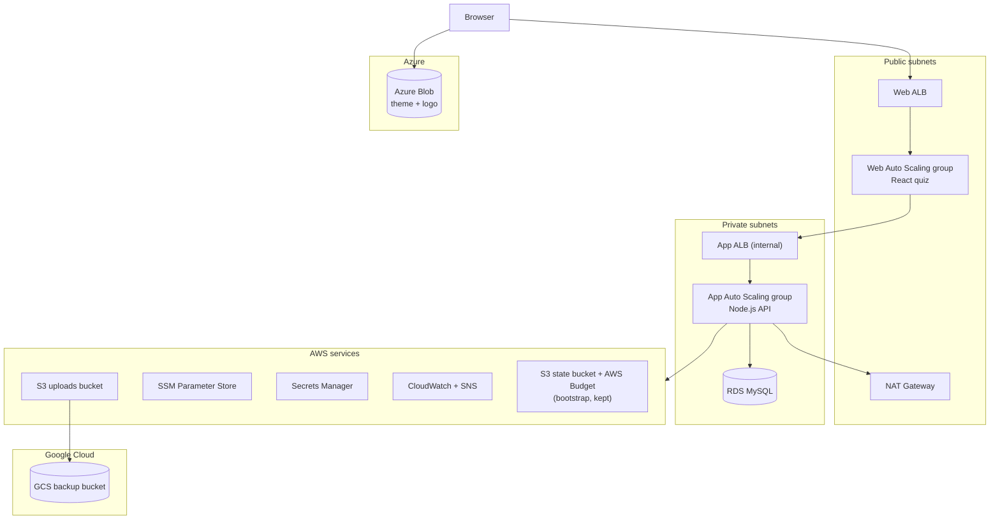

# Terraform Bootcamp: 3-Tier AWS Capstone with Multi-Cloud Backup & Assets

A 4-week, self-paced, text-based Terraform bootcamp: 12 modules and a capstone. You build **one** Terraform codebase, step by step, that runs a **Terraform Flashcard Quiz** you can open and play in your browser: a 3-tier application on AWS (`ap-southeast-1`), an off-site database backup on Google Cloud Storage, and static assets on Azure Blob Storage. Everything runs in personal sandbox accounts, sized to keep cloud spend minimal, and everything is created and destroyed by Terraform.

## Project Overview

### Application Architecture
- **Web tier**: Nginx serving the **React** Flashcard Quiz page, in an Auto Scaling group behind a public Application Load Balancer
- **App tier**: the quiz's **Node.js** API (cards, answers, score), in an Auto Scaling group behind an internal Application Load Balancer
- **Data tier**: Amazon RDS for MySQL 8.4 (single-AZ, private, encrypted) holding the cards and your answers, with its password in AWS Secrets Manager
- **Off-site backup**: a Google Cloud Storage bucket that moves old backups to Coldline
- **Static assets**: the quiz's theme and logo in an Azure Blob container, readable by the Web ALB's pages only (CORS)

### Expected Infrastructure

Everything below is created by Terraform, and everything except `bootstrap/` is destroyed at the end of every session.



The code map, the module wiring and more diagrams are in [Capstone requirements](./modules/capstone-requirements.md#architecture).

### Terraform Implementation
- Local state first, then remote state in S3 with native locking, from a `bootstrap/` root you never destroy
- **One module per resource type** (`alb`, `asg`, `rds-mysql`, `s3-bucket`, …), plus one grouped `network` module
- Security groups generated from one tier map; least-privilege IAM
- `dev` and `prod` workspaces from one codebase, with guards (prod is plan-only)
- CloudWatch alarms, SNS email alerts, a dashboard, and an AWS Budget with early-warning alerts
- A second root using the `google` and `azurerm` providers alongside `aws`

## Quick Start

1. **Prerequisites**
   - Terraform **1.11 or newer** (the course uses 1.16.3), AWS CLI v2, Git; later, the Google Cloud CLI (M11) and the Azure CLI (M12)
   - Sandbox accounts on AWS (from M1), GCP (M11) and Azure (M12)
   - Bash (macOS/Linux, or WSL 2 on Windows)
   ```bash
   terraform version
   aws sts get-caller-identity
   ```

2. **Start the course**
   - Open [M1 — Terraform Fundamentals & Remote State](./modules/01-terraform-fundamentals-remote-state.md). Every module has:
     - a short lecture;
     - a guided lab, with the expected output of each command;
     - a solved practice exercise;
     - **Next steps**: small capstone tasks with no solution;
     - a checkpoint.
   - The rhythm of every session: **plan → apply → check → `terraform destroy` → `terraform state list` prints nothing.**

3. **Finish with the capstone**
   - Read [Capstone requirements](./modules/capstone-requirements.md): the architecture, the 18 requirements, the validation steps and the grading, in one place.
   - Use the files in [`data/`](./data/): the quiz's boot scripts, seed data, the dump helper, the Azure assets and the invalid-input file.
   - Your demo is scripted in [Capstone requirements → Deliverables](./modules/capstone-requirements.md#deliverables): you'll play the quiz live and show every tier behind it.

## Project Structure

```
.
├── modules/                                   # Course content: one file per module, plus the capstone
│   ├── 01-terraform-fundamentals-remote-state.md  # M1  Lifecycle, local state → S3 remote state, validation
│   ├── 02-data-sources-iteration.md               # M2  Data sources, for_each, dynamic, the tier map
│   ├── 03-modules.md                              # M3  One module per resource: ec2-instance, s3-bucket
│   ├── 04-vpc-network.md                          # M4  The network module: VPC, subnets, NAT, routes
│   ├── 05-security-groups-iam.md                  # M5  security-groups and iam-instance-role modules
│   ├── 06-compute-load-balancing.md               # M6  alb and asg modules, each called twice
│   ├── 07-data-tier-secrets.md                    # M7  rds-mysql module, Secrets Manager
│   ├── 08-workspaces-environments.md              # M8  dev/prod workspaces, sizing map, guards
│   ├── 09-observability-finops.md                 # M9  sns-topic and cloudwatch-alarm modules, budget
│   ├── 10-deployment-full-aws-stack.md            # M10 Deploy, verify and destroy the full AWS stack
│   ├── 11-gcp-gcs-backup.md                       # M11 google provider, GCS backup bucket
│   ├── 12-azure-assets-cors.md                    # M12 azurerm provider, Blob assets, CORS
│   └── capstone-requirements.md                   # Capstone: architecture, requirements, validation, grading
│
└── data/                                      # Reference files you need to complete the capstone
    ├── templates/web.sh.tftpl                     # Web boot script: Nginx + the React Flashcard Quiz (M6)
    ├── templates/app.sh.tftpl                     # App boot script: Node.js LTS + the quiz API (M6)
    ├── seed.sql                                   # The quiz tables and 10 Terraform flashcards
    ├── db-seed-and-dump.sh                        # Runs on an App server: dump the quiz DB for the backup
    ├── assets/app.css, assets/logo.svg            # The quiz's theme and logo, for Azure Blob (M12)
    └── bad.tfvars                                 # Deliberately invalid input, for a failure proof
```

Everything you build goes into **your own** repository (`bootstrap/`, `modules/`, `capstone/aws/`, `capstone/multicloud/`), as the modules walk you through it.

## Implementation Requirements

The capstone has 18 requirements. Five of them must also be shown **failing correctly**. The full list is in [Capstone requirements](./modules/capstone-requirements.md#project-requirements).

### 1. Foundations (M1–M3) — Req. 1, 2, 4, 17
- Encrypted, locked remote state; validated inputs (failure proof); no hardcoded AMIs or AZs
- One module per resource type, reused where it repeats

### 2. Network & Security (M4–M5) — Req. 5, 6, 7
- VPC with 3 tiers × 2 AZs, one switchable NAT, a DB tier with no internet route
- Security groups from one map; the Web tier can't reach the database (failure proof); least-privilege IAM

### 3. Compute, Data & Operations (M6–M10) — Req. 3, 8–13
- Self-healing Auto Scaling groups behind two load balancers (failure proof)
- RDS MySQL 8.4 with a generated secret; `dev`/`prod` workspaces with guards (failure proof)
- Alarms, dashboard and budget; one full deployment rehearsed end to end

### 4. Multi-Cloud (M11–M12) — Req. 14, 15, 16
- A GCS backup bucket holding a real dump; Azure assets with exact-origin CORS (failure proof)

### 5. Hygiene (all modules) — Req. 18
- Everything created and destroyed by Terraform; tags and naming everywhere; sandbox-sized resources throughout

## Documentation

- [M1 — Terraform Fundamentals & Remote State](./modules/01-terraform-fundamentals-remote-state.md) - Where the course starts; each module links to the next
- [M10 — Deployment: The Full AWS Stack](./modules/10-deployment-full-aws-stack.md) - What a correct deployment looks like, stage by stage
- [Capstone Requirements](./modules/capstone-requirements.md) - Architecture, requirements, validation steps, the `EVIDENCE.md` checklist and grading
- [Reference Data](./data/) - Boot scripts, seed data, helper script, assets and test inputs

## Timeline

### Week 1: Foundations
- Days 1–2: M1 — Terraform fundamentals, local state, then remote state
- Day 3: M2 — Data sources and iteration
- Days 4–5: M3 — Modules; review the Week 1 checkpoints

### Week 2: Network, Security & Compute
- Day 1: M4 — VPC network
- Day 2: M5 — Security groups and IAM
- Days 3–4: M6 — Load balancers and Auto Scaling
- Day 5: Review; catch up on Next steps

### Week 3: Data, Environments & Operations
- Days 1–2: M7 — RDS and secrets
- Day 3: M8 — Workspaces
- Days 4–5: M9 — Monitoring and budget

### Week 4: Deployment, Multi-Cloud & Capstone
- Day 1: M10 — Deploy the full AWS stack
- Day 2: M11 — GCP backup bucket
- Day 3: M12 — Azure assets and CORS
- Day 4: Capstone integrated run, and `EVIDENCE.md`
- Day 5: Capstone demo, the live "break it" test, and your defense

## Evaluation Criteria

The capstone uses a **weighted** rubric: Technical Execution **45%**, Functional Demonstration **35%**, Presentation & Defense **20%**. On top of the score, a pass/fail **Documentation Gate** applies (`EVIDENCE.md` with your real output); failing it fails the capstone.

### Developing (50–69%)
- The stack applies, but some requirements are missing, or break during the demo
- Standards partly followed (CIDR sources between tiers, broad IAM, copied modules instead of reused ones)
- Failure proofs missing, or failing for the wrong reason

### Proficient (70–89%) — the target
- All 18 requirements met; every failure proof fails with the expected message or status
- Small, single-purpose modules; security groups from one map; least-privilege IAM; no secrets in code
- Clean teardown, sandbox-sized resources throughout, and choices explained with confidence

### Exemplary (90–100%)
- Everything in Proficient, plus work beyond the course (see Optional Features)
- Handles an unrehearsed "break it" request cleanly
- Compares design alternatives with their cost and failure modes

Hard caps, whatever the score:
- a committed secret caps Technical Execution at 1;
- resources left running, or created by hand, cap Functional Demonstration at 2.

## Optional Features

These don't add bonus points; they're the kind of work that earns **Exemplary** scores.

1. **Security**
   - Keep the DB password out of state entirely (`manage_master_user_password`)
2. **Testing & Safety**
   - `terraform test` with mocked providers for the validation, the workspace guards and the tier map
   - `moved` blocks for refactors, instead of destroy-and-recreate
3. **Design Exploration** (plan only, never applied)
   - Two NAT Gateways for `prod` via a conditional, with a written cost trade-off

## Support

Need help?
1. Re-read the module's lab; each command shows its expected output.
2. Read the whole `terraform plan` or error message. It usually names the resource and the argument.
3. When in doubt about cost, run `terraform state list` in each root you applied. Anything listed is still running, so `terraform destroy` it.
4. Official documentation:
   - [Terraform language](https://developer.hashicorp.com/terraform/language)
   - [AWS provider](https://registry.terraform.io/providers/hashicorp/aws/latest/docs)
   - [Google provider](https://registry.terraform.io/providers/hashicorp/google/latest/docs/guides/provider_reference)
   - [AzureRM provider](https://registry.terraform.io/providers/hashicorp/azurerm/latest/docs)
