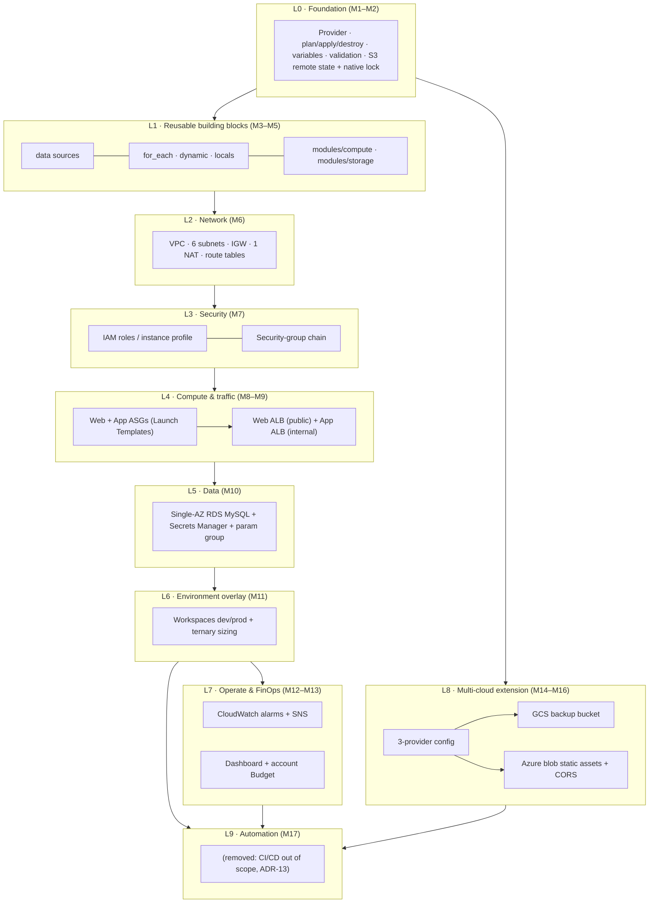
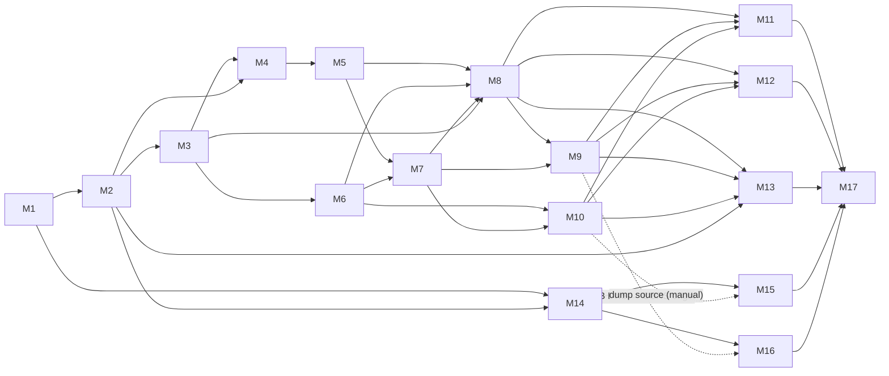
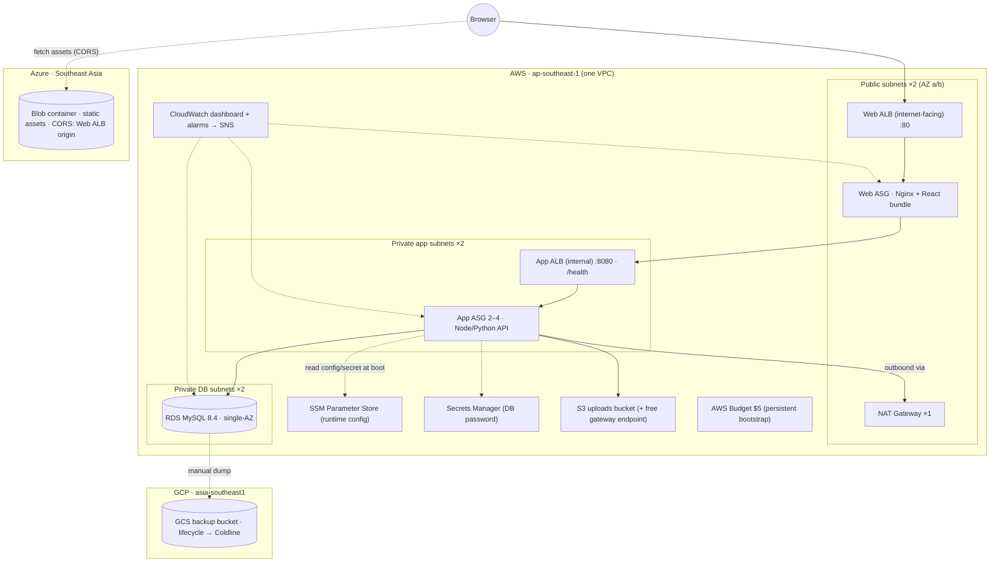

# Solution Design Document — Terraform Bootcamp 3-Tier Capstone

| | |
|---|---|
| **Source PRD** | `terraform-bootcamp-syllabus.md` (4-Week Terraform Bootcamp, 17 modules) |
| **Document type** | Solution design (architecture view of the curriculum) |
| **Status** | Draft for review — revised 2026-09-29 (see §12) |
| **Date** | 2026-09-28 (revised 2026-09-29) |
| **Companion files** | `ADR-0001` … `ADR-0014` (decisions referenced as **[ADR-n]**) |

---

## 1. Purpose and scope

The PRD describes the bootcamp as a sequence of 17 teaching modules. This document restates it as **one system**: what each module contributes, how modules stack in layers, which modules must exist before others, and how they converge into the final capstone. It also defines the **operating model that keeps total learner spend as close to zero as possible** inside the PRD's hard cap of **< $5 across AWS + GCP + Azure**.

**In scope:** the capstone system (AWS 3-tier + GCP backup bucket + Azure static-asset bucket), the repo/state layout, module dependency map, per-module cost ledger, and PRD gaps found during translation.

**Out of scope:** everything in the PRD's "Out of Scope" list (Organizations/SCPs, billing APIs, tag-filtered budgets, paid SaaS, OPA/Sentinel, cross-cloud global routing). Also out of scope: application code beyond a deliberately thin demo app (static React bundle + Nginx, a tiny API exposing `/health`).

### Design principles (derived from the PRD)

1. **One codebase, additive layers.** Each module adds a layer; no module rewrites the previous one except where flagged in §5.
2. **Pay only while learning.** Anything that bills by the hour exists only inside a short *apply window* that ends in `terraform destroy` [ADR-3].
3. **Cheapest configuration that still teaches the concept.** Single NAT, single-AZ RDS, smallest instance classes, zero optional paid features [ADR-4, ADR-5].
4. **Decouple tiers at runtime, not at plan time**, so lab order (M8 before M9 before M10) never forces a circular dependency [ADR-6].
5. **Persistent things are tiny and separate** (state bucket, budget); ephemeral things are everything else [ADR-2].

---

## 2. Architecture view A — Layer stack

Modules stack bottom-up. A layer may use anything below it and nothing above it.



| Layer | Modules | What it adds to the capstone | Terraform skills introduced |
|---|---|---|---|
| **L0 Foundation** | M1, M2 | Provider config, first instance, remote state, validated inputs | init/plan/apply/destroy, variables/outputs/tfvars, `validation`, S3 backend + `use_lockfile` |
| **L1 Building blocks** | M3, M4, M5 | AMI + AZ lookups, `for_each` node map, dynamic SG rules, `modules/compute`, `modules/storage` | `data`, dependencies, `for_each`, `dynamic`, `locals`, modules |
| **L2 Network** | M6 | Custom VPC, 6 subnets, IGW, one NAT, route tables | Resource graph at scale, `for_each` associations |
| **L3 Security** | M7 | IAM role + profile, Web→App→DB security-group chain | IAM, SG referencing |
| **L4 Compute & traffic** | M8, M9 | Web/App ASGs, Launch Templates, public ALB, internal ALB | Launch Templates, ASG, target tracking, ALB/TG/listener |
| **L5 Data** | M10 | RDS, generated password, Secrets Manager, parameter group | `random`, secrets in IaC, safe in-place change |
| **L6 Environments** | M11 | dev/prod sizing from one codebase | workspaces, conditionals |
| **L7 Operate** | M12, M13 | Alarms → SNS, dashboard, $5 budget with forecast alert | CloudWatch, SNS, `jsonencode`, Budgets |
| **L8 Multi-cloud** | M14, M15, M16 | GCS backup bucket, Azure static-asset bucket + CORS to the Web ALB | Provider aliases/multi-provider, GCS lifecycle, Azure blob CORS |
| ~~**L9 Automation**~~ | ~~M17~~ | *Removed: CI/CD is out of scope for the bootcamp [ADR-13]* | — |

---

## 3. Architecture view B — Module dependency map

**Hard dependency** = the module cannot be built without the outputs/code of the other. **Soft** = conceptual reuse or a value consumed later.



| Module | Hard dependencies | Soft / late-bound links | What downstream needs from it |
|---|---|---|---|
| **M1** | — | — | Provider block, region default |
| **M2** | M1 | — | Variables/outputs pattern, backend config (needs the bootstrap bucket, §6) |
| **M3** | M1, M2 | — | AMI data source, EIP pattern, AZ data source (challenge) |
| **M4** | M2, M3 | — | `for_each` node map, dynamic SG, tier→port map |
| **M5** | M4 | M2 | `modules/compute`, `modules/storage`; S3 bucket name as module input |
| **M6** | M2, M3 (AZ data) | — | `vpc_id`, `public/app/db_subnet_ids`, route tables |
| **M7** | M5, M6 | M4 (SG pattern) | `web_sg`, `app_sg`, `db_sg`, `instance_profile` |
| **M8** | M3, M5, M6, M7 | — | `app_asg`, `web_asg`, target-group attachments |
| **M9** | M6, M7, M8 | — | Web ALB DNS, App ALB DNS, target groups |
| **M10** | M6, M7 | M8 (consumer of DB endpoint) | DB endpoint, secret ARN, `db_identifier` |
| **M11** | M6–M10 | M2 | `terraform.workspace`-driven sizing map |
| **M12** | M8, M9, M10 | — | SNS topic ARN |
| **M13** | M8, M9, M10 (dashboard); M2 (bootstrap root for budget) | M12 (SNS reuse optional) | Dashboard, budget |
| **M14** | M1, M2 | — | Three configured providers, region variables |
| **M15** | M14 | M10 (what gets backed up) | GCS bucket name |
| **M16** | M14 | **M9** (ALB DNS as CORS origin) | Blob endpoint for the web tier |
| **M17** | M2, M14 (credentials/backends) | validates M1–M16 roots | MR pipeline; CI OIDC identity lives in `bootstrap/` [ADR-11] |

**Critical path:** M1 → M2 → M3 → M4 → M5 → M6 → M7 → M8 → M9 → M10 → M11 → M12/M13 → integrated run.
**Parallelisable branch:** M14 → M15 → M16 needs no AWS compute and can be done any time after M2 (only M16's *challenge* needs a live ALB).

---

## 4. Architecture view C — Convergence: the final capstone system



### Request and trust path

`Browser → Web ALB (0.0.0.0/0:80) → Web tier → App ALB (from Web-SG only) → App tier (from App-ALB-SG only) → RDS (from App-SG only)` [ADR-7].
Static media bypasses the AWS Web tier: the browser fetches it directly from Azure Blob, which is why CORS must allow the Web ALB origin (M16).

### Where each PRD capstone challenge lands in the final system

| Module | Challenge | Ends up as |
|---|---|---|
| M1 | 8 GB EBS volume + attachment | Root-volume/EBS sizing convention (small gp3) |
| M2 | `environment` validation | Gate on the workspace names used in M11 |
| M3 | Dynamic AZ selection | AZ list feeding M6 subnets |
| M4 | Tier→ports/sources map | Source of truth that M7 SG chain is generated from |
| M5 | `modules/storage` + bucket name → compute | Uploads bucket wired into App tier config |
| M6 | `for_each` route-table associations | All 6 subnet associations |
| M7 | DB-SG egress lockdown | Zero internet egress from DB tier |
| M8 | Web ASG + CPU 65% target tracking | Web tier + App scale-out policy |
| M9 | Internal ALB :8080, `/health` | Web→App hop |
| M10 | Slow-query parameter group | In-place attach, no replacement |
| M11 | Larger prod RDS via ternary | Prod sizing map (plan-only by default) [ADR-8] |
| M12 | RDS free-storage alarm < 2 GB | Third alarm in the alerting set |
| M13 | Forecasted-spend alert | Budget notification #3 |
| M14 | Region variables | `aws_region` / `gcp_region` / `azure_location` |
| M15 | 30-day → Coldline rule | GCS lifecycle rule |
| M16 | Blob-service CORS | `blob_properties.cors_rule` allowing Web ALB origin |
| M17 | Plan shown on the merge request (Terraform widget + plan artifact) | Pipeline over all three roots [ADR-11] |

---

## 5. PRD gaps and assumptions found while translating to architecture

These are places where modules, read in isolation, do not fit together. Each has a proposed resolution so the reference solutions stay consistent.

| # | Gap in the PRD | Resolution in this design |
|---|---|---|
| G1 | M7 grants **SSM Parameter Store** read, but M10 keeps the DB password in **Secrets Manager**. The App role would be unable to fetch it. | M10's guided step adds a policy statement on the M7 role for `secretsmanager:GetSecretValue` on that one secret ARN only. DB endpoint is published to SSM [ADR-6]. |
| G2 | M5 challenge creates an uploads bucket, but no module grants the App tier access to it. | M7/M8 role gets a policy scoped to that bucket's ARN. |
| G3 | M7 says `App-SG` accepts traffic strictly from `Web-SG`; M9's internal ALB now sits in between, so instances see the ALB's traffic, not Web-SG's. | Add `AppALB-SG`: accepts :8080 from `Web-SG`; `App-SG` accepts :8080 from `AppALB-SG` [ADR-7]. |
| G4 | Ordering cycle: Web Launch Template (M8) needs the internal ALB address (M9); App Launch Template (M8) needs DB endpoint (M10). | Runtime config via SSM Parameter Store; no plan-time reference from Launch Templates to later layers [ADR-6]. |
| G5 | M11 says both workspaces "share the same single NAT Gateway topology". Workspaces have separate state, hence separate VPCs. | Read as "each workspace has exactly one NAT". **Only one workspace is applied at a time.** |
| G6 | M3 binds an Elastic IP to the entrypoint server; by M9 the ALB is the entrypoint. | EIP is a prototype artifact, removed at M9 (saves a public-IPv4 charge). |
| G7 | M2 backend needs a bucket that Terraform itself would create (chicken-and-egg). | Separate `bootstrap/` root with local state [ADR-2]. |
| G8 | M16 CORS origin = Web ALB address, which changes on every re-create; ALB has no TLS/domain in this budget. | Origin is `http://<alb-dns>`, looked up via `data "aws_lb"`; blob endpoint is HTTPS so no mixed-content problem [ADR-9]. |
| G9 | M15's Coldline rule at 30 days cannot be observed live (Coldline has a 90-day minimum storage duration; sandbox lives hours). | Checkpoint verifies the rule via `terraform plan` + reading the bucket's lifecycle config, not by waiting. |
| G10 | M13 forecast-based budget alert may not evaluate in a brand-new sandbox account with no usage history. | Checkpoint verifies the notification exists in state/console; do not wait for it to fire. (Confirm behaviour against AWS Budgets docs.) |
| G11 | M10 says "MySQL RDS" without a version. RDS MySQL 8.0 left standard support on **2026-07-31**; instances still on 8.0 are auto-enrolled in paid Extended Support (per-vCPU-hour). | Pin engine to **MySQL 8.4** (parameter-group family `mysql8.4`) [ADR-5]. |
| G12 | T3 instances default to *unlimited* CPU credits, which can bill surplus credits. | Launch Templates set `cpu_credits = "standard"` [ADR-3]. |
| G13 | M4's tier map uses "allowed source IPs"; M7 requires SG-to-SG references. | The map's `sources` field accepts either CIDRs (Web tier) or tier names (App/DB), resolved to SG IDs. |
| G14 | M10's challenge wants the parameter group attached "without destructive replacement"; ADR-0005 claimed no reboot. AWS applies a newly associated group only after a reboot. | In-place update, then one `reboot-db-instance` [ADR-5 amendment]. |
| G15 | M17 specifies GitHub Actions and a PR comment; the course runs on GitLab. | GitLab merge-request pipeline, GitLab OIDC → read-only role in `bootstrap/`, native Terraform MR widget [ADR-11]. |
| G16 | M17's CI identity was set up by hand in the console, contradicting a Terraform-managed teardown. | CI identity moved to `bootstrap/ci.tf`; teardown script dropped [ADR-11, ADR-12]. |

---

## 6. Repository, state and environment layout

```text
tf-bootcamp/
├─ bootstrap/                  # PERSISTENT · local state · never destroyed
│   ├─ main.tf   state bucket (versioned, encrypted, prevent_destroy)     [course M1]
│   └─ budget.tf account-wide AWS Budget + email alerts                    [course M9]
├─ modules/                    # ONE MODULE PER RESOURCE TYPE [ADR-14]; network grouped
│   ├─ ec2-instance/  s3-bucket/                                           [course M3]
│   ├─ network/                                                            [course M4]
│   ├─ security-groups/  iam-instance-role/                                [course M5]
│   ├─ alb/  asg/                  (each called twice: web, app)           [course M6]
│   ├─ rds-mysql/                                                          [course M7]
│   └─ sns-topic/  cloudwatch-alarm/  (alarm called three times)           [course M9]
└─ capstone/
    ├─ aws/                    # EPHEMERAL · S3 backend · workspaces dev/prod; root owns SSM runtime_config + dashboard
    └─ multicloud/             # EPHEMERAL · aws + google + azurerm                 [course M11–M12]
```

> **Revised 2026-09-29 (first pass, now superseded by ADR-14 for the module layout and ADR-13 for CI).**
> - Launch Templates and ASGs stay in `compute/` (the M5 module rebuilt in M8), so the "call compute twice" pattern survives. `traffic/` holds only the ALBs.
> - The GCS and Azure resources are declared directly in `capstone/multicloud`, rather than in `backup_gcs/`/`assets_azure/` modules; there is one call site each, so a module adds nothing.
> - `scripts/teardown-check.sh` is removed [ADR-12].
> - `.github/workflows/terraform.yml` is replaced by `.gitlab-ci.yml` [ADR-11].

| Concern | Decision | ADR |
|---|---|---|
| State backend | S3, `use_lockfile = true`, no DynamoDB; `required_version >= 1.11.0` (native locking is experimental in 1.10, GA in 1.11) | ADR-2 |
| State keys | `capstone/aws/terraform.tfstate` (workspaces auto-prefix `env:/<ws>/`), `capstone/multicloud/terraform.tfstate` | ADR-2 |
| Environments | `dev` (default working env), `prod` (sized up, **plan-only unless a checkpoint says apply**) | ADR-8 |
| Naming | `${project}-${terraform.workspace}-<role>` so a leaked resource is attributable | ADR-3 |
| Tagging | provider `default_tags`: `Project=tf-bootcamp`, `Env`, `Teardown=every-session`, `ManagedBy=terraform` (for attribution; not read by any script or budget — tag-filtered budgets are out of scope) | ADR-3, ADR-12 |
| Lifecycle | Every resource is a Terraform resource; nothing is created by hand. Teardown = `terraform destroy` per root/workspace, proven by an empty `terraform state list` | ADR-12 |
| CI | Out of scope for the bootcamp | ADR-13 |
| Module design | One child module per resource type; `network` grouped; the root owns SSM runtime config, IAM statements and the dashboard | ADR-14 |

---

## 7. Cost model — "as close to free as possible"

### 7.1 Cost drivers and how each is neutralised

| Driver | Why it costs | Lever used | ADR |
|---|---|---|---|
| **NAT Gateway** | Hourly + per-GB, plus its EIP's IPv4 charge | One only; created only in windows that need outbound; `nat_gateway_enabled` flag; free S3 gateway endpoint keeps S3 traffic off it | 4 |
| **Two ALBs** | Hourly each; internet-facing one also pays per-AZ public IPv4 | Exist only from M9 onward, only inside apply windows | 3 |
| **RDS** | Instance-hours + storage | Single-AZ, smallest burstable class, 20 GB minimum storage, no backups/Performance Insights/enhanced monitoring/log export, MySQL 8.4 (avoids Extended Support) | 5 |
| **EC2** | Instance-hours, public IPv4, T3 surplus credits | `t3.micro`, `cpu_credits="standard"`, no detailed monitoring, dev ASG min=1 | 3 |
| **Public IPv4** | $0.005/h per address, incl. EIPs | Web instances only (public subnet), EIP retired after M3–M8 | 3 |
| **Secrets Manager** | Per secret per month | One secret; `recovery_window_in_days = 0` so destroy/re-create works and nothing lingers | 5, 6 |
| **CloudWatch** | Dashboards, alarms, log ingestion | ≤3 dashboards and ≤10 alarms (intended to stay in free allowances), no custom metrics, no log exports | 3 |
| **S3** | Storage + requests | Noncurrent-version expiry on state bucket; empty uploads bucket with `force_destroy` | 2 |
| **GCS / Azure** | Storage + operations + egress | Zero/near-zero data; `force_destroy`; LRS/Hot/Standard; no replication | 9 |
| **CI** | Runner minutes | Only `fmt`/`validate` need no credentials; `plan` only; **never `apply` in CI** | 10 |
| **The forgotten stack** | Full stack ≈ $0.23/h ≈ **$5.50/day** — exceeds the whole budget in about a day | `terraform destroy` at end of every session, proven by an empty `terraform state list` [ADR-12]; budget alerts at $2 and $4 | 3 |

### 7.2 Planning rates (rounded, Singapore, on-demand)

> These are **planning figures for sizing the ledger, not quotes.** NAT hourly is taken from AWS's published Asia-Pacific pricing (Sydney $0.059/h, Tokyo $0.062/h), and $0.005/h per public IPv4 is AWS's published rate; verify Singapore rates in the AWS Pricing Calculator before publishing course material.

| Item | Rate used |
|---|---|
| `t3.micro` EC2 | $0.014 /h |
| Public IPv4 (any) | $0.005 /h |
| NAT Gateway + its EIP | $0.064 /h |
| Internet-facing ALB (incl. 2 AZ IPv4) | $0.040 /h |
| Internal ALB | $0.030 /h |
| RDS MySQL micro + 20 GB | $0.030 /h |
| Full stack (2 web + 2 app) | ≈ $0.23 /h |
| Dev-size stack (1 web + 1 app) | ≈ $0.20 /h |

### 7.3 Per-module apply-window ledger

Each row is one *apply → checkpoint → destroy* window. "Left off" is what the lab deliberately does not create.

| Module | Window | What is live | Left off | Est. cost |
|---|---|---|---|---|
| M1 | 0.5 h | 1 × t3.micro (default VPC) | — | $0.01 |
| M2 | 0.5 h | + S3 backend use | — | $0.01 |
| M3 | 0.5 h | 1 × t3.micro + EIP | — | $0.01 |
| M4 | 0.5 h | 2 × t3.micro + SG | — | $0.02 |
| M5 | 0.5 h | 2 × t3.micro + uploads bucket | — | $0.02 |
| M6 | 0.5 h | VPC + NAT | instances | $0.03 |
| M7 | plan + brief apply | IAM + SGs (all free) | **NAT, instances** | $0.00 |
| M8 | 1 h | NAT + 2 app + 2 web | ALBs, RDS | $0.13 |
| M9 | 1 h | + 2 ALBs | RDS | $0.20 |
| M10 | 1.25 h | + RDS (creation takes several minutes) | — | $0.29 |
| M11 | 1 h | dev-size full stack | **prod apply** | $0.20 |
| M12 | 0.75 h | dev-size full stack + alarms | — | $0.15 |
| M13 | 0.75 h | dev-size full stack + dashboard/budget | — | $0.15 |
| M14 | init only | nothing | — | $0.00 |
| M15 | 0.25 h | GCS bucket | — | < $0.01 |
| M16 | 0.25 h | Azure storage + container | — | < $0.01 |
| M17 | CI runs | nothing billable | apply | $0.00 |
| **Integrated final run** | 1.5 h | full AWS stack + GCS + Azure, then destroy all | — | $0.36 |
| | | | **Planned total** | **≈ $1.60** |
| | | | **With 2× rework buffer** | **≈ $3.20** |
| | | | **Headroom under $5** | **≈ $1.80** |

Persistent baseline (state bucket, budget): pennies per month.

### 7.4 Budget guardrails (account-wide, so compatible with the PRD's exclusions)

- Budget: $5/month, actual-spend alerts at 40% and 80%, forecast alert at 100% (M13 challenge). Email subscribers only.
- ~~`teardown-check.sh`~~ *(removed, ADR-12)*: the end-of-session check is `terraform state list` printing nothing in every destroyed root. It is trustworthy because no resource is ever created outside Terraform.
- Optional free extra: `terraform test` with mocked providers (Terraform ≥ 1.11) to verify M2 validation rules, M4 dynamic rules and M11 ternaries at **$0**, before any apply.

---

## 8. Learner session protocol (self-paced, text-based)

1. `git pull`, `terraform workspace show` → confirm `dev`.
2. Read module text → run the guided walkthrough → `terraform plan` first, always.
3. Apply only the layers the checkpoint needs (see "Left off" in §7.3).
4. Compare against the module's *expected results* checkpoint and reference solution.
5. `terraform destroy` (multicloud first, then aws) → `terraform state list` → must be empty [ADR-12].
6. Never destroy `bootstrap/` (state bucket, budget, CI identity) between sessions.

---

## 9. Risks

| Risk | Impact | Mitigation |
|---|---|---|
| Stack left running overnight | ≈ $5.50/day, whole budget | Protocol step 5 (`destroy` + empty `state list`), budget alerts |
| Budget alert only fires after spend | Late warning | 40% early threshold; treat as a stop signal |
| Rework in M8–M10 (longest windows) | Doubles those rows | 2× buffer already in §7.3; use `plan` and `terraform test` before applying |
| Price drift / regional rate errors | Ledger off | Re-verify §7.2 each cohort |
| Forgotten GCP/Azure resources | Small, but shares the $5 | Same root as their provider config: one `terraform destroy` in `capstone/multicloud` removes them |
| Resource created by hand in a console | Invisible to `destroy` and `state list`; keeps billing | Golden rule in M1 and every lab: nothing outside Terraform (import or delete); asked in the capstone defense [ADR-12] |
| Sandbox permissions differ (Azure RG pre-provisioned, quota) | Lab fails | M14 checkpoint validates credentials before anything is applied |
| Non-idempotent teardown (Secrets Manager name reuse, non-empty buckets) | Blocked re-apply | `recovery_window_in_days = 0`, `force_destroy = true` |

---

## 10. ADR index

| ADR | Title |
|---|---|
| ADR-0001 | Layered single-capstone architecture and module-to-layer mapping |
| ADR-0002 | State topology: persistent bootstrap root + ephemeral capstone roots, S3 native locking |
| ADR-0003 | Cost guardrails: ephemeral apply windows and teardown discipline *(decision 7 superseded by ADR-0012)* |
| ADR-0004 | Egress: one NAT Gateway, feature-flagged |
| ADR-0005 | Data tier: single-AZ RDS, MySQL 8.4, minimal paid features *(amended: parameter-group reboot)* |
| ADR-0006 | Runtime configuration through SSM Parameter Store; secrets access reconciliation |
| ADR-0007 | Security-group chain including the internal ALB hop |
| ADR-0008 | Environments via workspaces; prod is plan-only by default |
| ADR-0009 | Multi-cloud scope: storage-only, separate root, ALB origin by data source |
| ADR-0010 | CI/CD scope: fmt, validate, plan, PR comment — never apply *(superseded in part by ADR-0011)* |
| ADR-0011 | CI platform: GitLab CI merge-request pipeline with OIDC to AWS *(superseded by ADR-0013)* |
| ADR-0012 | Terraform-only lifecycle: no teardown script; `terraform destroy` is the teardown |
| ADR-0013 | CI/CD out of scope for the bootcamp *(supersedes ADR-0010, ADR-0011)* |
| ADR-0014 | One Terraform module per resource type (network grouped) |

---

## 11. Open items for the PRD owner

1. ~~Confirm G1–G13 resolutions~~ — folded into the module texts and the reference solution (2026-09-29); G14–G16 added and resolved.
2. Confirm the `t3.micro` / Ubuntu 22.04 choices still hold for the cohort date (22.04 remains in standard support in 2026, but confirm).
3. ~~Decide on the NAT-instance stretch~~ — offered as an optional, plan-only design exploration (capstone "Optional Features").
4. Re-verify the §7.2 planning rates against current AWS pricing pages. (CloudWatch free allowances were verified 2026-09-28: 3 dashboards, 10 alarm metrics.)
5. Update the PRD to the delivered course: 12 modules (mapping in §12), no CI/CD module (ADR-0013), single-AZ RDS (ADR-0005), and per-resource modules (ADR-0014).
6. Run one live dry run of the integrated capstone, including the GitLab `plan` job, and replace the *expected* outputs in the instructor guide with captured ones.

---

## 12. Revision history

| Date | Change | Decision record |
|---|---|---|
| 2026-09-28 | Initial solution design, ADR-0001 … ADR-0010 | — |
| 2026-09-29 | CI moved from GitHub Actions to a GitLab CI merge-request pipeline with keyless OIDC; CI identity in `bootstrap/ci.tf`; plan shown via the Terraform MR widget | ADR-0011 (supersedes ADR-0010 in part), ADR-0002 amendment |
| 2026-09-29 | Teardown script removed; teardown = `terraform destroy` + empty `terraform state list`; nothing created by hand | ADR-0012 (supersedes ADR-0003 §7) |
| 2026-09-29 | Parameter-group association needs one reboot (correction) | ADR-0005 amendment, G14 |
| 2026-09-29 | Providers resolved: aws 6.66.0, random 3.9.1, google 8.4.0, azurerm 5.7.0; azurerm 5.x argument changes | ADR-0009 amendment |
| 2026-09-29 | M9 Web-SG hardening adopted; SG rules as standalone resources from one map | ADR-0007 amendment |
| 2026-09-29 | Module layout: LT/ASG in `compute/`; GCS/Azure inline in `capstone/multicloud`; tag `Module` replaced by `ManagedBy` | §6 (this document) |
| 2026-09-29 | CI/CD removed from the course; `bootstrap/ci.tf` removed; capstone requirement 17 becomes "Module structure" | ADR-0013 |
| 2026-09-29 | Modules restructured to one per resource type (`alb`, `asg`, `rds-mysql`, …), `network` grouped; full dev stack = 75 resources | ADR-0014 |
| 2026-09-29 | Course restructured from the PRD's 17 modules to 12, with a new integrated Deployment module; local state taught before migrating to S3 | this section |
| 2026-09-29 | Demo app replaced by a course-provided **Flashcard Quiz**: React page on the Web tier, Node.js API on the App tier, `flashcards` + `answers` tables in RDS, Azure theme/logo fetched with CORS; delivered as user data in `data/templates/` | this section |

### PRD module → course module mapping (2026-09-29)

| PRD module | Course module |
|---|---|
| M1 Hello Terraform & Local State, M2 Parameterization & Remote State | **M1** Terraform Fundamentals & Remote State (local state first, then `init -migrate-state`) |
| M3 Data Sources, M4 Iteration & Dynamic Rules | **M2** Data Sources & Iteration |
| M5 Modularizing | **M3** Modules (`ec2-instance`, `s3-bucket`) |
| M6 VPC Topology | **M4** VPC Network Topology |
| M7 Security Groups & IAM | **M5** Security Groups & IAM |
| M8 Auto Scaling, M9 ALBs | **M6** Compute & Load Balancing |
| M10 RDS & Secrets | **M7** Data Tier & Secrets |
| M11 Workspaces | **M8** Environments with Workspaces |
| M12 Alarms & SNS, M13 Dashboards & Budgets | **M9** Observability & FinOps |
| *(new)* | **M10** Deployment: the Full AWS Stack |
| M14 Multi-Cloud Providers, M15 GCS Backup | **M11** Multi-Cloud with GCP |
| M16 Azure Static Assets | **M12** Multi-Cloud with Azure |
| M17 CI/CD Pipeline | *removed* (ADR-0013) |

The PRD numbering (M1–M17) used elsewhere in this document and in ADR-0001 … ADR-0012 refers to the PRD, not to the delivered course.
