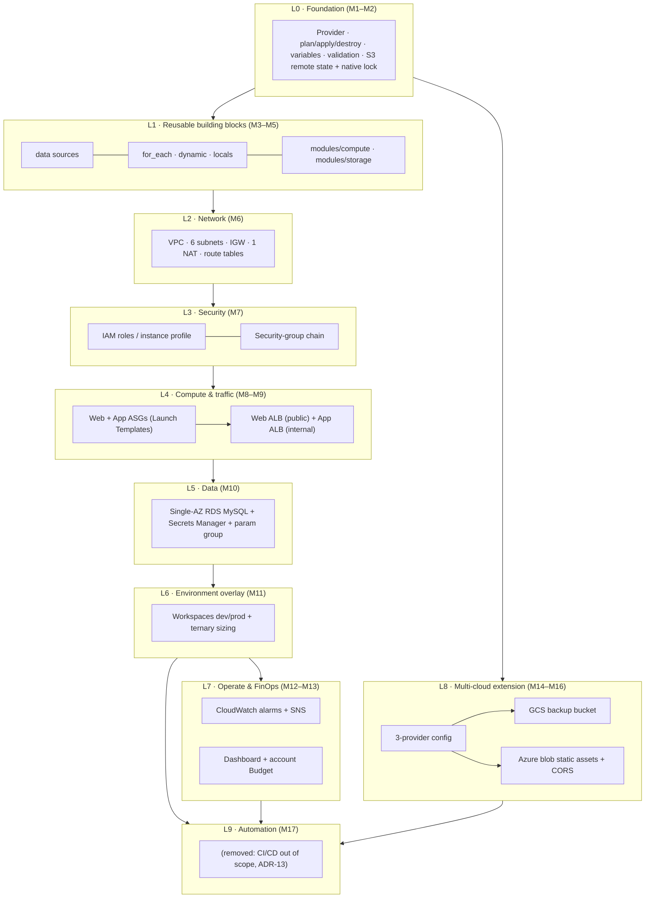
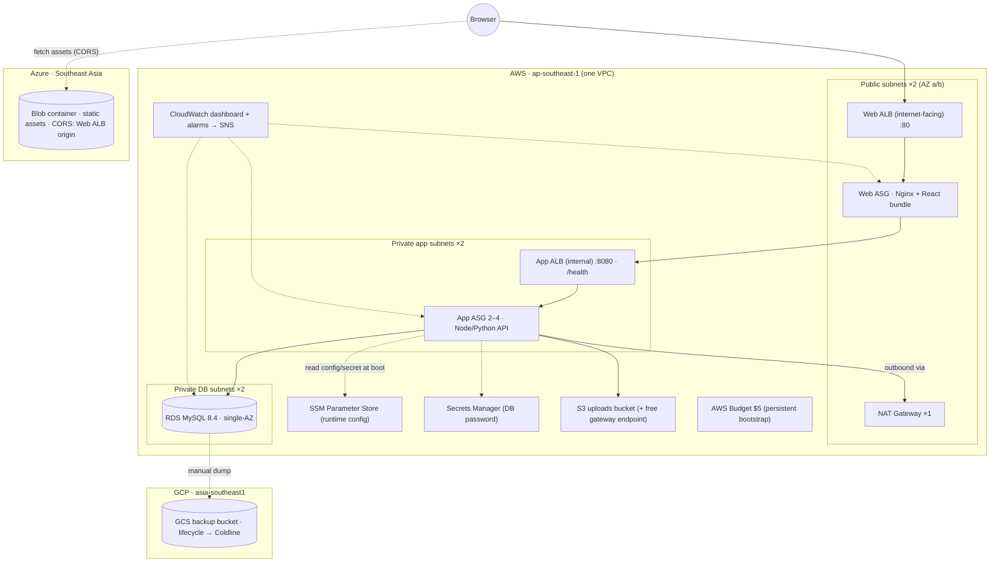

# Architecture Summary

_Auto-generated by ingest_architecture_doc_


## Adr-0001: Layered Single-Capstone Architecture And Module-To-Layer Mapping

# ADR-0001: Layered single-capstone architecture and module-to-layer mapping

- **Status:** Accepted
- **Date:** 2026-09-28
- **Modules affected:** all (M1–M17)
- **Related:** soldoc §2–§4


## Decision

## Decision

1. Child modules, one per resource type:

   | Module | Wraps | Called in the capstone |
   |---|---|---|
   | `ec2-instance` | one EC2 instance | M3 prototype only |
   | `s3-bucket` | bucket + public-access block | `uploads_bucket` |
   | `network` | VPC, subnets, IGW, NAT, route tables, associations, S3 endpoint (grouped) | once |
   | `security-groups` | every tier's security group + chain rules, from one map | once |
   | `iam-instance-role` | role, inline policy (statements passed in), SSM core, instance profile | once |
   | `alb` | load balancer + target group + listener | twice: `web_alb`, `app_alb` |
   | `asg` | Launch Template + Auto Scaling group (+ optional CPU policy) | twice: `web_asg`, `app_asg` |
   | `rds-mysql` | password, secret, subnet group, parameter group, DB instance | once |
   | `sns-topic` | topic + optional email subscription | once |
   | `cloudwatch-alarm` | one metric alarm | three times |

2. **The root owns the wiring and the cross-cutting resources:**
   - the SSM `runtime_config` map, which becomes `aws_ssm_parameter.runtime` (ADR-0006);
   - the IAM policy statements passed to `iam-instance-role`, including the DB secret (ADR-0006 §5);
   - the CloudWatch dashboard.

   Modules never publish SSM parameters or attach policies to other modules' roles.
3. Module names describe **what** is created, not **which tier** it serves. The tier comes from the call's name and inputs.
4. The resource count for the full `dev` stack is **75** (mocked plan, 2026-09-29). It was 76 with the layered layout, because the separate secret-read policy is now one statement in the role's inline policy.


## Options Considered

## Options considered

| Option | Verdict |
|---|---|
| Layered modules (`compute`, `database`, …) | Rejected — course owner decision; hides resource types and encourages "god modules". |
| Public registry modules (e.g. `terraform-aws-modules/*`) | Rejected for teaching — too many inputs for beginners, and hides what is being learned. Mentioned as a next step in real projects. |
| Split `network` into `vpc`, `subnet`, `nat-gateway`, … | Rejected — these resources change together; splitting adds wiring without benefit. |


## Consequences

## Consequences

- More, smaller modules. Each is easy to read and test, and `alb`/`asg`/`cloudwatch-alarm` show reuse directly.
- The root `main.tf` is longer, but it reads as the architecture diagram.
- Capstone requirement 17 ("Module structure") and the rubric's "Structure & reuse" criterion grade this layout.


## Adr-0002: State Topology — Persistent Bootstrap Root + Ephemeral Capstone Roots, S3 Native Locking

# ADR-0002: State topology — persistent bootstrap root + ephemeral capstone roots, S3 native locking

- **Status:** Accepted; amended 2026-09-29 (bootstrap also holds the CI identity)
- **Date:** 2026-09-28
- **Modules affected:** M2 (backend), M11 (workspaces), M13 (budget), M14–M16, M17
- **Related:** ADR-0003, ADR-0009, ADR-0011, ADR-0012


## Context

## Context

The first course draft grouped Terraform modules by architectural layer (`compute`, `traffic`, `database`, `observability`). The course owner wants trainees to learn the structure real teams use: **one module per resource type**, reused wherever the resource repeats. The network is the accepted exception: a VPC, its subnets, gateways and route tables are always built and changed together, so they stay one module.


## Amendment — 2026-09-29: Ci Identity In `Bootstrap/`

## Amendment — 2026-09-29: CI identity in `bootstrap/`

`bootstrap/` also owns the GitLab CI identity (`bootstrap/ci.tf`, ADR-0011): an IAM OIDC provider for `https://gitlab.com`, and a read-only `plan` role, created only when `var.gitlab_project_path` is set. Like the state bucket and the budget, it must survive between sessions, so it belongs in the persistent root. Nothing in the course is created outside a Terraform root (ADR-0012).


## Amendment — 2026-09-29 (Later): Ci Identity Removed

## Amendment — 2026-09-29 (later): CI identity removed

With CI/CD out of scope ([ADR-0013](ADR-0013-cicd-out-of-scope.md)), `bootstrap/ci.tf` is removed. `bootstrap/` holds only the state bucket (`main.tf`) and the budget (`budget.tf`).


## Adr-0003: Cost Guardrails — Ephemeral Apply Windows And Teardown Discipline

# ADR-0003: Cost guardrails — ephemeral apply windows and teardown discipline

- **Status:** Accepted; decision 7 superseded by [ADR-0012](ADR-0012-terraform-only-lifecycle.md) (2026-09-29)
- **Date:** 2026-09-28
- **Modules affected:** all; especially M6–M13
- **Related:** soldoc §7, ADR-0004, ADR-0005


## Adr-0004: Egress — One Nat Gateway, Feature-Flagged

# ADR-0004: Egress — one NAT Gateway, feature-flagged

- **Status:** Accepted (default). NAT-instance variant recorded as an optional stretch, not adopted.
- **Date:** 2026-09-28
- **Modules affected:** M6 (introduces), M7, M8, M11
- **Related:** ADR-0003, ADR-0007


## Adr-0005: Data Tier — Single-Az Rds, Mysql 8.4, Minimal Paid Features

# ADR-0005: Data tier — single-AZ RDS, MySQL 8.4, minimal paid features

- **Status:** Accepted; amended 2026-09-29 (decision 7 corrected)
- **Date:** 2026-09-28
- **Modules affected:** M10, M11, M12, M13
- **Related:** ADR-0003, ADR-0006, ADR-0008


## Amendment — 2026-09-29: Parameter-Group Association Needs One Reboot

## Amendment — 2026-09-29: parameter-group association needs one reboot

Decision 7 said attaching the parameter group needs "no reboot for dynamic parameters". AWS documents otherwise: *"When you associate a new DB parameter group with a DB instance, the modified static and dynamic parameters are applied only after the DB instance is rebooted. However, if you modify dynamic parameters in the DB parameter group after you associate it with the DB instance, these changes are applied immediately without a reboot."* ([Associating a DB parameter group](https://docs.aws.amazon.com/AmazonRDS/latest/UserGuide/USER_WorkingWithParamGroups.Associating.html)).

Corrected decision 7:
- Attaching the group is still an **in-place update**, never a replacement: `name_prefix` plus `create_before_destroy`.
- The instance then shows `ParameterApplyStatus = pending-reboot`. One `aws rds reboot-db-instance` (a brief outage; no data loss, same endpoint) activates the group.
- Later changes to *dynamic* parameters in the already-associated group apply immediately.
- Best practice, taught in M10: create the instance with its own parameter group from day one.


## Adr-0006: Runtime Configuration Through Ssm Parameter Store; Secrets Access Reconciliation

# ADR-0006: Runtime configuration through SSM Parameter Store; secrets access reconciliation

- **Status:** Accepted
- **Date:** 2026-09-28
- **Modules affected:** M5, M7, M8, M9, M10
- **Related:** ADR-0001, ADR-0005, ADR-0007, soldoc gaps G1, G2, G4


## Adr-0007: Security-Group Chain Including The Internal Alb Hop

# ADR-0007: Security-group chain including the internal ALB hop

- **Status:** Accepted; amended 2026-09-29 (the M9 hardening step is adopted)
- **Date:** 2026-09-28
- **Modules affected:** M4, M7, M9, M10
- **Related:** ADR-0004, ADR-0006, soldoc gaps G3, G13


## Amendment — 2026-09-29: M9 Hardening Adopted

## Amendment — 2026-09-29: M9 hardening adopted

The step marked **Proposed** (Web-SG accepts 80 only from `WebALB-SG`, not from `0.0.0.0/0`) is **adopted** in the course, as the M9 planned refactor. The only `0.0.0.0/0` ingress left in the final stack is on `WebALB-SG`.

Implementation notes from the validated reference solution:
- The chain is expressed as one `tier_rules` map (`web_alb`, `web`, `app_alb`, `app`, `db`) and expanded with `setproduct`.
- Rules are **standalone** `aws_vpc_security_group_ingress_rule` / `aws_vpc_security_group_egress_rule` resources. Inline rules between groups that reference each other would form a dependency cycle.
- Each group-to-group ingress gets a mirrored egress rule on the source group.
- `DB-SG` has **no** egress rules at all. Replies to the App tier flow because security groups are stateful.


## Adr-0008: Environments Via Workspaces; Prod Is Plan-Only By Default

# ADR-0008: Environments via workspaces; prod is plan-only by default

- **Status:** Accepted
- **Date:** 2026-09-28
- **Modules affected:** M2, M11, and every module that sizes resources
- **Related:** ADR-0002, ADR-0003, ADR-0004, ADR-0005, soldoc gap G5


## Adr-0009: Multi-Cloud Scope — Storage-Only, Separate Root, Alb Origin By Data Source

# ADR-0009: Multi-cloud scope — storage-only, separate root, ALB origin by data source

- **Status:** Accepted; amended 2026-09-29 (azurerm 5.x)
- **Date:** 2026-09-28
- **Modules affected:** M14, M15, M16, M17
- **Related:** ADR-0002, ADR-0003, ADR-0010, ADR-0011, ADR-0012, soldoc gaps G8, G9


## Amendment — 2026-09-29: Azurerm 5.X

## Amendment — 2026-09-29: azurerm 5.x

Provider versions were resolved for the course on 2026-09-28: `azurerm` **5.7.0** (not 4.x), `google` 8.4.0, `aws` 6.66.0 and `random` 3.9.1. Decision 5 changes as follows:
- `azurerm_storage_container` takes `storage_account_id`, and `azurerm_storage_blob` takes `storage_container_id`. The 4.x `storage_account_name`/`storage_container_name` arguments fail `terraform validate` on 5.x.
- The provider block still needs `subscription_id` (variable or `ARM_SUBSCRIPTION_ID`). Automatic registration is disabled with `resource_provider_registrations = "none"`.
- Mock assets are uploaded with `azurerm_storage_blob`, so `terraform destroy` removes them (ADR-0012).


## Adr-0010: Ci/Cd Scope — Fmt, Validate, Plan, Pr Comment; Never Apply

# ADR-0010: CI/CD scope — fmt, validate, plan, PR comment; never apply

- **Status:** Superseded by [ADR-0013](ADR-0013-cicd-out-of-scope.md) (2026-09-29): CI/CD is out of scope for the bootcamp. (Earlier partly superseded by ADR-0011.)
- **Date:** 2026-09-28
- **Modules affected:** M17 (and it validates M1–M16 code)
- **Related:** ADR-0002, ADR-0003, ADR-0009


## Adr-0011: Ci Platform — Gitlab Ci Merge-Request Pipeline With Oidc To Aws

# ADR-0011: CI platform — GitLab CI merge-request pipeline with OIDC to AWS

- **Status:** Superseded by [ADR-0013](ADR-0013-cicd-out-of-scope.md) (2026-09-29): CI/CD removed from the course; kept as research for a follow-on course.
- **Date:** 2026-09-29
- **Supersedes:** ADR-0010 decisions 1, 4, 6 and 7 (the GitHub Actions specifics). ADR-0010 decisions 2, 3 and 5 (the scope: fmt, validate, plan, never apply) still hold, and are restated here for the new platform.
- **Modules affected:** M17, the capstone (requirement 17), `bootstrap/`
- **Related:** ADR-0002, ADR-0003, ADR-0010, ADR-0012


## Adr-0012: Terraform-Only Lifecycle — No Teardown Script; `Terraform Destroy` Is The Teardown

# ADR-0012: Terraform-only lifecycle — no teardown script; `terraform destroy` is the teardown

- **Status:** Accepted
- **Date:** 2026-09-29
- **Supersedes:** ADR-0003 decision 7 (`scripts/teardown-check.sh`), and the teardown-script parts of soldoc §6, §7.4 and §8
- **Modules affected:** all (M1–M17), the capstone (requirement 18)
- **Related:** ADR-0002, ADR-0003, ADR-0011


## Adr-0013: Ci/Cd Is Out Of Scope For The Terraform Bootcamp

# ADR-0013: CI/CD is out of scope for the Terraform bootcamp

- **Status:** Accepted
- **Date:** 2026-09-29
- **Supersedes:** ADR-0010 and ADR-0011 in full; the PRD's Module 17 (Multi-Cloud CI/CD Pipeline)
- **Modules affected:** the former M17; `bootstrap/` (the CI identity); the capstone (the old requirement 17)
- **Related:** ADR-0002, ADR-0012, ADR-0014


## Adr-0014: One Terraform Module Per Resource Type (Network Grouped)

# ADR-0014: One Terraform module per resource type (network grouped)

- **Status:** Accepted
- **Date:** 2026-09-29
- **Supersedes:** the module layout in soldoc §6 (`compute/`, `traffic/`, `database/`, `observability/`, `storage/`, `security/`)
- **Modules affected:** M3, M5, M6, M7, M9, M10; the capstone (requirement 17)
- **Related:** ADR-0001, ADR-0006, ADR-0007, ADR-0013


## Community 1 - "Adr-0002: State Topology — Persistent Bootstrap Root + Ephemeral Capstone Roots, S3 Native Locking"

### Community 1 - "ADR-0002: State topology — persistent bootstrap root + ephemeral capstone roots, S3 native locking"
Cohesion: 0.25
Nodes (8): ADR-0002: State topology — persistent bootstrap root + ephemeral capstone roots, S3 native locking, Amendment — 2026-09-29: CI identity in `bootstrap/`, Amendment — 2026-09-29 (later): CI identity removed, Consequences, Context, Decision, Options considered, Verify before publishing


## Community 2 - "Adr-0004: Egress — One Nat Gateway, Feature-Flagged"

### Community 2 - "ADR-0004: Egress — one NAT Gateway, feature-flagged"
Cohesion: 0.29
Nodes (6): ADR-0004: Egress — one NAT Gateway, feature-flagged, Consequences, Context, Decision, Options considered, Verify before publishing


## Community 3 - "Adr-0001: Layered Single-Capstone Architecture And Module-To-Layer Mapping"

### Community 3 - "ADR-0001: Layered single-capstone architecture and module-to-layer mapping"
Cohesion: 0.33
Nodes (5): ADR-0001: Layered single-capstone architecture and module-to-layer mapping, Consequences, Context, Decision, Options considered


## Community 4 - "Adr-0003: Cost Guardrails — Ephemeral Apply Windows And Teardown Discipline"

### Community 4 - "ADR-0003: Cost guardrails — ephemeral apply windows and teardown discipline"
Cohesion: 0.17
Nodes (10): ADR-0003: Cost guardrails — ephemeral apply windows and teardown discipline, Consequences, Context, Decision, Options considered, ADR-0012: Terraform-only lifecycle — no teardown script; `terraform destroy` is the teardown, Consequences, Context (+2 more)


## Community 5 - "Adr-0005: Data Tier — Single-Az Rds, Mysql 8.4, Minimal Paid Features"

### Community 5 - "ADR-0005: Data tier — single-AZ RDS, MySQL 8.4, minimal paid features"
Cohesion: 0.29
Nodes (6): ADR-0005: Data tier — single-AZ RDS, MySQL 8.4, minimal paid features, Amendment — 2026-09-29: parameter-group association needs one reboot, Consequences, Context, Decision, Options considered


## Community 6 - "Adr-0006: Runtime Configuration Through Ssm Parameter Store; Secrets Access Reconciliation"

### Community 6 - "ADR-0006: Runtime configuration through SSM Parameter Store; secrets access reconciliation"
Cohesion: 0.33
Nodes (5): ADR-0006: Runtime configuration through SSM Parameter Store; secrets access reconciliation, Consequences, Context, Decision, Options considered


## Community 7 - "Adr-0007: Security-Group Chain Including The Internal Alb Hop"

### Community 7 - "ADR-0007: Security-group chain including the internal ALB hop"
Cohesion: 0.29
Nodes (6): ADR-0007: Security-group chain including the internal ALB hop, Amendment — 2026-09-29: M9 hardening adopted, Consequences, Context, Decision, Options considered


## Community 8 - "Adr-0008: Environments Via Workspaces; Prod Is Plan-Only By Default"

### Community 8 - "ADR-0008: Environments via workspaces; prod is plan-only by default"
Cohesion: 0.33
Nodes (5): ADR-0008: Environments via workspaces; prod is plan-only by default, Consequences, Context, Decision, Options considered


## Community 9 - "Adr-0009: Multi-Cloud Scope — Storage-Only, Separate Root, Alb Origin By Data Source"

### Community 9 - "ADR-0009: Multi-cloud scope — storage-only, separate root, ALB origin by data source"
Cohesion: 0.29
Nodes (6): ADR-0009: Multi-cloud scope — storage-only, separate root, ALB origin by data source, Amendment — 2026-09-29: azurerm 5.x, Consequences, Context, Decision, Options considered


## Community 10 - "Adr-0010: Ci/Cd Scope — Fmt, Validate, Plan, Pr Comment; Never Apply"

### Community 10 - "ADR-0010: CI/CD scope — fmt, validate, plan, PR comment; never apply"
Cohesion: 0.14
Nodes (10): ADR-0010: CI/CD scope — fmt, validate, plan, PR comment; never apply, Consequences, Context, Decision, Options considered, ADR-0011: CI platform — GitLab CI merge-request pipeline with OIDC to AWS, Consequences, Context (+2 more)


## Community 12 - "Adr-0014: One Terraform Module Per Resource Type (Network Grouped)"

### Community 12 - "ADR-0014: One Terraform module per resource type (network grouped)"
Cohesion: 0.33
Nodes (5): ADR-0014: One Terraform module per resource type (network grouped), Consequences, Context, Decision, Options considered


## Community 13 - "Adr-0013: Ci/Cd Is Out Of Scope For The Terraform Bootcamp"

### Community 13 - "ADR-0013: CI/CD is out of scope for the Terraform bootcamp"
Cohesion: 0.40
Nodes (5): ADR-0013: CI/CD is out of scope for the Terraform bootcamp, Consequences, Context, Decision, Options considered


## 2. Architecture View A — Layer Stack

## 2. Architecture view A — Layer stack

Modules stack bottom-up. A layer may use anything below it and nothing above it.



| Layer | Modules | What it adds to the capstone | Terraform skills introduced |
|---|---|---|---|
| **L0 Foundation** | M1, M2 | Provider config, first instance, remote state, validated inputs | init/plan/apply/destroy, variables/outputs/tfvars, `validation`, S3 backend + `use_lockfile` |
| **L1 Building blocks** | M3, M4, M5 | AMI + AZ lookups, `for_each` node map, dynamic SG rules, `modules/compute`, `modules/storage` | `data`, dependencies, `for_each`, `dynamic`, `locals`, modules |
| **L2 Network** | M6 | Custom VPC, 6 subnets, IGW, one NAT, route tables | Resource graph at scale, `for_each` associations |
| **L3 Security** | M7 | IAM role + profile, Web→App→DB security-group chain | IAM, SG referencing |
| **L4 Compute & traffic** | M8, M9 | Web/App ASGs, Launch Templates, public ALB, internal ALB | Launch Templates, ASG, target tracking, ALB/TG/listener |
| **L5 Data** | M10 | RDS, generated password, Secrets Manager, parameter group | `random`, secrets in IaC, safe in-place change |
| **L6 Environments** | M11 | dev/prod sizing from one codebase | workspaces, conditionals |
| **L7 Operate** | M12, M13 | Alarms → SNS, dashboard, $5 budget with forecast alert | CloudWatch, SNS, `jsonencode`, Budgets |
| **L8 Multi-cloud** | M14, M15, M16 | GCS backup bucket, Azure static-asset bucket + CORS to the Web ALB | Provider aliases/multi-provider, GCS lifecycle, Azure blob CORS |
| ~~**L9 Automation**~~ | ~~M17~~ | *Removed: CI/CD is out of scope for the bootcamp [ADR-13]* | — |

---


## 4. Architecture View C — Convergence: The Final Capstone System

## 4. Architecture view C — Convergence: the final capstone system




## Request And Trust Path

### Request and trust path

`Browser → Web ALB (0.0.0.0/0:80) → Web tier → App ALB (from Web-SG only) → App tier (from App-ALB-SG only) → RDS (from App-SG only)` [ADR-7].
Static media bypasses the AWS Web tier: the browser fetches it directly from Azure Blob, which is why CORS must allow the Web ALB origin (M16).


## 5. Prd Gaps And Assumptions Found While Translating To Architecture

## 5. PRD gaps and assumptions found while translating to architecture

These are places where modules, read in isolation, do not fit together. Each has a proposed resolution so the reference solutions stay consistent.

| # | Gap in the PRD | Resolution in this design |
|---|---|---|
| G1 | M7 grants **SSM Parameter Store** read, but M10 keeps the DB password in **Secrets Manager**. The App role would be unable to fetch it. | M10's guided step adds a policy statement on the M7 role for `secretsmanager:GetSecretValue` on that one secret ARN only. DB endpoint is published to SSM [ADR-6]. |
| G2 | M5 challenge creates an uploads bucket, but no module grants the App tier access to it. | M7/M8 role gets a policy scoped to that bucket's ARN. |
| G3 | M7 says `App-SG` accepts traffic strictly from `Web-SG`; M9's internal ALB now sits in between, so instances see the ALB's traffic, not Web-SG's. | Add `AppALB-SG`: accepts :8080 from `Web-SG`; `App-SG` accepts :8080 from `AppALB-SG` [ADR-7]. |
| G4 | Ordering cycle: Web Launch Template (M8) needs the internal ALB address (M9); App Launch Template (M8) needs DB endpoint (M10). | Runtime config via SSM Parameter Store; no plan-time reference from Launch Templates to later layers [ADR-6]. |
| G5 | M11 says both workspaces "share the same single NAT Gateway topology". Workspaces have separate state, hence separate VPCs. | Read as "each workspace has exactly one NAT". **Only one workspace is applied at a time.** |
| G6 | M3 binds an Elastic IP to the entrypoint server; by M9 the ALB is the entrypoint. | EIP is a prototype artifact, removed at M9 (saves a public-IPv4 charge). |
| G7 | M2 backend needs a bucket that Terraform itself would create (chicken-and-egg). | Separate `bootstrap/` root with local state [ADR-2]. |
| G8 | M16 CORS origin = Web ALB address, which changes on every re-create; ALB has no TLS/domain in this budget. | Origin is `http://<alb-dns>`, looked up via `data "aws_lb"`; blob endpoint is HTTPS so no mixed-content problem [ADR-9]. |
| G9 | M15's Coldline rule at 30 days cannot be observed live (Coldline has a 90-day minimum storage duration; sandbox lives hours). | Checkpoint verifies the rule via `terraform plan` + reading the bucket's lifecycle config, not by waiting. |
| G10 | M13 forecast-based budget alert may not evaluate in a brand-new sandbox account with no usage history. | Checkpoint verifies the notification exists in state/console; do not wait for it to fire. (Confirm behaviour against AWS Budgets docs.) |
| G11 | M10 says "MySQL RDS" without a version. RDS MySQL 8.0 left standard support on **2026-07-31**; instances still on 8.0 are auto-enrolled in paid Extended Support (per-vCPU-hour). | Pin engine to **MySQL 8.4** (parameter-group family `mysql8.4`) [ADR-5]. |
| G12 | T3 instances default to *unlimited* CPU credits, which can bill surplus credits. | Launch Templates set `cpu_credits = "standard"` [ADR-3]. |
| G13 | M4's tier map uses "allowed source IPs"; M7 requires SG-to-SG references. | The map's `sources` field accepts either CIDRs (Web tier) or tier names (App/DB), resolved to SG IDs. |
| G14 | M10's challenge wants the parameter group attached "without destructive replacement"; ADR-0005 claimed no reboot. AWS applies a newly associated group only after a reboot. | In-place update, then one `reboot-db-instance` [ADR-5 amendment]. |
| G15 | M17 specifies GitHub Actions and a PR comment; the course runs on GitLab. | GitLab merge-request pipeline, GitLab OIDC → read-only role in `bootstrap/`, native Terraform MR widget [ADR-11]. |
| G16 | M17's CI identity was set up by hand in the console, contradicting a Terraform-managed teardown. | CI identity moved to `bootstrap/ci.tf`; teardown script dropped [ADR-11, ADR-12]. |

---


## 6. Repository, State And Environment Layout

## 6. Repository, state and environment layout

```text
tf-bootcamp/
├─ bootstrap/                  # PERSISTENT · local state · never destroyed
│   ├─ main.tf   state bucket (versioned, encrypted, prevent_destroy)     [course M1]
│   └─ budget.tf account-wide AWS Budget + email alerts                    [course M9]
├─ modules/                    # ONE MODULE PER RESOURCE TYPE [ADR-14]; network grouped
│   ├─ ec2-instance/  s3-bucket/                                           [course M3]
│   ├─ network/                                                            [course M4]
│   ├─ security-groups/  iam-instance-role/                                [course M5]
│   ├─ alb/  asg/                  (each called twice: web, app)           [course M6]
│   ├─ rds-mysql/                                                          [course M7]
│   └─ sns-topic/  cloudwatch-alarm/  (alarm called three times)           [course M9]
└─ capstone/
    ├─ aws/                    # EPHEMERAL · S3 backend · workspaces dev/prod; root owns SSM runtime_config + dashboard
    └─ multicloud/             # EPHEMERAL · aws + google + azurerm                 [course M11–M12]
```

> **Revised 2026-09-29 (first pass, now superseded by ADR-14 for the module layout and ADR-13 for CI).**
> - Launch Templates and ASGs stay in `compute/` (the M5 module rebuilt in M8), so the "call compute twice" pattern survives. `traffic/` holds only the ALBs.
> - The GCS and Azure resources are declared directly in `capstone/multicloud`, rather than in `backup_gcs/`/`assets_azure/` modules; there is one call site each, so a module adds nothing.
> - `scripts/teardown-check.sh` is removed [ADR-12].
> - `.github/workflows/terraform.yml` is replaced by `.gitlab-ci.yml` [ADR-11].

| Concern | Decision | ADR |
|---|---|---|
| State backend | S3, `use_lockfile = true`, no DynamoDB; `required_version >= 1.11.0` (native locking is experimental in 1.10, GA in 1.11) | ADR-2 |
| State keys | `capstone/aws/terraform.tfstate` (workspaces auto-prefix `env:/<ws>/`), `capstone/multicloud/terraform.tfstate` | ADR-2 |
| Environments | `dev` (default working env), `prod` (sized up, **plan-only unless a checkpoint says apply**) | ADR-8 |
| Naming | `${project}-${terraform.workspace}-<role>` so a leaked resource is attributable | ADR-3 |
| Tagging | provider `default_tags`: `Project=tf-bootcamp`, `Env`, `Teardown=every-session`, `ManagedBy=terraform` (for attribution; not read by any script or budget — tag-filtered budgets are out of scope) | ADR-3, ADR-12 |
| Lifecycle | Every resource is a Terraform resource; nothing is created by hand. Teardown = `terraform destroy` per root/workspace, proven by an empty `terraform state list` | ADR-12 |
| CI | Out of scope for the bootcamp | ADR-13 |
| Module design | One child module per resource type; `network` grouped; the root owns SSM runtime config, IAM statements and the dashboard | ADR-14 |

---


## 7.1 Cost Drivers And How Each Is Neutralised

### 7.1 Cost drivers and how each is neutralised

| Driver | Why it costs | Lever used | ADR |
|---|---|---|---|
| **NAT Gateway** | Hourly + per-GB, plus its EIP's IPv4 charge | One only; created only in windows that need outbound; `nat_gateway_enabled` flag; free S3 gateway endpoint keeps S3 traffic off it | 4 |
| **Two ALBs** | Hourly each; internet-facing one also pays per-AZ public IPv4 | Exist only from M9 onward, only inside apply windows | 3 |
| **RDS** | Instance-hours + storage | Single-AZ, smallest burstable class, 20 GB minimum storage, no backups/Performance Insights/enhanced monitoring/log export, MySQL 8.4 (avoids Extended Support) | 5 |
| **EC2** | Instance-hours, public IPv4, T3 surplus credits | `t3.micro`, `cpu_credits="standard"`, no detailed monitoring, dev ASG min=1 | 3 |
| **Public IPv4** | $0.005/h per address, incl. EIPs | Web instances only (public subnet), EIP retired after M3–M8 | 3 |
| **Secrets Manager** | Per secret per month | One secret; `recovery_window_in_days = 0` so destroy/re-create works and nothing lingers | 5, 6 |
| **CloudWatch** | Dashboards, alarms, log ingestion | ≤3 dashboards and ≤10 alarms (intended to stay in free allowances), no custom metrics, no log exports | 3 |
| **S3** | Storage + requests | Noncurrent-version expiry on state bucket; empty uploads bucket with `force_destroy` | 2 |
| **GCS / Azure** | Storage + operations + egress | Zero/near-zero data; `force_destroy`; LRS/Hot/Standard; no replication | 9 |
| **CI** | Runner minutes | Only `fmt`/`validate` need no credentials; `plan` only; **never `apply` in CI** | 10 |
| **The forgotten stack** | Full stack ≈ $0.23/h ≈ **$5.50/day** — exceeds the whole budget in about a day | `terraform destroy` at end of every session, proven by an empty `terraform state list` [ADR-12]; budget alerts at $2 and $4 | 3 |


## 10. Adr Index

## 10. ADR index

| ADR | Title |
|---|---|
| ADR-0001 | Layered single-capstone architecture and module-to-layer mapping |
| ADR-0002 | State topology: persistent bootstrap root + ephemeral capstone roots, S3 native locking |
| ADR-0003 | Cost guardrails: ephemeral apply windows and teardown discipline *(decision 7 superseded by ADR-0012)* |
| ADR-0004 | Egress: one NAT Gateway, feature-flagged |
| ADR-0005 | Data tier: single-AZ RDS, MySQL 8.4, minimal paid features *(amended: parameter-group reboot)* |
| ADR-0006 | Runtime configuration through SSM Parameter Store; secrets access reconciliation |
| ADR-0007 | Security-group chain including the internal ALB hop |
| ADR-0008 | Environments via workspaces; prod is plan-only by default |
| ADR-0009 | Multi-cloud scope: storage-only, separate root, ALB origin by data source |
| ADR-0010 | CI/CD scope: fmt, validate, plan, PR comment — never apply *(superseded in part by ADR-0011)* |
| ADR-0011 | CI platform: GitLab CI merge-request pipeline with OIDC to AWS *(superseded by ADR-0013)* |
| ADR-0012 | Terraform-only lifecycle: no teardown script; `terraform destroy` is the teardown |
| ADR-0013 | CI/CD out of scope for the bootcamp *(supersedes ADR-0010, ADR-0011)* |
| ADR-0014 | One Terraform module per resource type (network grouped) |

---
