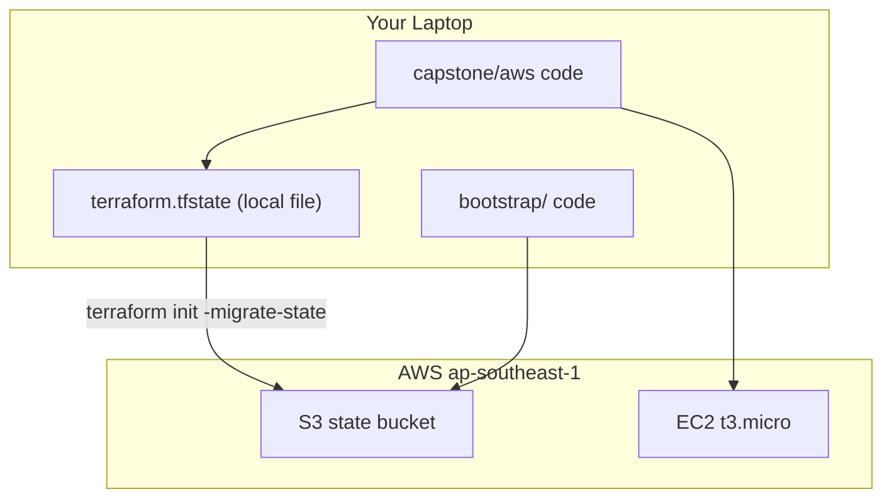

# Week 1 — Terraform Fundamentals & Remote State (M1)

## Objective

Create your first piece of AWS infrastructure with Terraform, look inside the **state file** Terraform keeps on your laptop, then **move that state** into a shared, locked S3 bucket. Along the way you'll add inputs with validation, so bad values are stopped before anything is created.

| | |
|---|---|
| **Builds on** | nothing — this is the start |
| **Next** | M2 |
| **Time** | about 2.5 hours |
| **Cloud spend** | about $0.02 |
| **Capstone requirements** | 1 (remote state), 2 (input validation), 18 (tags) |

## Topics

- Infrastructure as Code, and the Terraform lifecycle (`init`, `plan`, `apply`, `destroy`)
- Local state: what `terraform.tfstate` is, and why it matters
- Variables and validation
- Remote state in S3 with native locking, and migrating to it

## M1: Terraform Fundamentals & Remote State

- **Learning Objective:** This guide will help you create and destroy real infrastructure with code, and understand how Terraform remembers what it made. We'll break it down into simple steps.
- **Core Idea:** What is Terraform, and what is this "state" it keeps?
- **Why It Matters:**
  - **Problem:** Clicking in a console can't be repeated or reviewed, and a forgotten resource can quietly rack up charges overnight. And if the only record of what you built sits on one laptop, it can be lost.
  - **Solution:** Terraform describes infrastructure in code and records what it built in a **state file**. Moving that file to S3 keeps it safe, shared and locked.
- **How It Works:**
  - **Concepts:** You write `.tf` files. `terraform plan` compares them with the **state** (and with AWS), and shows what would change. `terraform apply` makes those changes and updates the state. Key terms:
    - **Provider:** the plugin that talks to AWS.
    - **State (`terraform.tfstate`):** Terraform's memory: which real resource belongs to which block in your code.
    - **Backend:** where the state file lives. By default it's **local** (a file next to your code).
    - **Remote backend (S3):** the state lives in a bucket; `use_lockfile = true` locks it during each run.
    - **`validation`:** a rule that rejects a bad input at plan time.
  - **Best Practices:**
    - Always read the plan before typing `yes`.
    - Never edit state by hand, and never commit it to Git: it can contain secrets.
  - **Real-World Example:** Think of state like the lockfile next to `package.json`: it records exactly what was installed. But for cloud infrastructure!
- **Supplemental Reading:**
  - [Install Terraform](https://developer.hashicorp.com/terraform/install)
  - [Install or update the AWS CLI](https://docs.aws.amazon.com/cli/latest/userguide/getting-started-install.html)
  - [Configuring settings for the AWS CLI](https://docs.aws.amazon.com/cli/latest/userguide/cli-configure-quickstart.html)
  - [What is Terraform?](https://developer.hashicorp.com/terraform/intro)
  - [Get started — AWS tutorial](https://developer.hashicorp.com/terraform/tutorials/aws-get-started)
  - [State](https://developer.hashicorp.com/terraform/language/state)
  - [S3 backend](https://developer.hashicorp.com/terraform/language/backend/s3)

## Hands-on lab

**What you'll build:** first an instance whose state is a file on your laptop. Then a bucket in AWS that the state moves into.



### Before you start

1. **Install Terraform 1.11 or newer.** Pick your OS:
   - **macOS** (Homebrew):
     ```bash
     brew tap hashicorp/tap
     brew install hashicorp/tap/terraform
     ```
   - **Ubuntu/Debian** (HashiCorp's apt repository):
     ```bash
     wget -O - https://apt.releases.hashicorp.com/gpg | sudo gpg --dearmor -o /usr/share/keyrings/hashicorp-archive-keyring.gpg
     echo "deb [arch=$(dpkg --print-architecture) signed-by=/usr/share/keyrings/hashicorp-archive-keyring.gpg] https://apt.releases.hashicorp.com $(grep -oP '(?<=UBUNTU_CODENAME=).*' /etc/os-release || lsb_release -cs) main" | sudo tee /etc/apt/sources.list.d/hashicorp.list
     sudo apt update && sudo apt install terraform
     ```
   - **Windows**: download the ZIP for your architecture from the [official install page](https://developer.hashicorp.com/terraform/install), unzip it, and add the folder to your `PATH`.

   Then confirm it's on your `PATH`:
   ```bash
   terraform version
   ```
   Expected: `Terraform v1.16.x` (or newer) and the AWS provider isn't listed yet — that comes from `init` later.

2. **Install the AWS CLI v2.** On **macOS or Linux**, the official install script handles both:
   ```bash
   curl -fsSL https://awscli.amazonaws.com/v2/install.sh | bash
   ```
   On **Windows**, from PowerShell:
   ```powershell
   irm https://awscli.amazonaws.com/v2/install.ps1 | iex
   ```
   Confirm it:
   ```bash
   aws --version
   ```
   Expected: `aws-cli/2.x.x Python/… <your-OS>/…`.

3. **Connect the CLI to your sandbox account.** If your programme hands you an access key and secret, run:
   ```bash
   aws configure
   ```
   and enter the key, secret, `ap-southeast-1` as the default region, and `json` as the output format. If instead your programme uses SSO or another method, follow the sign-in steps it gives you. Either way, confirm you're signed in:
   ```bash
   aws sts get-caller-identity
   ```
   Expected: your AWS account ID, user ARN and user ID, as JSON. If it prints an error instead, fix your AWS login before going further — nothing in this module will work without it.

4. Create the course folder, and tell Git never to save state or local settings:
   ```bash
   mkdir -p tf-bootcamp/capstone/aws tf-bootcamp/bootstrap
   cd tf-bootcamp && git init
   printf '.terraform/\n*.tfstate\n*.tfstate.*\nbackend.hcl\ntfplan\nplan.txt\n' > .gitignore
   ```

**The rhythm of every session, all course long:**
1. `terraform plan` first, and read it.
2. `terraform apply` only what you need.
3. Check your result.
4. `terraform destroy`, then `terraform state list`. It must print nothing.

**Golden rule:** create everything with Terraform, never by hand in the AWS console. Then `destroy` always removes everything.

### M1.1 — Your first instance, with local state

**Apply window:** 30 minutes · **Cost:** $0.01

1. In `capstone/aws/`, create `main.tf`. The first block says *which* provider to use; the second says *where*; the third says *what* to build:
   ```hcl
   terraform {
     required_version = ">= 1.11.0"
     required_providers {
       aws = {
         source  = "hashicorp/aws"
         version = "6.66.0"
       }
     }
   }

   provider "aws" {
     region = "ap-southeast-1" # Singapore
   }

   resource "aws_instance" "web" {
     ami           = var.ami_id
     instance_type = "t3.micro"

     credit_specification {
       cpu_credits = "standard" # T3 "unlimited" credits can bill extra; standard never does
     }

     tags = { Name = "${var.project}-${var.environment}-web" }
   }
   ```
2. Create `capstone/aws/variables.tf`. Variables are the inputs of your code. The `validation` block rejects any environment name that isn't in the list:
   ```hcl
   variable "project" {
     type    = string
     default = "tf-bootcamp"
   }

   variable "environment" {
     type    = string
     default = "dev"

     validation {
       condition     = contains(["dev", "staging", "prod"], var.environment)
       error_message = "environment must be one of: dev, staging, prod."
     }
   }

   variable "ami_id" {
     description = "Ubuntu 22.04 image ID (M2 replaces this with a lookup)."
     type        = string
   }
   ```
3. Look up today's Ubuntu 22.04 image ID for Singapore, and keep it in a shell variable:
   ```bash
   cd capstone/aws
   AMI=$(aws ssm get-parameter --region ap-southeast-1 --query Parameter.Value --output text \
     --name /aws/service/canonical/ubuntu/server/jammy/stable/current/amd64/hvm/ebs-gp2/ami-id)
   echo "$AMI"
   ```
   Expected: an ID such as `ami-0abc…`.
4. **`init`** downloads the AWS provider into a hidden `.terraform/` folder:
   ```bash
   terraform init
   ```
   Expected: `Terraform has been successfully initialized!`
5. **`plan`** shows what *would* happen. It changes nothing, and it's free:
   ```bash
   terraform plan -var "ami_id=$AMI"
   ```
   Expected: `Plan: 1 to add, 0 to change, 0 to destroy.`
6. **`apply`** does it. Read the plan again, then type `yes`:
   ```bash
   terraform apply -var "ami_id=$AMI"
   ```
   Expected: `Apply complete! Resources: 1 added, 0 changed, 0 destroyed.`
7. **Look at the state.** A new file, `terraform.tfstate`, appeared next to your code. It is Terraform's memory:
   ```bash
   ls
   terraform state list
   terraform state show aws_instance.web | grep -E ' id |instance_type|private_ip'
   ```
   Expected: `aws_instance.web`, and the real instance ID (`i-0…`) that AWS gave it. You can also open `terraform.tfstate` in an editor to read it, but never change it by hand.
8. Run `plan` again. Code, state and AWS all agree, so there is nothing to do:
   ```bash
   terraform plan -var "ami_id=$AMI"
   ```
   Expected: `No changes. Your infrastructure matches the configuration.`
9. Try a bad input. The validation stops it before AWS is ever called:
   ```bash
   terraform plan -var "ami_id=$AMI" -var environment=qa
   ```
   Expected: `environment must be one of: dev, staging, prod.`

**Keep the instance running** for M1.2: you're about to move its state.

### M1.2 — Move the state into S3

**Why:** the state file on your laptop can be lost, can't be shared, and nothing stops two runs writing it at once. An S3 bucket fixes all three. That bucket must exist *before* any code can store state in it, so it gets its own small project, `bootstrap/`, which you create once and **never destroy**.

**Apply window:** continues the same session · **Cost:** pennies per month

1. Create `bootstrap/main.tf`. It keeps its own state locally, on purpose, because it creates the bucket everything else uses:
   ```hcl
   terraform {
     required_version = ">= 1.11.0"
     required_providers {
       aws = {
         source  = "hashicorp/aws"
         version = "6.66.0"
       }
     }
   }

   provider "aws" {
     region = "ap-southeast-1"
   }

   variable "project" {
     type    = string
     default = "tf-bootcamp"
   }

   data "aws_caller_identity" "current" {}

   resource "aws_s3_bucket" "state" {
     # Your account ID makes the name globally unique.
     bucket = "${var.project}-tfstate-${data.aws_caller_identity.current.account_id}"

     lifecycle {
       prevent_destroy = true # a stray `destroy` can never delete everyone's state
     }
   }

   resource "aws_s3_bucket_versioning" "state" {
     bucket = aws_s3_bucket.state.id
     versioning_configuration {
       status = "Enabled" # every state change keeps the previous version
     }
   }

   resource "aws_s3_bucket_server_side_encryption_configuration" "state" {
     bucket = aws_s3_bucket.state.id
     rule {
       apply_server_side_encryption_by_default {
         sse_algorithm = "AES256"
       }
     }
   }

   resource "aws_s3_bucket_public_access_block" "state" {
     bucket                  = aws_s3_bucket.state.id
     block_public_acls       = true
     block_public_policy     = true
     ignore_public_acls      = true
     restrict_public_buckets = true
   }

   output "state_bucket" {
     value = aws_s3_bucket.state.bucket
   }
   ```
2. Create the bucket:
   ```bash
   cd ../../bootstrap
   terraform init
   terraform apply
   ```
   Expected: `Apply complete! Resources: 4 added`, and an output `state_bucket = "tf-bootcamp-tfstate-<your-account-id>"`.
3. Go back to `capstone/aws` and tell Terraform to keep its state in that bucket. Add this **inside** the existing `terraform { }` block in `main.tf`:
   ```hcl
     backend "s3" {
       key          = "capstone/aws/terraform.tfstate" # the file's path inside the bucket
       region       = "ap-southeast-1"
       encrypt      = true
       use_lockfile = true # S3 native locking: no DynamoDB table needed
     }
   ```
   The bucket name is left out on purpose, because it contains your account ID. It goes in a small file that Git ignores:
   ```bash
   cd ../capstone/aws
   printf 'bucket = "%s"\n' "$(terraform -chdir=../../bootstrap output -raw state_bucket)" > backend.hcl
   cat backend.hcl
   ```
4. **Migrate.** Terraform notices the new backend and offers to copy your local state into S3. Answer `yes`:
   ```bash
   terraform init -backend-config=backend.hcl -migrate-state
   ```
   Expected: a question like `Do you want to copy existing state to the new backend?`, then `Successfully configured the backend "s3"!`
5. **Prove nothing was lost.** The state now lives in S3, and Terraform still knows about your instance:
   ```bash
   aws s3 ls "s3://$(terraform -chdir=../../bootstrap output -raw state_bucket)/capstone/aws/"
   terraform plan -var "ami_id=$AMI"
   ```
   Expected: `terraform.tfstate` listed in the bucket, and `No changes.` The local `terraform.tfstate` is now empty; it's safe to delete it.
6. Tear down the instance, but **not** `bootstrap/`:
   ```bash
   terraform destroy -var "ami_id=$AMI"
   terraform state list
   ```
   Expected: `Destroy complete! Resources: 1 destroyed.`, then no output from `state list`.

## Lab exercise

**Add storage without breaking the server.** Attach an 8 GB EBS volume to the instance. The plan must show **2 to add, 0 to change, 0 to destroy**, meaning the instance itself is untouched.

<details><summary>Reference solution</summary>

```hcl
resource "aws_ebs_volume" "data" {
  availability_zone = aws_instance.web.availability_zone # same AZ, by reference
  size              = 8
  type              = "gp3"
}

resource "aws_volume_attachment" "data" {
  device_name = "/dev/sdf"
  volume_id   = aws_ebs_volume.data.id
  instance_id = aws_instance.web.id
}
```
The volume takes its AZ from the instance *by reference* instead of you typing it. That's why the instance is not replaced. Remove both blocks afterwards: the capstone doesn't use them.
</details>

## Next steps

Capstone tasks. **No reference solution**: work them out, and note what you did in `EVIDENCE.md`.

**N1 — Tag everything automatically** (capstone requirement 18)
Make every AWS resource in `capstone/aws` carry the tags `Project`, `Env`, `Teardown = "every-session"` and `ManagedBy = "terraform"`, without writing `tags` on each resource.
- *Hint:* look for `default_tags` in the AWS provider documentation.
- *Done when:* after an apply, the instance shows all four tags in the EC2 console, plus its own `Name`.

## Checkpoint (self-assessed)

- [ ] You ran `init`, `plan`, `apply` and `destroy`, and can say in one sentence what each one does.
- [ ] You opened `terraform.tfstate` and found your instance's real ID in it.
- [ ] `environment = qa` fails at plan time with your message.
- [ ] After the migration, the state is in S3, and `terraform plan` said `No changes`.
- [ ] After `terraform destroy`, `terraform state list` prints nothing, and `bootstrap/` still exists.
