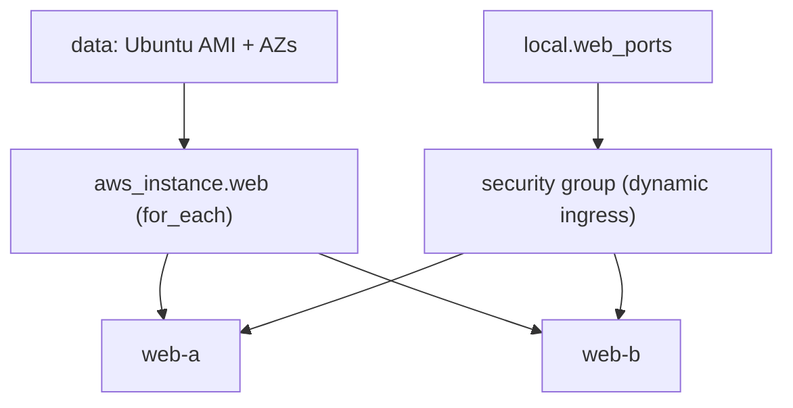

# Week 1 — Data Sources & Iteration (M2)

## Objective

Stop hardcoding what AWS can tell you: look up the Ubuntu image and the Availability Zones instead. Then remove repetition with `for_each`, `dynamic` blocks and one **tier map**, which later becomes the source of truth for the capstone's security-group chain.

| | |
|---|---|
| **Builds on** | M1 |
| **Next** | M3 |
| **Time** | about 1.5 hours |
| **Cloud spend** | about $0.03 |
| **Capstone requirements** | 4 (no hardcoded lookups), 6 (the tier map) |

## Topics

- `data` blocks and the resource graph (implicit dependencies, `depends_on`)
- `count` vs. `for_each`, and why `for_each` is safer
- `dynamic` blocks and `locals`

## M2: Data Sources & Iteration

- **Learning Objective:** This guide will help you query live AWS values and describe many similar things once. We'll break it down into simple steps.
- **Core Idea:** How do we avoid hardcoded IDs and copy-pasted blocks?
- **Why It Matters:**
  - **Problem:** AMI IDs and AZ names change and differ per account. Five copy-pasted blocks mean five places to fix.
  - **Solution:** `data` blocks read the current values; `for_each` and `dynamic` generate repeats from data.
- **How It Works:**
  - **Concepts:** Terraform builds a graph from references, and runs independent parts in parallel. Key terms:
    - **`data` block:** a read-only lookup.
    - **Implicit dependency:** created by referencing another block's attribute.
    - **`for_each`:** one resource per map key, with stable addresses like `["web-a"]`.
    - **`dynamic`:** repeats a nested block, such as `ingress`.
  - **Best Practices:**
    - Prefer `for_each` over `count`. Removing item `[0]` from a `count` list shifts, and recreates, everything after it.
    - Keep the data (maps in `locals`) apart from the shape (resources).
  - **Real-World Example:** Think of it like a `for` loop in a Helm template, but for cloud resources!
- **Supplemental Reading:**
  - [Data sources](https://developer.hashicorp.com/terraform/language/data-sources)
  - [`for_each`](https://developer.hashicorp.com/terraform/language/meta-arguments/for_each)
  - [Dynamic blocks](https://developer.hashicorp.com/terraform/language/expressions/dynamic-blocks)
  - [Find Ubuntu images on AWS](https://ubuntu.com/aws/docs/aws-how-to/instances/find-ubuntu-images/)

## Hands-on lab

**What you'll build:** two web instances and one security group, generated from data.



### M2 — Look up, then iterate

**Apply window:** 30 minutes · **Cost:** $0.03

1. Make the region an input too. Add this to `variables.tf`, and change the provider to `region = var.aws_region`:
   ```hcl
   variable "aws_region" {
     type    = string
     default = "ap-southeast-1"
   }
   ```
   Then, in `capstone/aws/main.tf`, replace `var.ami_id` with lookups. Delete the `ami_id` variable and the `-var "ami_id=…"` flags; you won't need them again:
   ```hcl
   data "aws_ami" "ubuntu" {
     most_recent = true
     owners      = ["099720109477"] # Canonical

     filter {
       name   = "name"
       values = ["ubuntu/images/hvm-ssd*/ubuntu-jammy-22.04-amd64-server-*"]
     }
   }

   data "aws_availability_zones" "available" {
     state = "available"
   }

   locals {
     azs       = slice(data.aws_availability_zones.available.names, 0, 2)
     web_ports = [80, 443]

     nodes = {
       web-a = { az = local.azs[0] }
       web-b = { az = local.azs[1] }
     }
   }
   ```
2. Replace the single instance with a `for_each` cluster and a `dynamic` security group:
   ```hcl
   resource "aws_security_group" "web" {
     name        = "${var.project}-${var.environment}-web-sg"
     description = "Web tier"

     dynamic "ingress" {
       for_each = local.web_ports
       content {
         from_port   = ingress.value
         to_port     = ingress.value
         protocol    = "tcp"
         cidr_blocks = ["0.0.0.0/0"] # prototype edge; the load balancer takes over in M6
       }
     }

     egress {
       from_port   = 0
       to_port     = 0
       protocol    = "-1"
       cidr_blocks = ["0.0.0.0/0"] # prototype only; tightened per tier in M5
     }
   }

   resource "aws_instance" "web" {
     for_each = local.nodes

     ami                    = data.aws_ami.ubuntu.id
     instance_type          = "t3.micro"
     availability_zone      = each.value.az
     vpc_security_group_ids = [aws_security_group.web.id]

     credit_specification {
       cpu_credits = "standard"
     }

     tags = { Name = "${var.project}-${var.environment}-${each.key}" }
   }
   ```
3. Plan and apply, look at the addresses, then destroy:
   ```bash
   terraform apply
   terraform state list | grep aws_instance   # expected: aws_instance.web["web-a"] and ["web-b"]
   terraform destroy
   ```

## Lab exercise

**Give web-a a fixed address.** Add an Elastic IP bound to `web-a` *by reference*, and find the dependency in `terraform graph`.

<details><summary>Reference solution</summary>

```hcl
resource "aws_eip" "entry" {
  domain   = "vpc"
  instance = aws_instance.web["web-a"].id # this reference is the dependency
}
```
```bash
terraform graph | grep aws_eip
```
The graph shows an edge from `aws_eip.entry` to `aws_instance.web`, so Terraform creates the instance first. Remove the EIP before M3: from M6 the load balancer is the entry point, and every public IPv4 address costs money.
</details>

## Next steps

Capstone tasks. **No reference solution.**

**N1 — Start the tier map** (capstone requirement 6)
Add a `tier_rules` local that describes each tier's open ports and allowed sources: `web` (80 and 443 from `0.0.0.0/0`) and `app` (8080). In M5 this map drives the whole security-group chain, so every firewall rule in the capstone is reviewed in one place.
- *Hint:* use a map of objects with `ports` (a list of numbers) and `sources` (a list of strings). For now, the `app` source can be the default VPC's CIDR, `172.31.0.0/16`.
- *Done when:* `terraform console` prints your map for `local.tier_rules`, and `local.tier_rules["app"].ports` returns `[8080]`.

## Checkpoint (self-assessed)

- [ ] No AMI ID or AZ name is typed anywhere in `capstone/aws`.
- [ ] Instance addresses in state are keys (`["web-a"]`), not indexes.
- [ ] After `terraform destroy`, `terraform state list` prints nothing.
