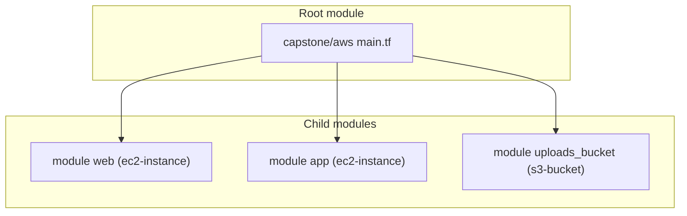

# Week 1 — Modules (M3)

## Objective

Package repeated code as reusable **modules**, one module per kind of resource, as real teams do: `ec2-instance` for an instance and `s3-bucket` for a bucket. You call the instance module once for Web, guided step by step — then call it a second time for App, on your own, using nothing but the pattern you just followed. Then you bring both modules up to the same engineering standards a real team would hold them to, before this default-VPC prototype is retired in M4.

| | |
|---|---|
| **Builds on** | M2 |
| **Next** | M4 |
| **Time** | about 1.5 hours |
| **Cloud spend** | about $0.02 |
| **Capstone requirements** | reuse through modules (every module that follows uses this pattern) |

## Topics

- Root vs. child modules, and the standard module structure
- One module per resource type, named after what it creates
- Module inputs (variables) and outputs
- Version constraints: exact pins in roots, minimums in modules
- Module-authoring standards: file layout, variable hygiene, naming

## M3: Modules

- **Learning Objective:** This guide will help you turn copy-pasted resources into small, reusable building blocks. We'll break it down into simple steps.
- **Core Idea:** What is a Terraform module, and why one per resource type?
- **Why It Matters:**
  - **Problem:** The Web and App instances need nearly the same code. Two copies drift apart.
  - **Solution:** A module: write the instance once, and call it with different inputs. Small modules named after what they create (`ec2-instance`, `s3-bucket`, `alb`) are easy to find, test and reuse.
- **How It Works:**
  - **Concepts:** Any folder of `.tf` files is a module — Terraform merges every `.tf` file in a folder into one configuration, so which file a block lives in is a human convenience, never a technical requirement. Key terms:
    - **Root module:** the folder where you run `terraform`.
    - **Child module:** a folder called with a `module` block and a `source` path.
    - **Outputs:** the only values a caller can read from a module.
    - **Standard module layout:** by convention, `main.tf` holds resources (and any `locals`), `variables.tf` holds every `variable` block, and `outputs.tf` holds every `output` block. A module a stranger can navigate in ten seconds is a module people will actually reuse.
  - **Best Practices:**
    - One module, one resource type, one job. The root module decides how they connect.
    - Pin exact provider versions in roots; child modules only state a minimum (`>= 6.0`).
    - Every variable needs a `description`. It's the documentation most callers will ever read — a name alone doesn't say what unit, format or constraint applies.
    - Give a default to inputs that don't vary by environment (an instance size); leave inputs that do vary (an AMI ID, an account-specific name) without one, so the caller can't forget to set them.
    - Don't repeat the resource type in a resource's own label (`aws_instance.web`, not `aws_instance.web_instance`) — the address already says the type.
    - Some standards name a module's one-and-only resource of a kind `main`; this course uses `this` throughout instead, for consistency across every module you'll write. Either is fine — what matters is picking one and never mixing the two inside a codebase.
  - **Real-World Example:** Think of it like a function in Python, or a React component, but for infrastructure!
- **Supplemental Reading:**
  - [Modules overview](https://developer.hashicorp.com/terraform/language/modules)
  - [Standard module structure](https://developer.hashicorp.com/terraform/language/modules/develop/structure)
  - [Build and use a local module (tutorial)](https://developer.hashicorp.com/terraform/tutorials/modules/module)
  - [Terraform style guide](https://developer.hashicorp.com/terraform/language/style)

## Hands-on lab

**What you'll build:** one root calling two small modules, one of them twice.



### M3 — `ec2-instance` and `s3-bucket`

**Apply window:** 30 minutes · **Cost:** $0.02

1. Create `modules/ec2-instance/main.tf` at the repository root, next to `capstone/`:
   ```hcl
   terraform {
     required_providers {
       aws = {
         source  = "hashicorp/aws"
         version = ">= 6.0"
       }
     }
   }

   variable "name" { type = string }
   variable "ami_id" { type = string }
   variable "availability_zone" { type = string }
   variable "security_group_ids" { type = list(string) }

   variable "instance_type" {
     type    = string
     default = "t3.micro"
   }

   resource "aws_instance" "this" {
     ami                    = var.ami_id
     instance_type          = var.instance_type
     availability_zone      = var.availability_zone
     vpc_security_group_ids = var.security_group_ids

     credit_specification {
       cpu_credits = "standard"
     }

     metadata_options {
       http_tokens = "required" # IMDSv2 only
     }

     root_block_device {
       volume_type = "gp3"
       encrypted   = true
     }

     tags = { Name = var.name }
   }

   output "id" {
     value = aws_instance.this.id
   }

   output "public_ip" {
     value = aws_instance.this.public_ip
   }
   ```
2. Create `modules/s3-bucket/main.tf`, with the same `terraform {}` block:
   ```hcl
   variable "name" { type = string }

   variable "force_destroy" {
     description = "Delete the bucket even if it still holds files (lab buckets only)."
     type        = bool
     default     = false
   }

   resource "aws_s3_bucket" "this" {
     bucket        = var.name
     force_destroy = var.force_destroy
   }

   resource "aws_s3_bucket_public_access_block" "this" {
     bucket                  = aws_s3_bucket.this.id
     block_public_acls       = true
     block_public_policy     = true
     ignore_public_acls      = true
     restrict_public_buckets = true
   }

   output "name" {
     value = aws_s3_bucket.this.bucket
   }

   output "arn" {
     value = aws_s3_bucket.this.arn
   }
   ```
3. In `capstone/aws/main.tf`, delete the M2 `aws_instance.web` block. Keep the data sources, the locals and `aws_security_group.web`, and call the modules instead:
   ```hcl
   data "aws_caller_identity" "current" {}

   module "web" {
     source = "../../modules/ec2-instance"

     name               = "${var.project}-${var.environment}-web"
     ami_id             = data.aws_ami.ubuntu.id
     availability_zone  = local.azs[0]
     security_group_ids = [aws_security_group.web.id]
   }

   module "uploads_bucket" {
     source = "../../modules/s3-bucket"

     name          = "${var.project}-${var.environment}-uploads-${data.aws_caller_identity.current.account_id}"
     force_destroy = true # lab bucket: destroy must never be blocked by leftover files
   }
   ```
   **Now add `module "app"` yourself.** No code is given for this one. You've just seen every input `ec2-instance` takes — `module "app"` needs the same five, with exactly two differences from `web`: its own `name` (end it in `-app`), and `local.azs[1]` instead of `local.azs[0]`, so it lands in the other Availability Zone. `source`, `ami_id` and `security_group_ids` are identical to `web`'s. Write the block directly below `module "web"`.
4. New modules must be installed, so run `init` again. Then apply, look at the addresses, and destroy:
   ```bash
   terraform init -backend-config=backend.hcl
   terraform apply    # expected: Apply complete! Resources: 5 added (the web security group, 2 instances, 2 bucket resources)
   terraform state list        # expected: module.web.aws_instance.this, module.app.aws_instance.this, module.uploads_bucket…
   terraform destroy
   ```
   If `module.app` is missing, or its `availability_zone` still reads `local.azs[0]`, the plan or the state list will tell you before you apply.

## Lab exercise

**Read a module's output from the root.** Print the Web instance's public IP after an apply, without opening the console.

<details><summary>Reference solution</summary>

```hcl
output "web_public_ip" {
  value = module.web.public_ip
}
```
```bash
terraform output web_public_ip
```
A root can only read what a child module declares in an `output` block.
</details>

## Next steps

Capstone tasks. **No reference solution.**

**N1 — Publish the uploads bucket name** (capstone deliverable: `terraform output`)
Add a root output named `uploads_bucket` that returns the bucket's name from `module.uploads_bucket`. The capstone uses it to upload the seed data.
- *Done when:* `terraform output -raw uploads_bucket` prints `tf-bootcamp-dev-uploads-<account-id>`.

**N2 — Bring your modules up to standard** (course engineering standards)
Split `modules/ec2-instance` and `modules/s3-bucket` each into `main.tf` (the `terraform {}` block, `resource` blocks, any `locals`), `variables.tf` (every `variable` block) and `outputs.tf` (every `output` block). Then add a `description` to every variable in both modules — every one currently has none. No code is given: work from the Best Practices above.
- *Hint:* moving a block to a different file changes nothing about how Terraform reads it — every `.tf` file in a folder is merged into one module. Only variable and output *names* matter to a caller (`module "web" { ... }`), never which file declares them, so `module.web` and `module.uploads_bucket` keep working exactly as they do now.
- *Done when:* `terraform init -backend=false && terraform validate`, run from inside each module folder, still say `Success!`; `terraform fmt -check -recursive` from the repo root reports no changes; and every `variable` block in both modules has a `description`.

## Checkpoint (self-assessed)

- [ ] `modules/ec2-instance` and `modules/s3-bucket` each create one kind of resource.
- [ ] `terraform state list` shows `module.web…` and `module.app…`, both from one `ec2-instance` module.
- [ ] You wrote `module "app"` yourself, from the pattern in `module "web"`, with no code given.
- [ ] After `terraform destroy`, `terraform state list` prints nothing.
