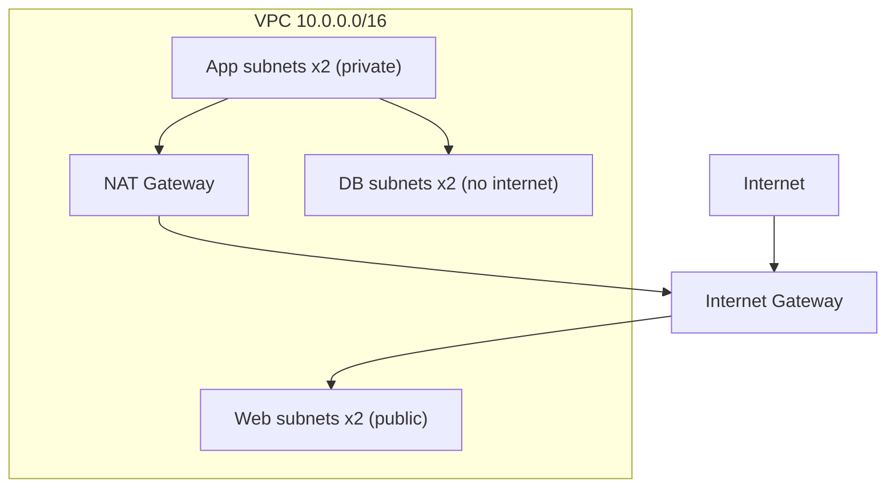

# Week 2 — VPC Network Topology (M4)

## Objective

Replace the default VPC with the capstone's own network: one VPC across two Availability Zones, six subnets in three tiers, an Internet Gateway, one NAT Gateway that you can switch off, and a free S3 endpoint. **Planned refactor:** the M3 prototype instances are removed; compute returns as Auto Scaling groups in M6.

| | |
|---|---|
| **Builds on** | M1, M2 |
| **Next** | M5 |
| **Time** | about 1.5 hours |
| **Cloud spend** | about $0.03 (the NAT Gateway dominates) |
| **Capstone requirements** | 5 (network) |

## Topics

- VPCs, CIDR blocks and `cidrsubnet()`
- Public vs. private subnets, Internet Gateway, NAT Gateway
- Route tables, and the free S3 gateway endpoint

## M4: VPC Network Topology

- **Learning Objective:** This guide will help you build the private network the whole capstone lives in. We'll break it down into simple steps.
- **Core Idea:** What decides whether a subnet can reach the internet?
- **Why It Matters:**
  - **Problem:** In the default VPC everything is public, and a database there is one bad rule away from the internet.
  - **Solution:** Tiered subnets, where each tier's **route table** decides what it can reach.
- **How It Works:**
  - **Concepts:** Key terms:
    - **Public subnet:** its route table sends `0.0.0.0/0` to an Internet Gateway.
    - **Private subnet:** no route to the Internet Gateway.
    - **NAT Gateway:** lets private servers make *outbound* calls. It bills hourly.
    - **S3 gateway endpoint:** a free private path to S3.
  - **Best Practices:**
    - Give the DB route table **no default route**.
    - Put the NAT behind a flag (`nat_gateway_enabled`) so network-only sessions cost $0.
  - **Real-World Example:** Think of it like floors of an office building: the lobby has a street door, offices send mail through the mailroom, and the vault has no outside door.
- **Supplemental Reading:**
  - [How Amazon VPC works](https://docs.aws.amazon.com/vpc/latest/userguide/how-it-works.html)
  - [NAT gateways](https://docs.aws.amazon.com/vpc/latest/userguide/vpc-nat-gateway.html)
  - [Route tables](https://docs.aws.amazon.com/vpc/latest/userguide/VPC_Route_Tables.html)
  - [Gateway endpoints for S3](https://docs.aws.amazon.com/vpc/latest/privatelink/vpc-endpoints-s3.html)

## Hands-on lab

**What you'll build:** Web subnets reach the internet directly. App subnets go out only through the NAT. DB subnets have no route out.



### M4 — The network module

**Apply window:** 30 minutes · **Cost:** $0.03

1. Remove the prototype from `capstone/aws/main.tf`: `module "web"`, `module "app"` and `aws_security_group.web`. Keep `module "uploads_bucket"`, the data sources and the locals.
2. Create `modules/network/main.tf`, starting with the child-module `terraform {}` block from M3. The network is the one module that groups several resource types, because a VPC, its subnets and its routes are always built and changed together:
   ```hcl
   variable "name_prefix" { type = string }
   variable "azs" { type = list(string) }

   variable "vpc_cidr" {
     type    = string
     default = "10.0.0.0/16"
   }

   variable "nat_gateway_enabled" {
     description = "Create the single NAT Gateway (billed hourly)."
     type        = bool
     default     = true
   }

   data "aws_region" "current" {}

   locals {
     # Tier => third-octet offset: web 10.0.0-1.x, app 10.0.10-11.x, db 10.0.20-21.x
     tier_offsets = { web = 0, app = 10, db = 20 }

     subnets = merge([
       for tier, offset in local.tier_offsets : {
         for i, az in var.azs : "${tier}-${i}" => {
           tier = tier
           az   = az
           cidr = cidrsubnet(var.vpc_cidr, 8, offset + i)
         }
       }
     ]...)
   }

   resource "aws_vpc" "this" {
     cidr_block           = var.vpc_cidr
     enable_dns_support   = true
     enable_dns_hostnames = true
     tags                 = { Name = "${var.name_prefix}-vpc" }
   }

   resource "aws_subnet" "this" {
     for_each = local.subnets

     vpc_id                  = aws_vpc.this.id
     cidr_block              = each.value.cidr
     availability_zone       = each.value.az
     map_public_ip_on_launch = each.value.tier == "web"
     tags                    = { Name = "${var.name_prefix}-${each.key}", Tier = each.value.tier }
   }

   resource "aws_internet_gateway" "this" {
     vpc_id = aws_vpc.this.id
   }

   resource "aws_eip" "nat" {
     count  = var.nat_gateway_enabled ? 1 : 0
     domain = "vpc"
   }

   resource "aws_nat_gateway" "this" {
     count         = var.nat_gateway_enabled ? 1 : 0
     allocation_id = aws_eip.nat[0].id
     subnet_id     = aws_subnet.this["web-0"].id
     depends_on    = [aws_internet_gateway.this] # AWS needs the IGW first; no attribute shows that
   }

   resource "aws_route_table" "this" {
     for_each = local.tier_offsets
     vpc_id   = aws_vpc.this.id
     tags     = { Name = "${var.name_prefix}-${each.key}-rt" }
   }

   resource "aws_route" "web_internet" {
     route_table_id         = aws_route_table.this["web"].id
     destination_cidr_block = "0.0.0.0/0"
     gateway_id             = aws_internet_gateway.this.id
   }

   resource "aws_route" "app_nat" {
     count                  = var.nat_gateway_enabled ? 1 : 0
     route_table_id         = aws_route_table.this["app"].id
     destination_cidr_block = "0.0.0.0/0"
     nat_gateway_id         = aws_nat_gateway.this[0].id
   }

   # The DB route table deliberately has no default route.

   resource "aws_vpc_endpoint" "s3" {
     vpc_id            = aws_vpc.this.id
     service_name      = "com.amazonaws.${data.aws_region.current.region}.s3"
     vpc_endpoint_type = "Gateway"
     route_table_ids   = [aws_route_table.this["app"].id, aws_route_table.this["db"].id]
   }

   output "vpc_id" {
     value = aws_vpc.this.id
   }

   output "subnet_ids" {
     description = "Subnet IDs per tier: { web = [...], app = [...], db = [...] }"
     value = {
       for tier in keys(local.tier_offsets) :
       tier => [for key, subnet in aws_subnet.this : subnet.id if local.subnets[key].tier == tier]
     }
   }
   ```
3. Call it from the root, and add a `nat_gateway_enabled` variable (bool, default `true`) to `capstone/aws/variables.tf`:
   ```hcl
   module "network" {
     source = "../../modules/network"

     name_prefix         = "${var.project}-${var.environment}"
     azs                 = local.azs
     nat_gateway_enabled = var.nat_gateway_enabled
   }
   ```
4. Apply, check the route tables, and destroy:
   ```bash
   terraform init -backend-config=backend.hcl
   terraform apply
   aws ec2 describe-route-tables --region ap-southeast-1 --filters "Name=tag:Name,Values=tf-bootcamp-dev-*-rt" \
     --query 'RouteTables[].[Tags[?Key==`Name`]|[0].Value, Routes[].DestinationCidrBlock | join(`,`, @)]' --output table
   terraform destroy
   ```

## Lab exercise

**Read the cost switch.** With the network applied, predict what `terraform plan -var nat_gateway_enabled=false` does, then run it (plan only).

<details><summary>Reference solution</summary>

```text
  # module.network.aws_eip.nat[0] will be destroyed
  # module.network.aws_nat_gateway.this[0] will be destroyed
  # module.network.aws_route.app_nat[0] will be destroyed
Plan: 0 to add, 0 to change, 3 to destroy.
```
The `count = var.nat_gateway_enabled ? 1 : 0` toggle turns off the most expensive hourly resource and nothing else.
</details>

## Next steps

Capstone tasks. **No reference solution.**

**N1 — Connect the subnets to their route tables** (capstone requirement 5)
The six subnets and three route tables exist, but nothing connects them. Associate each subnet with its tier's table using **one** resource block.
- *Hint:* `aws_route_table_association` with `for_each = local.subnets`; each entry knows its `tier`.
- *Done when:* `terraform state list | grep association` shows six entries.

## Checkpoint (self-assessed)

- [ ] Six subnets across two AZs. Web → Internet Gateway, App → NAT, DB → no default route.
- [ ] `nat_gateway_enabled = false` removes exactly the NAT, its EIP and the App route.
- [ ] After `terraform destroy`, `terraform state list` prints nothing.
