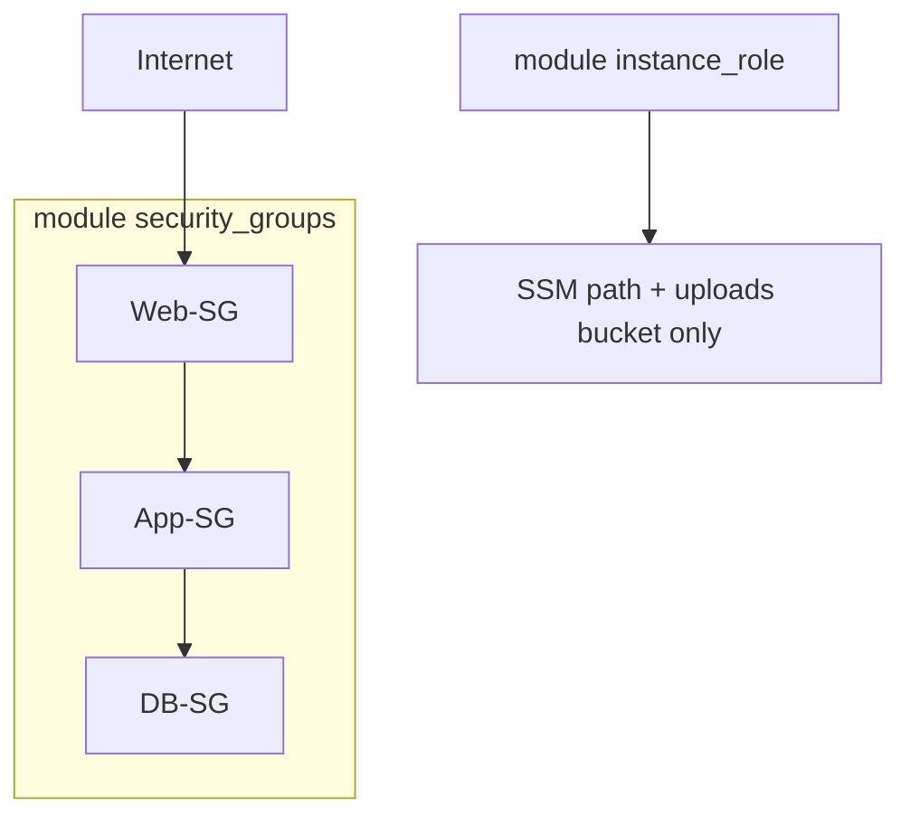

# Week 2 — Security Groups & IAM (M5)

## Objective

Decide who may talk to whom. Build a `security-groups` module that turns the M2 tier map into a chain in which each tier accepts traffic only from the tier in front of it. Then build an `iam-instance-role` module that gives servers exactly the AWS permissions they need, with no keys on the servers. **Planned refactor:** security-group sources change from CIDR ranges to group names.

| | |
|---|---|
| **Builds on** | M2 (tier map), M3, M4 |
| **Next** | M6 |
| **Time** | about 1.5 hours |
| **Cloud spend** | $0.00 (security groups and IAM are free; run with the NAT off) |
| **Capstone requirements** | 6 (security-group chain), 7 (least-privilege IAM), 11 (runtime config) |

## Topics

- Least privilege; IAM roles and instance profiles
- Security groups vs. NACLs; stateful filtering
- Security-group chaining with group references
- Runtime configuration in SSM Parameter Store

## M5: Security Groups & IAM

- **Learning Objective:** This guide will help you lock down traffic between tiers and the AWS permissions of your servers. We'll break it down into simple steps.
- **Core Idea:** How does each tier trust only the tier in front of it?
- **Why It Matters:**
  - **Problem:** Wide IP ranges let a hacked web server reach the database directly. Access keys copied onto servers leak.
  - **Solution:** Security groups whose source is **another security group**, and an IAM role handed to servers through an instance profile.
- **How It Works:**
  - **Concepts:** Key terms:
    - **Security group (SG):** a stateful firewall on each server's network card. Replies to allowed traffic are allowed automatically.
    - **SG reference:** a rule whose source is another group, not an IP range.
    - **Instance profile:** hands an IAM role to EC2 instances.
    - **SSM Parameter Store:** a free key/value store that servers read their settings from at boot.
  - **Best Practices:**
    - Only the internet edge uses `0.0.0.0/0` as a source, with a comment saying why.
    - No `"*"` in the `resources` of your own policies: name the exact path, bucket or secret.
  - **Real-World Example:** Think of it like office badges: the lobby badge opens the lobby, and the office door only opens for people coming from the lobby.
- **Supplemental Reading:**
  - [Security groups](https://docs.aws.amazon.com/vpc/latest/userguide/vpc-security-groups.html)
  - [IAM roles for EC2 / instance profiles](https://docs.aws.amazon.com/IAM/latest/UserGuide/id_roles_use_switch-role-ec2_instance-profiles.html)
  - [IAM security best practices](https://docs.aws.amazon.com/IAM/latest/UserGuide/best-practices.html)
  - [SSM Parameter Store](https://docs.aws.amazon.com/systems-manager/latest/userguide/systems-manager-parameter-store.html)
  - **Note:** AWS documents security-group references, but none of the sources gathered for this course names a "security-group chain" pattern. The pattern here is built from the security-groups page.

## Hands-on lab

**What you'll build:** a Web → App → DB trust chain, and one role that can read only its own settings.



### M5 — `security-groups` and `iam-instance-role`

**Apply window:** a brief apply with `-var nat_gateway_enabled=false` · **Cost:** $0.00

1. Create `modules/security-groups/main.tf` (child-module `terraform {}` block, then the code below). One map goes in, and a whole chain comes out. Rules are separate resources, because groups that reference each other inline would form a dependency loop.
   ```hcl
   variable "name_prefix" { type = string }
   variable "vpc_id" { type = string }

   variable "tier_rules" {
     description = "Group name => ports and sources. A source is a CIDR (internet edge only) or another group's name."
     type = map(object({
       ports   = list(number)
       sources = list(string)
     }))
   }

   variable "internet_egress_ports" {
     type    = map(list(number))
     default = {}
   }

   locals {
     ingress = merge([
       for group, rule in var.tier_rules : {
         for pair in setproduct(rule.ports, rule.sources) :
         "${group}-${pair[0]}-from-${replace(pair[1], "/", "_")}" => {
           group   = group
           port    = pair[0]
           source  = pair[1]
           is_cidr = can(cidrhost(pair[1], 0))
         }
       }
     ]...)

     # Every group-to-group ingress gets a matching egress on the source group.
     chain_egress = { for key, rule in local.ingress : key => rule if !rule.is_cidr }

     internet_egress = merge([
       for group, ports in var.internet_egress_ports : {
         for port in ports : "${group}-${port}-to-internet" => { group = group, port = port }
       }
     ]...)
   }

   resource "aws_security_group" "tier" {
     for_each    = var.tier_rules
     name        = "${var.name_prefix}-${each.key}-sg"
     description = "${each.key} tier (managed by Terraform)"
     vpc_id      = var.vpc_id
     # Terraform removes AWS's default allow-all egress rule; only the rules below exist.
   }

   resource "aws_vpc_security_group_ingress_rule" "this" {
     for_each = local.ingress

     security_group_id            = aws_security_group.tier[each.value.group].id
     description                  = each.key
     ip_protocol                  = "tcp"
     from_port                    = each.value.port
     to_port                      = each.value.port
     cidr_ipv4                    = each.value.is_cidr ? each.value.source : null
     referenced_security_group_id = each.value.is_cidr ? null : aws_security_group.tier[each.value.source].id
   }

   resource "aws_vpc_security_group_egress_rule" "chain" {
     for_each = local.chain_egress

     security_group_id            = aws_security_group.tier[each.value.source].id
     description                  = "to ${each.value.group}:${each.value.port}"
     ip_protocol                  = "tcp"
     from_port                    = each.value.port
     to_port                      = each.value.port
     referenced_security_group_id = aws_security_group.tier[each.value.group].id
   }

   resource "aws_vpc_security_group_egress_rule" "internet" {
     for_each = local.internet_egress

     security_group_id = aws_security_group.tier[each.value.group].id
     description       = each.key
     ip_protocol       = "tcp"
     from_port         = each.value.port
     to_port           = each.value.port
     cidr_ipv4         = "0.0.0.0/0" # outbound only: package installs and AWS APIs at boot
   }

   output "ids" {
     description = "Security group ID per group name."
     value       = { for name, sg in aws_security_group.tier : name => sg.id }
   }
   ```
2. Create `modules/iam-instance-role/main.tf` (child-module `terraform {}` block, then the code below). The caller passes in what the role may do, so the module stays reusable:
   ```hcl
   variable "name" { type = string }

   variable "policy_statements" {
     description = "What the instances may do: a list of { actions, resources }. Never use \"*\" resources."
     type = list(object({
       actions   = list(string)
       resources = list(string)
     }))
   }

   data "aws_iam_policy_document" "assume" {
     statement {
       actions = ["sts:AssumeRole"]
       principals {
         type        = "Service"
         identifiers = ["ec2.amazonaws.com"]
       }
     }
   }

   resource "aws_iam_role" "this" {
     name               = var.name
     assume_role_policy = data.aws_iam_policy_document.assume.json
   }

   data "aws_iam_policy_document" "inline" {
     dynamic "statement" {
       for_each = var.policy_statements
       content {
         actions   = statement.value.actions
         resources = statement.value.resources
       }
     }
   }

   resource "aws_iam_role_policy" "inline" {
     name   = "${var.name}-inline"
     role   = aws_iam_role.this.id
     policy = data.aws_iam_policy_document.inline.json
   }

   # AWS-managed policy for Systems Manager Run Command: no SSH keys, no port 22.
   resource "aws_iam_role_policy_attachment" "ssm_core" {
     role       = aws_iam_role.this.name
     policy_arn = "arn:aws:iam::aws:policy/AmazonSSMManagedInstanceCore"
   }

   resource "aws_iam_instance_profile" "this" {
     name = var.name
     role = aws_iam_role.this.name
   }

   output "instance_profile_name" {
     value = aws_iam_instance_profile.this.name
   }
   ```
3. In the root, turn the tier map's sources into **group names** (only the web edge keeps a CIDR), and call both modules. The root also publishes the first runtime setting to SSM:
   ```hcl
   locals {
     ssm_prefix = "/${var.project}/${var.environment}"

     tier_rules = {
       web = { ports = [80, 443], sources = ["0.0.0.0/0"] } # internet edge until the ALB arrives in M6
       app = { ports = [8080], sources = ["web"] }
       db  = { ports = [3306], sources = ["app"] }
     }

     # Values the servers read at boot. Later modules add entries here.
     runtime_config = {
       "storage/uploads_bucket" = module.uploads_bucket.name
     }
   }

   module "security_groups" {
     source = "../../modules/security-groups"

     name_prefix           = "${var.project}-${var.environment}"
     vpc_id                = module.network.vpc_id
     tier_rules            = local.tier_rules
     internet_egress_ports = { web = [80, 443], app = [80, 443], db = [80, 443] } # db: see Next steps
   }

   module "instance_role" {
     source = "../../modules/iam-instance-role"

     name = "${var.project}-${var.environment}-instance"
     policy_statements = [
       {
         actions   = ["ssm:GetParameter", "ssm:GetParameters", "ssm:GetParametersByPath"]
         resources = ["arn:aws:ssm:${var.aws_region}:${data.aws_caller_identity.current.account_id}:parameter${local.ssm_prefix}/*"]
       },
       {
         actions   = ["s3:ListBucket"]
         resources = [module.uploads_bucket.arn]
       },
       {
         actions   = ["s3:GetObject", "s3:PutObject", "s3:DeleteObject"]
         resources = ["${module.uploads_bucket.arn}/*"]
       },
     ]
   }

   resource "aws_ssm_parameter" "runtime" {
     for_each = local.runtime_config

     name  = "${local.ssm_prefix}/${each.key}"
     type  = "String"
     value = each.value
   }
   ```
4. Apply with the NAT off (everything here is free), look at the rules, and destroy:
   ```bash
   terraform init -backend-config=backend.hcl
   terraform apply -var nat_gateway_enabled=false
   aws ec2 describe-security-group-rules --region ap-southeast-1 \
     --query 'SecurityGroupRules[].[GroupId, IsEgress, FromPort, CidrIpv4, ReferencedGroupInfo.GroupId]' --output table
   terraform destroy -var nat_gateway_enabled=false
   ```

## Lab exercise

**Count the rules before Terraform does.** From the tier map and `internet_egress_ports` above, predict how many security-group **rule** resources are created. Then check.

<details><summary>Reference solution</summary>

Ingress: web 80 and 443, app 8080, db 3306 = **4**. Mirrored egress: web → app, app → db = **2**. Internet egress: 3 tiers × 2 ports = **6**. Total **12**.
```bash
terraform state list | grep -c '_rule\.'   # expected: 12
```
</details>

## Next steps

Capstone tasks. **No reference solution.**

**N1 — Cut the database off from the internet** (capstone requirement 6)
The DB tier must have **no** internet egress. The App tier must still be able to query it in M7.
- *Hint:* it's a one-line change. Before you add a rule "for the replies", remember that security groups are stateful.
- *Done when:* the DB group shows 1 ingress rule and 0 egress rules, and the Lab exercise count drops by the number you predicted.

## Checkpoint (self-assessed)

- [ ] Every inter-tier rule references a security group. The only CIDR ingress source is `0.0.0.0/0` on the web edge, and it has a comment.
- [ ] The role's policy names exact ARNs, with no `"*"` resource.
- [ ] After `terraform destroy`, `terraform state list` prints nothing.
