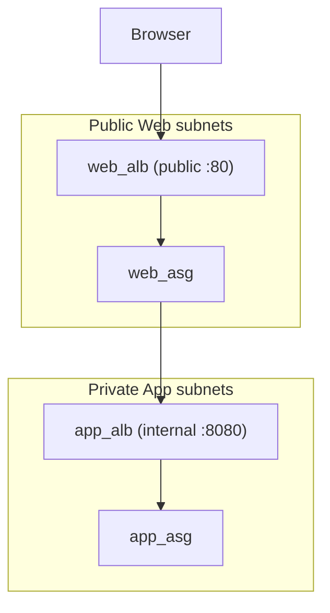

# Week 2 — Compute & Load Balancing (M6)

## Objective

Run servers you never log in to. Build an `asg` module (Launch Template + Auto Scaling group) and an `alb` module (load balancer + target group + listener). Each is called twice: once for Web, guided step by step — then once for App, from the same pattern, on your own. **Planned refactor:** the Web ALB becomes the only internet edge.

| | |
|---|---|
| **Builds on** | M3, M4, M5 |
| **Next** | M7 |
| **Time** | about 2.5 hours (one apply window) |
| **Cloud spend** | about $0.30 |
| **Capstone requirements** | 8 (self-healing compute), 9 (load balancing), 11 (runtime config) |

## Topics

- Immutable infrastructure: Launch Templates, user data, Auto Scaling groups
- Application Load Balancers: listeners, target groups, health checks
- Internet-facing vs. internal load balancers
- One module, called twice, with different inputs

## M6: Compute & Load Balancing

- **Learning Objective:** This guide will help you run self-healing tiers behind stable load-balancer addresses. We'll break it down into simple steps.
- **Core Idea:** How do we get servers that rebuild themselves, and one address that always reaches healthy ones?
- **Why It Matters:**
  - **Problem:** Hand-built servers drift, and every replacement gets a new IP address.
  - **Solution:** A Launch Template (the recipe), an Auto Scaling group (keeps N servers running), and an ALB (one address, healthy servers only).
- **How It Works:**
  - **Concepts:** Key terms:
    - **User data:** a boot script that configures each server on its first start.
    - **Target group:** the servers an ALB sends traffic to. The ASG registers them automatically.
    - **Health check:** a URL the ALB polls. Servers that fail it get no traffic.
    - **Runtime config:** values that only exist later (the App ALB address, the DB endpoint) are read from SSM at boot, with retries. That's why the apply order never matters.
  - **Best Practices:**
    - Put cost and security settings in the template: standard CPU credits, IMDSv2.
    - Once the ALB exists, the Web tier accepts port 80 **only** from the ALB's security group.
  - **Real-World Example:** Think of it like a Kubernetes Deployment behind a Service, but on EC2!
- **Supplemental Reading:**
  - [Launch templates](https://docs.aws.amazon.com/autoscaling/ec2/userguide/launch-templates.html)
  - [Auto Scaling groups](https://docs.aws.amazon.com/autoscaling/ec2/userguide/auto-scaling-groups.html)
  - [What is an Application Load Balancer?](https://docs.aws.amazon.com/elasticloadbalancing/latest/application/introduction.html)
  - [Health checks](https://docs.aws.amazon.com/elasticloadbalancing/latest/application/target-group-health-checks.html)

## Hands-on lab

**What you'll build:** one public front door, and a private hallway between the tiers.



**Checking servers without SSH.** Paste this helper into your shell. It runs a command on every server of a tier through Systems Manager:
```bash
run_on_tier() {  # usage: run_on_tier app 'curl -s localhost:8080/health'
  local id
  id=$(aws ssm send-command --region ap-southeast-1 --document-name AWS-RunShellScript \
    --targets "Key=tag:Name,Values=tf-bootcamp-dev-$1" \
    --parameters "commands=[\"$2\"]" --query Command.CommandId --output text)
  sleep 8
  aws ssm list-command-invocations --region ap-southeast-1 --command-id "$id" --details \
    --query 'CommandInvocations[].[InstanceId, CommandPlugins[0].Output]' --output text
}
```

### M6.1 — The `alb` module

**Apply window:** start of a 1.5-hour window · **Cost:** included below

Create `modules/alb/main.tf` (child-module `terraform {}` block, then):
```hcl
variable "name" { type = string }
variable "vpc_id" { type = string }
variable "subnet_ids" { type = list(string) }
variable "security_group_id" { type = string }
variable "internal" { type = bool }
variable "port" { type = number }
variable "health_check_path" { type = string }

resource "aws_lb" "this" {
  name               = "${var.name}-alb"
  load_balancer_type = "application"
  internal           = var.internal
  subnets            = var.subnet_ids
  security_groups    = [var.security_group_id]
}

resource "aws_lb_target_group" "this" {
  name                 = "${var.name}-tg"
  port                 = var.port
  protocol             = "HTTP"
  vpc_id               = var.vpc_id
  deregistration_delay = 30

  health_check {
    path     = var.health_check_path
    matcher  = "200"
    interval = 15
  }
}

resource "aws_lb_listener" "this" {
  load_balancer_arn = aws_lb.this.arn
  port              = var.port
  protocol          = "HTTP"

  default_action {
    type             = "forward"
    target_group_arn = aws_lb_target_group.this.arn
  }
}

output "dns_name" {
  value = aws_lb.this.dns_name
}

output "arn_suffix" {
  description = "The LoadBalancer dimension for CloudWatch metrics."
  value       = aws_lb.this.arn_suffix
}

output "target_group_arn" {
  value = aws_lb_target_group.this.arn
}
```

### M6.2 — The `asg` module

Create `modules/asg/main.tf` (child-module `terraform {}` block, then):
```hcl
variable "name" { type = string }
variable "ami_id" { type = string }
variable "subnet_ids" { type = list(string) }
variable "security_group_ids" { type = list(string) }
variable "instance_profile_name" { type = string }
variable "user_data" { type = string }
variable "min_size" { type = number }
variable "max_size" { type = number }

variable "target_group_arns" {
  type    = list(string)
  default = []
}

resource "aws_launch_template" "this" {
  name_prefix            = "${var.name}-"
  image_id               = var.ami_id
  instance_type          = "t3.micro"
  user_data              = base64encode(var.user_data)
  vpc_security_group_ids = var.security_group_ids

  iam_instance_profile {
    name = var.instance_profile_name
  }

  credit_specification {
    cpu_credits = "standard"
  }

  metadata_options {
    http_tokens = "required"
  }

  block_device_mappings {
    device_name = "/dev/sda1" # Ubuntu's root volume

    ebs {
      volume_size           = 8
      volume_type           = "gp3"
      encrypted             = true
      delete_on_termination = true
    }
  }

  tag_specifications {
    resource_type = "instance"
    tags          = { Name = var.name }
  }
}

resource "aws_autoscaling_group" "this" {
  name                      = "${var.name}-asg"
  min_size                  = var.min_size
  max_size                  = var.max_size
  desired_capacity          = var.min_size
  vpc_zone_identifier       = var.subnet_ids
  target_group_arns         = var.target_group_arns
  health_check_type         = length(var.target_group_arns) > 0 ? "ELB" : "EC2"
  health_check_grace_period = 300

  launch_template {
    id      = aws_launch_template.this.id
    version = aws_launch_template.this.latest_version
  }

  instance_refresh {
    strategy = "Rolling" # replace instances when the template changes
  }
}

output "name" {
  value = aws_autoscaling_group.this.name
}
```

### M6.3 — Wire them together in the root

1. Copy the two boot scripts from the course's `data/templates/` folder into `capstone/aws/templates/`. Together they are the **Flashcard Quiz** you'll demo in the capstone:
   - `web.sh.tftpl` installs Nginx and serves the quiz's **React** page at once. It then forwards `/api/` to the App ALB, when that address appears in SSM.
   - `app.sh.tftpl` installs **Node.js** (a pinned LTS version, checked against its official checksum) and starts the quiz API on port 8080: `/health`, `/cards`, `/answers`, `/stats`. The API connects to MySQL once the database exists (M7).

   Open them and skim them. Terraform fills in `${region}` and `${ssm_prefix}` through `templatefile()`.
2. **The refactor.** Add the two ALB groups to the tier map. The internet now only reaches the Web ALB:
   ```hcl
   tier_rules = {
     web_alb = { ports = [80], sources = ["0.0.0.0/0"] } # the only internet-facing ingress
     web     = { ports = [80], sources = ["web_alb"] }
     app_alb = { ports = [8080], sources = ["web"] }
     app     = { ports = [8080], sources = ["app_alb"] }
     db      = { ports = [3306], sources = ["app"] }
   }
   ```
   Add the App ALB's address to `runtime_config`, so Web servers can find it at boot:
   ```hcl
   "api/base_url" = "http://${module.app_alb.dns_name}:8080"
   ```
3. Call each module for the **Web** tier — this part is given in full:
   ```hcl
   module "web_alb" {
     source = "../../modules/alb"

     name              = "${var.project}-${var.environment}-web"
     vpc_id            = module.network.vpc_id
     subnet_ids        = module.network.subnet_ids["web"]
     security_group_id = module.security_groups.ids["web_alb"]
     internal          = false
     port              = 80
     health_check_path = "/"
   }

   module "web_asg" {
     source = "../../modules/asg"

     name                  = "${var.project}-${var.environment}-web"
     ami_id                = data.aws_ami.ubuntu.id
     subnet_ids            = module.network.subnet_ids["web"]
     security_group_ids    = [module.security_groups.ids["web"]]
     instance_profile_name = module.instance_role.instance_profile_name
     min_size              = 1
     max_size              = 2
     target_group_arns     = [module.web_alb.target_group_arn]
     user_data             = templatefile("${path.module}/templates/web.sh.tftpl", { region = var.aws_region, ssm_prefix = local.ssm_prefix })
   }
   ```
   **Now call both modules for the App tier yourself — `module "app_alb"` and `module "app_asg"`.** No code is given. Every module file you've built in this course so far reuses the exact same two-tier shape (a Web version and an App version, wired to `network.subnet_ids["app"]` and the App-tier security groups instead of Web's), so use that pattern here too. What has to match exactly, because every module from here to M12 refers to it by name:

   | | `app_alb` | `app_asg` |
   |---|---|---|
   | Module call name | `app_alb` | `app_asg` |
   | `name` input | ends in `-app`, not `-web` | ends in `-app`, not `-web` |
   | `subnet_ids` tier | `"app"` | `"app"` |
   | Security group | `module.security_groups.ids["app_alb"]` | `[module.security_groups.ids["app"]]` |
   | `internal` / traffic | `true` — no internet edge | — |
   | `port` / health check | `8080`, path `/health` | — |
   | `min_size` / `max_size` | — | `2` / `4` — the App tier runs one more server than Web, since it's the one every quiz answer passes through |
   | `target_group_arns` | — | `[module.app_alb.target_group_arn]` |
   | `user_data` template | — | `templates/app.sh.tftpl`, with the same two template variables as `web_asg` |

   Everything not listed above (`source`, `ami_id`, `instance_profile_name`, the template's `region`/`ssm_prefix` variables) is identical to the Web version. Add the guard so App servers never run without their NAT, and the deployment's one public address:
   ```hcl
   resource "terraform_data" "nat_guard" {
     lifecycle {
       precondition {
         condition     = var.nat_gateway_enabled
         error_message = "App instances need the NAT Gateway. Set nat_gateway_enabled = true."
       }
     }
   }

   output "web_url" {
     value = "http://${module.web_alb.dns_name}"
   }
   ```
4. Apply, wait about 5 minutes for the servers to boot, and test the whole path — this is also how you'll know `app_alb`/`app_asg` are wired correctly, since the check below only passes if a request actually makes it Browser → Web ALB → Nginx → App ALB → Node.js API and back:
   ```bash
   terraform init -backend-config=backend.hcl
   terraform apply
   curl -s "$(terraform output -raw web_url)" | grep -o '<title>.*</title>'   # <title>Terraform Flashcards</title>
   curl -s "$(terraform output -raw web_url)/api/health"                      # {"status":"ok"}
   ```
5. Open `web_url` in your browser. You'll see **Terraform Flashcards** with the message *"Cards unavailable … Is the database up?"*. That's expected: the cards live in MySQL, which you add in M7.

**If `/api/health` doesn't return `{"status":"ok"}`** within a few minutes of a healthy `web_url` page: `terraform state list | grep app_a` should show one `alb` and one `asg` under `module.app_alb`/`module.app_asg` — if either is missing, that module call wasn't written. If both exist, re-check every row of the table in step 3 against what you wrote; a `subnet_ids` or security-group input pointed at the wrong tier is the most common miss. `run_on_tier app 'curl -s localhost:8080/health'` (the helper above) tells you whether the App servers themselves are healthy, independent of the ALB in front of them.

## Lab exercise

**Prove the App tier heals itself.** Terminate one App server, and watch what the Auto Scaling group does.

<details><summary>Reference solution</summary>

```bash
ID=$(aws autoscaling describe-auto-scaling-groups --region ap-southeast-1 --auto-scaling-group-names tf-bootcamp-dev-app-asg \
  --query 'AutoScalingGroups[0].Instances[0].InstanceId' --output text)
aws ec2 terminate-instances --region ap-southeast-1 --instance-ids "$ID"
aws autoscaling describe-scaling-activities --region ap-southeast-1 --auto-scaling-group-name tf-bootcamp-dev-app-asg \
  --max-items 2 --query 'Activities[].Description' --output text
```
Within a few minutes, the log shows "Terminating…" then "Launching a new EC2 instance…". The group returns to 2, and the new server passes `/health`. This is a capstone failure proof, so save the output for `EVIDENCE.md`.
</details>

Then destroy:
```bash
terraform destroy
terraform state list   # expected: no output
```

## Next steps

Capstone tasks. **No reference solution.**

**N1 — Scale the App tier on CPU** (capstone requirement 8)
Add a target-tracking scaling policy to the `asg` module that keeps average CPU near **65%**. Turn it on for `app_asg` only.
- *Hint:* resource `aws_autoscaling_policy` with `policy_type = "TargetTrackingScaling"` and the predefined metric `ASGAverageCPUUtilization`. Make it optional: a variable that defaults to `null`, and `count`.
- *Done when:* `terraform plan` adds one `aws_autoscaling_policy`, inside `module.app_asg` only.

## Checkpoint (self-assessed)

- [ ] `alb` and `asg` are each one module, each called twice.
- [ ] You wrote `module "app_alb"` and `module "app_asg"` yourself, from the pattern in `web_alb`/`web_asg`, with no code given.
- [ ] `web_url` shows the Flashcard Quiz page, and `/api/health` returns `{"status":"ok"}` through both ALBs.
- [ ] The only `0.0.0.0/0` ingress left is on the Web ALB's security group.
- [ ] A terminated App server was replaced automatically.
- [ ] After `terraform destroy`, `terraform state list` prints nothing.
