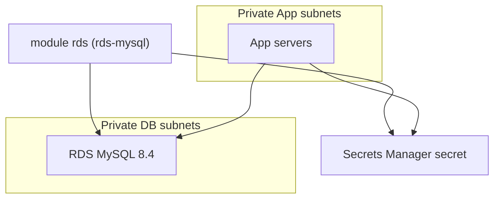

# Week 3 — Data Tier & Secrets (M7)

## Objective

Add the database without anyone ever typing its password. Build an `rds-mysql` module: a private, single-AZ MySQL 8.4 instance, with a password that Terraform generates and keeps in Secrets Manager. Then allow only the App tier to read that secret. You prove the App tier reaches the database and the Web tier cannot.

| | |
|---|---|
| **Builds on** | M4, M5, M6 |
| **Next** | M8 |
| **Time** | about 2 hours |
| **Cloud spend** | about $0.29 (RDS takes several minutes to create and delete) |
| **Capstone requirements** | 10 (data tier and secrets), 6 (Web cannot reach the DB) |

## Topics

- Amazon RDS in private subnets; single-AZ vs. Multi-AZ
- Secrets in IaC: `random_password` → Secrets Manager
- Parameter groups; MySQL 8.4 vs. 8.0 Extended Support

## M7: Data Tier & Secrets

- **Learning Objective:** This guide will help you add a private database whose password never appears in your code. We'll break it down into simple steps.
- **Core Idea:** How do we give the App tier a password that no human ever typed?
- **Why It Matters:**
  - **Problem:** A password in `main.tf` or a tfvars file stays in Git history forever.
  - **Solution:** Terraform generates it, Secrets Manager stores it, and exactly one IAM role can read it.
- **How It Works:**
  - **Concepts:** Key terms:
    - **DB subnet group:** the private subnets RDS may use.
    - **Multi-AZ:** a standby copy in another AZ. It roughly doubles the cost, so this course runs single-AZ.
    - **Extended Support:** a paid fee for old engine versions. MySQL 8.0 entered it on 1 August 2026, so we use **8.4**.
  - **Best Practices:**
    - `random_password` keeps the password out of code, **but not out of state**: keep state encrypted and private.
    - Lab databases skip backups and final snapshots, so `destroy` never blocks and nothing bills afterwards.
  - **Real-World Example:** Think of it like a password manager holding a generated password for a hosted database.
- **Supplemental Reading:**
  - [MySQL on Amazon RDS versions](https://docs.aws.amazon.com/AmazonRDS/latest/UserGuide/MySQL.Concepts.VersionMgmt.html)
  - [Multi-AZ deployments](https://docs.aws.amazon.com/AmazonRDS/latest/UserGuide/Concepts.MultiAZ.html)
  - [RDS + Secrets Manager](https://docs.aws.amazon.com/AmazonRDS/latest/UserGuide/rds-secrets-manager.html)
  - [Manage sensitive data in Terraform](https://developer.hashicorp.com/terraform/language/manage-sensitive-data)

## Hands-on lab

**What you'll build:** only the App tier can read the secret and reach the database.



### M7 — The `rds-mysql` module

**Apply window:** about 1.25 hours · **Cost:** $0.29

1. Pin `random` in the root's `required_providers` (`source = "hashicorp/random"`, `version = "3.9.1"`). Create `modules/rds-mysql/main.tf`:
   ```hcl
   terraform {
     required_providers {
       aws = {
         source  = "hashicorp/aws"
         version = ">= 6.0"
       }
       random = {
         source  = "hashicorp/random"
         version = ">= 3.6"
       }
     }
   }

   variable "name" { type = string }
   variable "subnet_ids" { type = list(string) }
   variable "security_group_id" { type = string }

   variable "instance_class" {
     type    = string
     default = "db.t4g.micro"
   }

   variable "allocated_storage_gb" {
     type    = number
     default = 20
   }

   resource "random_password" "master" {
     length           = 24
     override_special = "!#%^*()-_=+[]{}<>?" # RDS rejects /, @, " and spaces
   }

   resource "aws_secretsmanager_secret" "master" {
     name                    = "${var.name}/db/master"
     recovery_window_in_days = 0 # delete at once, so the next session can reuse the name
   }

   resource "aws_secretsmanager_secret_version" "master" {
     secret_id     = aws_secretsmanager_secret.master.id
     secret_string = jsonencode({ username = "appadmin", password = random_password.master.result })
   }

   resource "aws_db_subnet_group" "this" {
     name       = "${var.name}-db-subnets"
     subnet_ids = var.subnet_ids
   }

   resource "aws_db_instance" "this" {
     identifier             = "${var.name}-db"
     engine                 = "mysql"
     engine_version         = "8.4"
     instance_class         = var.instance_class
     allocated_storage      = var.allocated_storage_gb
     storage_type           = "gp3"
     storage_encrypted      = true
     db_name                = "app"
     username               = "appadmin"
     password               = random_password.master.result
     multi_az               = false
     publicly_accessible    = false
     db_subnet_group_name   = aws_db_subnet_group.this.name
     vpc_security_group_ids = [var.security_group_id]

     # Lab settings: nothing bills after destroy, nothing blocks destroy.
     backup_retention_period = 0
     skip_final_snapshot     = true
     apply_immediately       = true
   }

   output "address" {
     value = aws_db_instance.this.address
   }

   output "identifier" {
     value = aws_db_instance.this.identifier
   }

   output "secret_arn" {
     value = aws_secretsmanager_secret.master.arn
   }
   ```
2. In the root, call it:
   ```hcl
   module "rds" {
     source = "../../modules/rds-mysql"

     name              = "${var.project}-${var.environment}"
     subnet_ids        = module.network.subnet_ids["db"]
     security_group_id = module.security_groups.ids["db"]
   }
   ```
   Then connect it to what already exists. Add one statement to `module "instance_role"`'s `policy_statements`, so the servers may read **this one** secret:
   ```hcl
       {
         actions   = ["secretsmanager:GetSecretValue"]
         resources = [module.rds.secret_arn]
       },
   ```
   Add two entries to `runtime_config`. The App boot script has been waiting for them since M6:
   ```hcl
   "db/endpoint"   = module.rds.address
   "db/secret_arn" = module.rds.secret_arn
   ```
3. Plan and check the password is hidden, then apply (about 10 minutes):
   ```bash
   terraform init -backend-config=backend.hcl
   terraform plan | grep -i 'password '     # expected: password = (sensitive value)
   terraform apply
   ```
4. Prove the App tier reaches the database through the front door, and the Web tier cannot:
   ```bash
   curl -s "$(terraform output -raw web_url)/api/db"      # {"db":"reachable","host":"tf-bootcamp-dev-db…"}
   curl -s "$(terraform output -raw web_url)/api/cards" | grep -o '"id"' | wc -l      # 10: the API created and seeded its tables
   DB=$(aws ssm get-parameter --region ap-southeast-1 --name /tf-bootcamp/dev/db/endpoint --query Parameter.Value --output text)
   run_on_tier web "timeout 5 bash -c '</dev/tcp/$DB/3306' && echo OPEN || echo BLOCKED"   # expected: BLOCKED
   ```
5. **Play the quiz.** Open `web_url` in your browser: the cards are there now. Answer a few, then reload the page. Your score is still there, because it's saved in RDS. Watch the footer's *Answered by App server* line: it changes between your App servers, because the internal ALB spreads the requests.

## Lab exercise

**Where does the generated password actually live?** The plan hides it. Prove whether Terraform stores it anywhere, without printing it.

<details><summary>Reference solution</summary>

```bash
terraform state pull | grep -c '"result":'   # expected: 1 or more
```
The password is in **state**, so anyone who can read the state bucket can read it. That's why M1 made the bucket encrypted and private. RDS-managed master passwords (`manage_master_user_password`) keep it out of state entirely.
</details>

Then destroy (RDS takes a few minutes):
```bash
terraform destroy
terraform state list   # expected: no output
```

## Next steps

Capstone tasks. **No reference solution.**

**N1 — Turn on the slow-query log** (capstone requirement 10)
Inside the `rds-mysql` module, attach a custom parameter group that sets `slow_query_log = 1`, without replacing the database.
- *Hints:*
  - Use family `mysql8.4`, `name_prefix`, and `lifecycle { create_before_destroy = true }`.
  - AWS applies a **newly attached** group only after one reboot, even for dynamic parameters: `aws rds reboot-db-instance`.
- *Done when:*
  - the plan says `aws_db_instance.this will be updated in-place`, never `must be replaced`;
  - after the reboot, the group's `ParameterApplyStatus` is `in-sync`.

## Checkpoint (self-assessed)

- [ ] The plan shows the password only as `(sensitive value)`. No password is in any `.tf` or `.tfvars` file.
- [ ] RDS runs MySQL 8.4, single-AZ, not public, encrypted.
- [ ] `/api/db` returns `"reachable"`, the Web tier's port test returns `BLOCKED`, and the quiz shows 10 cards and keeps your score after a reload.
- [ ] After `terraform destroy`, `terraform state list` prints nothing, and `bootstrap/` still exists.
