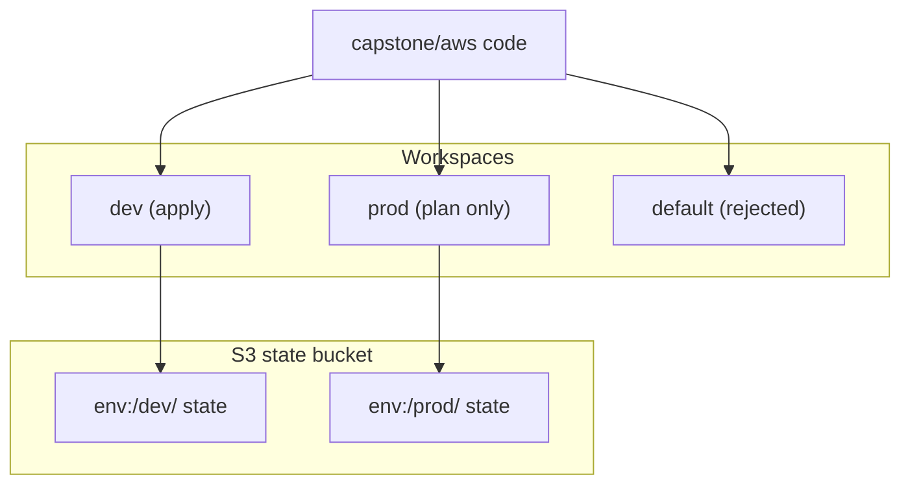

# Week 3 — Environments with Workspaces (M8)

## Objective

Run `dev` and `prod` from one codebase. Create workspaces, size everything from one map keyed by the workspace, and add guards so that a plan in the wrong workspace, or with mismatched input, fails before anything is created. `prod` is only ever planned.

| | |
|---|---|
| **Builds on** | M1 (validation), M4–M7 |
| **Next** | M9 |
| **Time** | about 1.5 hours |
| **Cloud spend** | about $0.20 (dev only) |
| **Capstone requirements** | 3 (environments) |

## Topics

- `terraform workspace` and per-workspace state
- Conditional expressions and lookup maps
- Preconditions as guards

## M8: Environments with Workspaces

- **Learning Objective:** This guide will help you run two environments from one codebase, safely. We'll break it down into simple steps.
- **Core Idea:** How do `dev` and `prod` differ without copying folders?
- **Why It Matters:**
  - **Problem:** Copied `dev/` and `prod/` folders drift, and prod-sized practice runs burn the budget.
  - **Solution:** Workspaces give each environment its own state, and one sizing map chosen by `terraform.workspace` holds every difference.
- **How It Works:**
  - **Concepts:** Key terms:
    - **Workspace:** a named state under the same backend. The S3 backend stores it under `env:/<name>/`.
    - **`terraform.workspace`:** the current workspace's name.
    - **Ternary:** `condition ? a : b`.
    - **Precondition:** a check that fails the plan with your message.
  - **Best Practices:**
    - Keep every environment difference in **one** map.
    - Make `terraform workspace show` step 1 of every session.
  - **Real-World Example:** Think of it like `NODE_ENV=production` switching config, but for infrastructure!
- **Supplemental Reading:**
  - [Workspaces (CLI)](https://developer.hashicorp.com/terraform/cli/workspaces)
  - [Conditional expressions](https://developer.hashicorp.com/terraform/language/expressions/conditionals)
  - [Validate configuration (preconditions)](https://developer.hashicorp.com/terraform/language/validate)

## Hands-on lab

**What you'll build:** one codebase with one state per workspace. `dev` is applied, `prod` is only planned, and `default` is rejected.



### M8 — `dev` and `prod` from one codebase

**Apply window:** 1 hour (dev only) · **Cost:** $0.20

1. Create the workspaces, and a tfvars file per workspace:
   ```bash
   terraform workspace new dev && terraform workspace new prod && terraform workspace select dev
   mkdir -p env && printf 'environment = "dev"\n' > env/dev.tfvars && printf 'environment = "prod"\n' > env/prod.tfvars
   ```
2. In `capstone/aws/main.tf`, name everything after the workspace and add the sizing map. Remove `default = "dev"` from `var.environment` (keep its validation):
   ```hcl
   locals {
     name_prefix = "${var.project}-${terraform.workspace}"
     ssm_prefix  = "/${var.project}/${terraform.workspace}"

     sizing = {
       dev  = { web_min = 1, web_max = 2, app_min = 1, app_max = 2 }
       prod = { web_min = 2, web_max = 4, app_min = 2, app_max = 4 }
     }
     size = local.sizing[terraform.workspace == "prod" ? "prod" : "dev"]
   }
   ```
   Use `local.name_prefix` wherever a `name` was built from `var.environment`. In `module "web_asg"` and `module "app_asg"`, replace the hardcoded sizes with `local.size.web_min`, `local.size.web_max`, `local.size.app_min` and `local.size.app_max`. Change the `ssm_prefix` in your locals to the workspace version above, and update the `nat_guard` condition to `var.nat_gateway_enabled || local.size.app_min == 0`.
3. Add the guard:
   ```hcl
   resource "terraform_data" "workspace_guard" {
     lifecycle {
       precondition {
         condition     = contains(["dev", "prod"], terraform.workspace)
         error_message = "Select the dev or prod workspace (terraform workspace select dev). The default workspace is not used."
       }
       precondition {
         condition     = var.environment == terraform.workspace
         error_message = "var.environment must match the workspace. Use -var-file=env/${terraform.workspace}.tfvars."
       }
     }
   }
   ```
4. Prove the guard, plan `prod` (plan only), then apply `dev`:
   ```bash
   terraform workspace select default && terraform plan -var-file=env/dev.tfvars   # expected: Resource precondition failed
   terraform workspace select prod && terraform plan -var-file=env/prod.tfvars | grep -E 'min_size|max_size'
   terraform workspace select dev && terraform apply -var-file=env/dev.tfvars
   ```
   From now on every command takes `-var-file=env/$(terraform workspace show).tfvars`.

## Lab exercise

**Prove the second guard.** Select `prod`, but plan with the **dev** tfvars. What stops it, and why is that useful?

<details><summary>Reference solution</summary>

```text
Error: Resource precondition failed
…
var.environment must match the workspace. Use -var-file=env/prod.tfvars.
```
The workspace picks the state file and the sizes; the tfvars pick `var.environment`. The guard makes them agree, so prod-sized resources can never be planned under dev names.
</details>

Then destroy:
```bash
terraform destroy -var-file=env/dev.tfvars
terraform state list   # expected: no output
```

## Next steps

Capstone tasks. **No reference solution.**

**N1 — A bigger database for `prod`** (capstone requirement 3)
Make `prod` plan a larger RDS class (`db.t4g.small`) and more storage (30 GB) than `dev` (`db.t4g.micro`, 20 GB), from the same sizing map.
- *Hint:* add two keys to each entry in `local.sizing`, then pass them to `module "rds"` as `instance_class` and `allocated_storage_gb`. The module already has both inputs.
- *Done when:* the `prod` plan shows the larger `instance_class` and `allocated_storage`, and the `dev` plan is unchanged.

## Checkpoint (self-assessed)

- [ ] A plan in the `default` workspace fails with your precondition message.
- [ ] The `prod` plan shows larger ASG sizes than `dev`, and prod was never applied.
- [ ] After `terraform destroy`, `terraform state list` prints nothing.
