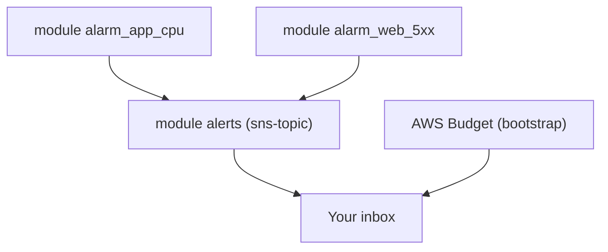

# Week 3 — Observability & FinOps (M9)

## Objective

Find out about problems before your users do, and see what the stack costs. Build an `sns-topic` module that emails you, and a `cloudwatch-alarm` module that you call once per alarm. Add a dashboard as code, and an account-wide AWS Budget alarm in `bootstrap/`, which keeps watching between sessions.

| | |
|---|---|
| **Builds on** | M1 (bootstrap), M6, M7 |
| **Next** | M10 |
| **Time** | about 2 hours |
| **Cloud spend** | about $0.15 |
| **Capstone requirements** | 12 (alerting and dashboard), 13 (budget) |

## Topics

- CloudWatch metrics and alarms; SNS publish/subscribe
- A generic module called several times with different inputs
- Dashboards as code with `jsonencode`
- FinOps: AWS Budgets, actual vs. forecast alerts

## M9: Observability & FinOps

- **Learning Objective:** This guide will help you get told about problems and spending before they hurt. We'll break it down into simple steps.
- **Core Idea:** How does the stack tell you when something is wrong, or expensive?
- **Why It Matters:**
  - **Problem:** Without alerts, the first sign of trouble is a user complaint, or the bill. The full stack left running overnight quietly adds up: alarms catch it before the bill does.
  - **Solution:** Alarms on AWS's free built-in metrics → SNS → email, plus a budget with early warnings.
- **How It Works:**
  - **Concepts:** Key terms:
    - **Metric:** a number over time, such as `CPUUtilization`.
    - **Alarm:** fires when a metric crosses a threshold for N periods.
    - **`treat_missing_data`:** what an alarm assumes when there's no data.
    - **Actual vs. forecast alert:** "you have spent X" vs. "you're on course to spend X".
  - **Best Practices:**
    - Stay inside the free allowances: at most 3 dashboards and 10 alarms.
    - A budget alert is a warning, not a cap. `terraform destroy` is the real guardrail.
  - **Real-World Example:** Think of it like a smoke detector wired to your phone, plus your bank's spending alert.
- **Supplemental Reading:**
  - [CloudWatch alarms](https://docs.aws.amazon.com/AmazonCloudWatch/latest/monitoring/CloudWatch_Alarms.html)
  - [What is Amazon SNS?](https://docs.aws.amazon.com/sns/latest/dg/welcome.html)
  - [Managing costs with AWS Budgets](https://docs.aws.amazon.com/cost-management/latest/userguide/budgets-managing-costs.html)
  - [CloudWatch pricing](https://aws.amazon.com/cloudwatch/pricing/)

## Hands-on lab

**What you'll build:** alarms that email you, and a budget that outlives every session.



### M9 — Alarms, dashboard and budget

**Apply window:** 45 minutes · **Cost:** $0.15

1. Create `modules/sns-topic/main.tf` (child-module `terraform {}` block, then):
   ```hcl
   variable "name" { type = string }

   variable "email" {
     description = "Subscriber email. Empty = no subscription."
     type        = string
     default     = ""
   }

   resource "aws_sns_topic" "this" {
     name = var.name
   }

   resource "aws_sns_topic_subscription" "email" {
     count     = var.email == "" ? 0 : 1
     topic_arn = aws_sns_topic.this.arn
     protocol  = "email"
     endpoint  = var.email # AWS emails a confirmation link: click it
   }

   output "arn" {
     value = aws_sns_topic.this.arn
   }
   ```
2. Create `modules/cloudwatch-alarm/main.tf` (child-module `terraform {}` block, then). One module, one alarm:
   ```hcl
   variable "name" { type = string }
   variable "namespace" { type = string }
   variable "metric_name" { type = string }
   variable "dimensions" { type = map(string) }
   variable "statistic" { type = string }
   variable "comparison_operator" { type = string }
   variable "threshold" { type = number }
   variable "alarm_actions" { type = list(string) }

   variable "period" {
     type    = number
     default = 300
   }

   variable "evaluation_periods" {
     type    = number
     default = 1
   }

   variable "treat_missing_data" {
     type    = string
     default = "missing"
   }

   resource "aws_cloudwatch_metric_alarm" "this" {
     alarm_name          = var.name
     namespace           = var.namespace
     metric_name         = var.metric_name
     dimensions          = var.dimensions
     statistic           = var.statistic
     period              = var.period
     evaluation_periods  = var.evaluation_periods
     threshold           = var.threshold
     comparison_operator = var.comparison_operator
     treat_missing_data  = var.treat_missing_data
     alarm_actions       = var.alarm_actions
   }
   ```
3. In the root, add an `alert_email` variable (string, default `""`), and put your address in `env/dev.tfvars`. Then call the topic once and the alarm module twice:
   ```hcl
   module "alerts" {
     source = "../../modules/sns-topic"

     name  = "${local.name_prefix}-alerts"
     email = var.alert_email
   }

   module "alarm_app_cpu" {
     source = "../../modules/cloudwatch-alarm"

     name                = "${local.name_prefix}-app-cpu-high"
     namespace           = "AWS/EC2"
     metric_name         = "CPUUtilization"
     dimensions          = { AutoScalingGroupName = module.app_asg.name }
     statistic           = "Average"
     evaluation_periods  = 2
     comparison_operator = "GreaterThanThreshold"
     threshold           = 80
     alarm_actions       = [module.alerts.arn]
   }

   module "alarm_web_5xx" {
     source = "../../modules/cloudwatch-alarm"

     name                = "${local.name_prefix}-web-alb-5xx"
     namespace           = "AWS/ApplicationELB"
     metric_name         = "HTTPCode_ELB_5XX_Count"
     dimensions          = { LoadBalancer = module.web_alb.arn_suffix }
     statistic           = "Sum"
     comparison_operator = "GreaterThanOrEqualToThreshold"
     threshold           = 5
     treat_missing_data  = "notBreaching" # no traffic means no errors
     alarm_actions       = [module.alerts.arn]
   }
   ```
4. Add the dashboard to the root. `jsonencode` turns HCL into the JSON CloudWatch expects:
   ```hcl
   resource "aws_cloudwatch_dashboard" "stack" {
     dashboard_name = "${local.name_prefix}-3tier"

     dashboard_body = jsonencode({
       widgets = [
         {
           type   = "metric"
           x      = 0
           y      = 0
           width  = 12
           height = 6
           properties = {
             title  = "Tier CPU (%)"
             region = var.aws_region
             stat   = "Average"
             period = 300
             metrics = [
               ["AWS/EC2", "CPUUtilization", "AutoScalingGroupName", module.web_asg.name],
               ["AWS/EC2", "CPUUtilization", "AutoScalingGroupName", module.app_asg.name],
             ]
           }
         },
         {
           type   = "metric"
           x      = 12
           y      = 0
           width  = 12
           height = 6
           properties = {
             title   = "Web ALB requests"
             region  = var.aws_region
             stat    = "Sum"
             period  = 300
             metrics = [["AWS/ApplicationELB", "RequestCount", "LoadBalancer", module.web_alb.arn_suffix]]
           }
         },
       ]
     })
   }
   ```
5. Add the budget to **`bootstrap/`** in a new file, `budget.tf`, and apply bootstrap:
   ```hcl
   variable "budget_alert_emails" { type = list(string) }

   resource "aws_budgets_budget" "account" {
     name         = "${var.project}-monthly"
     budget_type  = "COST"
     limit_amount = "5"
     limit_unit   = "USD"
     time_unit    = "MONTHLY"

     notification {
       comparison_operator        = "GREATER_THAN"
       threshold                  = 40 # $2: stop and check what is running
       threshold_type             = "PERCENTAGE"
       notification_type          = "ACTUAL"
       subscriber_email_addresses = var.budget_alert_emails
     }

     notification {
       comparison_operator        = "GREATER_THAN"
       threshold                  = 80 # $4
       threshold_type             = "PERCENTAGE"
       notification_type          = "ACTUAL"
       subscriber_email_addresses = var.budget_alert_emails
     }
   }
   ```
   ```bash
   terraform -chdir=../../bootstrap apply -var 'budget_alert_emails=["you@example.com"]'
   ```
6. Apply the stack, click the SNS confirmation email, and test an alarm without creating any load:
   ```bash
   terraform init -backend-config=backend.hcl
   terraform apply -var-file=env/dev.tfvars
   aws cloudwatch set-alarm-state --region ap-southeast-1 --alarm-name tf-bootcamp-dev-app-cpu-high \
     --state-value ALARM --state-reason "M9 test"                   # expected: an ALARM email within a minute
   ```

## Lab exercise

**Why `notBreaching`?** Straight after an apply, with no traffic, list your alarms' states. Explain why the 5xx alarm is `OK`, not `INSUFFICIENT_DATA`.

<details><summary>Reference solution</summary>

```bash
aws cloudwatch describe-alarms --region ap-southeast-1 --alarm-name-prefix tf-bootcamp-dev \
  --query 'MetricAlarms[].[AlarmName,StateValue]' --output table
```
With no requests there are no 5xx data points. `treat_missing_data = "notBreaching"` reads "no data" as "no errors", so the alarm settles at `OK`. The CPU alarm may show `INSUFFICIENT_DATA` for a few minutes, until metrics arrive.
</details>

Then destroy the stack (not `bootstrap/`):
```bash
terraform destroy -var-file=env/dev.tfvars
terraform state list   # expected: no output
```

## Next steps

Capstone tasks. **No reference solution.**

**N1 — Warn before the database disk fills** (capstone requirement 12)
Call the `cloudwatch-alarm` module a third time: alert the same topic when RDS free storage drops below **2 GB**.
- *Hint:* the metric is `FreeStorageSpace` in `AWS/RDS`, with dimension `DBInstanceIdentifier` (`module.rds.identifier`). It's measured in **bytes**.
- *Done when:* three alarms exist, and a forced `ALARM` on the new one emails you.

**N2 — Warn on forecast, not just actual** (capstone requirement 13)
Add a third notification to the budget, which fires when spend is **forecast** to pass 100%.
- *Hint:* copy a notification block; change its type and its threshold.
- *Done when:* `aws budgets describe-notifications-for-budget` lists `ACTUAL 40`, `ACTUAL 80` and `FORECASTED 100`.

## Checkpoint (self-assessed)

- [ ] The SNS subscription is confirmed, and a forced ALARM reached your inbox.
- [ ] One `cloudwatch-alarm` module is called once per alarm.
- [ ] The dashboard shows tier CPU and Web ALB requests.
- [ ] The budget lives in `bootstrap/`, with actual alerts at 40% and 80%.
- [ ] After `terraform destroy`, `terraform state list` prints nothing, and `bootstrap/` still exists.
