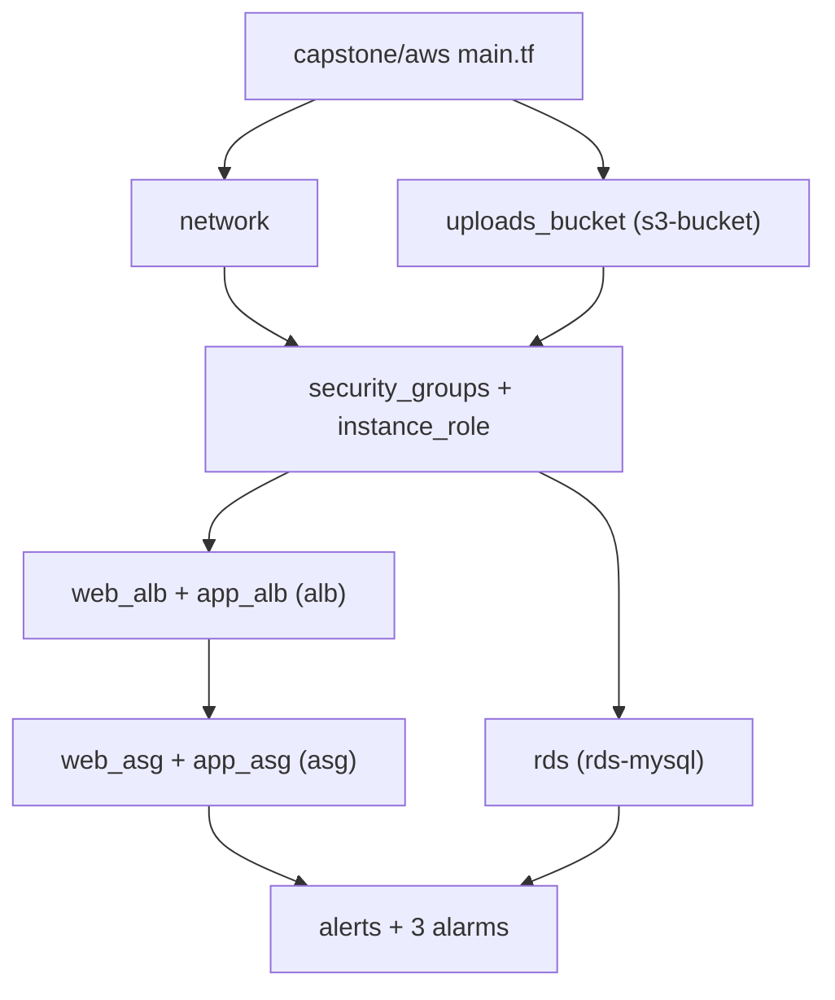

# Week 4 — Deployment: The Full AWS Stack (M10)

## Objective

Bring M1–M9 together. Deploy the complete `capstone/aws` stack in one run, and learn what to expect at every stage: the plan, the apply, the outputs, the health checks, and the **Flashcard Quiz** working in your browser. Prove it works, then tear it all down. This is the rehearsal for your capstone demo.

| | |
|---|---|
| **Builds on** | M1–M9, including their Next steps |
| **Next** | M11 |
| **Time** | about 2 hours (one 1.5-hour apply window) |
| **Cloud spend** | about $0.30 (≈ $0.20 per hour while the stack is up) |
| **Capstone requirements** | 9, 10, 11, 12 and 18 end to end; the Documentation Gate |

## Topics

- How a root module composes child modules
- Reading a large plan: counting, grouping, spotting surprises
- Outputs as the contract of a deployment
- Verifying a deployment tier by tier; idempotency; clean teardown

## M10: Deployment — The Full AWS Stack

- **Learning Objective:** This guide will help you deploy, verify and destroy the whole AWS stack with confidence. We'll break it down into simple steps.
- **Core Idea:** What should a correct deployment look like, before, during and after `apply`?
- **Why It Matters:**
  - **Problem:** A 75-resource apply that you can't predict is one you can't trust, or debug.
  - **Solution:** Know the expected plan, apply order, outputs and checks in advance, and compare each one as you go.
- **How It Works:**
  - **Concepts:** Terraform builds one dependency graph across all modules and creates independent resources in parallel. Key terms:
    - **Resource address:** e.g. `module.web_alb.aws_lb.this`; the module prefix tells you which module call owns it.
    - **Outputs:** the values a deployment promises to hand over (URLs, names, ARNs).
    - **Idempotent:** a second `plan` straight after `apply` says `No changes`.
  - **Best Practices:**
    - Save the plan (`-out=tfplan`) and apply exactly that file, so what you reviewed is what runs.
    - Verify from the outside in: page, then API, then database, then the security boundaries.
  - **Real-World Example:** Think of it like a release checklist for a web app, where every step has an expected result.
- **Supplemental Reading:**
  - [`terraform plan`](https://developer.hashicorp.com/terraform/cli/commands/plan)
  - [`terraform apply`](https://developer.hashicorp.com/terraform/cli/commands/apply)
  - [Outputs](https://developer.hashicorp.com/terraform/language/values/outputs)
  - [Resource graph](https://developer.hashicorp.com/terraform/internals/graph)

## Hands-on lab

**What you'll build:** everything from M1–M9, applied in one run, in dependency order.



### M10 — Deploy, verify, destroy

**Apply window:** 1.5 hours · **Cost:** about $0.30

1. **Pre-flight.** Start clean, and check the code before spending anything:
   ```bash
   cd capstone/aws
   terraform workspace show                 # expected: dev
   terraform state list                     # expected: no output (nothing running)
   terraform fmt -check -recursive ../..    # expected: no output
   terraform validate                       # expected: Success! The configuration is valid.
   ```
2. **Outputs: the deployment's contract.** Make sure `outputs.tf` hands over everything the capstone needs:
   ```hcl
   output "web_url" {
     value = "http://${module.web_alb.dns_name}"
   }

   output "uploads_bucket" {
     value = module.uploads_bucket.name
   }

   output "db_secret_arn" {
     value = module.rds.secret_arn
   }

   output "dashboard_name" {
     value = aws_cloudwatch_dashboard.stack.dashboard_name
   }
   ```
3. **Plan, and compare it with the expected result:**
   ```bash
   terraform plan -var-file=env/dev.tfvars -out=tfplan
   ```
   Expected, with an `alert_email` set and all Next steps from M1–M9 done: **`Plan: 75 to add, 0 to change, 0 to destroy.`**

   | Address | To add | What they are |
   |---|---|---|
   | root | 7 | 2 guards (`terraform_data`), 4 SSM parameters (`runtime_config`), 1 dashboard |
   | `module.uploads_bucket` | 2 | bucket, public-access block |
   | `module.network` | 22 | VPC, 6 subnets, IGW, NAT + EIP, 3 route tables, 2 routes, 6 associations, S3 endpoint |
   | `module.security_groups` | 18 | 5 security groups, 5 ingress + 8 egress rules |
   | `module.instance_role` | 4 | role, inline policy, SSM policy attachment, instance profile |
   | `module.web_alb`, `module.app_alb` | 3 + 3 | load balancer, target group, listener |
   | `module.web_asg`, `module.app_asg` | 2 + 3 | Launch Template, Auto Scaling group (+ CPU policy on App) |
   | `module.rds` | 6 | password, secret + version, subnet group, parameter group, RDS instance |
   | `module.alerts` | 2 | SNS topic, email subscription |
   | `module.alarm_*` | 3 | one alarm each: App CPU, Web 5xx, RDS storage |

   A different total isn't automatically wrong. Find which address differs, and check that module's Next steps. Without an `alert_email`, it's 74.
4. **Apply exactly what you reviewed:**
   ```bash
   terraform apply tfplan
   ```
   What to expect while it runs (about 10–15 minutes):
   - **First minute:** the VPC, subnets, security groups, IAM, S3 and SSM appear. They're quick, and many run in parallel.
   - **About 2 minutes:** the NAT Gateway and both ALBs become active. The ASGs launch instances as soon as their target groups exist.
   - **5–10 minutes:** the RDS instance is the slowest resource by far. The apply waits for it.
   - **End:** `Apply complete! Resources: 75 added, 0 changed, 0 destroyed.`, followed by your outputs.
5. **Read the outputs:**
   ```bash
   terraform output
   ```
   Expected shape:
   ```text
   dashboard_name = "tf-bootcamp-dev-3tier"
   db_secret_arn  = "arn:aws:secretsmanager:ap-southeast-1:<account-id>:secret:tf-bootcamp-dev/db/master-<suffix>"
   uploads_bucket = "tf-bootcamp-dev-uploads-<account-id>"
   web_url        = "http://tf-bootcamp-dev-web-alb-<id>.ap-southeast-1.elb.amazonaws.com"
   ```
6. **Verify, from the outside in.** Instances need about 5 minutes after launch to boot and pass health checks.

   | # | Check | Command | Expected |
   |---|---|---|---|
   | 1 | Web page | `curl -s "$(terraform output -raw web_url)" \| grep -o '<title>.*</title>'` | `<title>Terraform Flashcards</title>` |
   | 2 | API through both ALBs | `curl -s "$(terraform output -raw web_url)/api/health"` | `{"status":"ok"}` |
   | 3 | Database from the App tier | `curl -s "$(terraform output -raw web_url)/api/db"` | `{"db":"reachable",…}` |
   | 3b | Cards come from RDS | `curl -s "$(terraform output -raw web_url)/api/cards" \| grep -o '"id"' \| wc -l` | `10` |
   | 4 | Web tier can't reach the DB | the `run_on_tier web …/3306` test from M7 | `BLOCKED` |
   | 5 | Runtime config | `aws ssm get-parameters-by-path --region ap-southeast-1 --path /tf-bootcamp/dev --recursive --query 'length(Parameters)'` | `4` |
   | 6 | Alarms | `aws cloudwatch describe-alarms --region ap-southeast-1 --alarm-name-prefix tf-bootcamp-dev --query 'length(MetricAlarms)'` | `3` |
   | 7 | Idempotency | `terraform plan -var-file=env/dev.tfvars` | `No changes.` |
   | 8 | **The app** | open `web_url` in a browser, answer three cards, reload | the score survives the reload; *Answered by App server* shows both servers over time |
7. **Destroy, and prove it:**
   ```bash
   terraform destroy -var-file=env/dev.tfvars
   terraform state list
   ```
   Expected: `Destroy complete! Resources: 75 destroyed.`, the same number you added, and no output from `state list`.

**If something goes wrong:**

| Symptom | Likely cause | Fix |
|---|---|---|
| Targets stay `unhealthy` | Instances still booting, or App instances can't reach the internet | Wait 5 minutes; check `nat_gateway_enabled = true` |
| `/api/health` returns a 502 or the page instead | Web instances booted before the App ALB's address existed | `aws autoscaling start-instance-refresh --region ap-southeast-1 --auto-scaling-group-name tf-bootcamp-dev-web-asg` |
| The quiz says "Cards unavailable" | RDS is still being created (it's the slowest resource) | Wait and reload: the API connects as soon as the DB endpoint appears in SSM |
| `apply` fails: secret "scheduled for deletion" | An earlier secret was not deleted at once | Check `recovery_window_in_days = 0` on the secret |
| `destroy` fails part-way | A dependency is still being deleted | Run `terraform destroy` again; `state list` shows what's left |

## Lab exercise

**Predict a one-line change.** With the stack applied, change `app_max` for `dev` from 2 to 3 in the sizing map. What will `plan` say?

<details><summary>Reference solution</summary>

```text
  # module.app_asg.aws_autoscaling_group.this will be updated in-place
  ~ max_size = 2 -> 3
Plan: 0 to add, 1 to change, 0 to destroy.
```
Changing a size is an in-place update: no instance is replaced. Set it back to 2 before you destroy.
</details>

## Next steps

Capstone tasks. **No reference solution.**

**N1 — Start your capstone evidence** (capstone Documentation Gate)
Create `EVIDENCE.md` at the root of your repository, and record this deployment in it:
- the plan summary line;
- your `terraform output`;
- the result of each check in step 6, plus a screenshot of the quiz;
- the destroy summary, and the empty `terraform state list`, with the date and time.
- *Done when:* each entry holds your **real** output (your account ID, your ALB name), not a copy of the expected values above.

## Checkpoint (self-assessed)

- [ ] Your plan matched the expected total, or you can explain the difference module by module.
- [ ] All checks in step 6 passed, including the quiz in your browser.
- [ ] A second `plan` straight after `apply` said `No changes`.
- [ ] Destroy removed as many resources as apply added, and `terraform state list` prints nothing.
