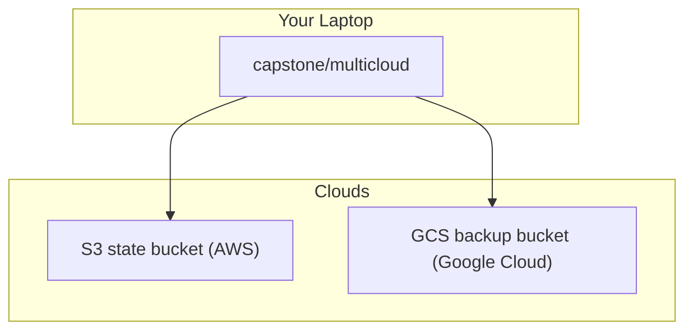

# Week 4 — Multi-Cloud with GCP: Off-Site Backup (M11)

## Objective

Take Terraform beyond AWS. Start a second root, `capstone/multicloud/`, with its own state, that uses the `google` provider alongside `aws`. In it, build a locked-down Google Cloud Storage bucket in Singapore to keep the database backups away from AWS.

| | |
|---|---|
| **Builds on** | M1 (state bucket), M10 (the database to back up) |
| **Next** | M12 |
| **Time** | about 1.5 hours |
| **Cloud spend** | under $0.01 |
| **Capstone requirements** | 14 (multi-cloud root), 15 (off-site backup) |

## Topics

- Several providers in one root; credentials from your shell login
- Google Cloud Storage vs. S3
- Storage classes and lifecycle rules
- Locked-down buckets: uniform access, public access prevention

## M11: Multi-Cloud with GCP: Off-Site Backup

- **Learning Objective:** This guide will help you manage Google Cloud storage with the same Terraform workflow you used for AWS. We'll break it down into simple steps.
- **Core Idea:** How does one Terraform root talk to two clouds, and why keep backups in another one?
- **Why It Matters:**
  - **Problem:** A backup stored in the same cloud account as the database can be lost with it.
  - **Solution:** An off-site bucket in Google Cloud, managed from the same codebase.
- **How It Works:**
  - **Concepts:** Each `provider` block configures one cloud, and one root can hold several. Key terms:
    - **Application Default Credentials:** the login `gcloud` leaves behind for Terraform.
    - **Storage class:** `STANDARD`, `NEARLINE`, `COLDLINE`, `ARCHIVE`, from most to least expensive to store.
    - **Minimum storage duration:** Coldline bills at least 90 days, even if you delete earlier.
    - **Public access prevention:** the bucket can never be made public.
  - **Best Practices:**
    - Credentials come only from your shell login, never from files in the repository.
    - Pick lifecycle ages that respect the minimum storage durations.
  - **Real-World Example:** Think of it like moving old files from your desk drawer to a cheaper storage box in another building.
- **Supplemental Reading:**
  - [Google provider configuration reference](https://registry.terraform.io/providers/hashicorp/google/latest/docs/guides/provider_reference)
  - [Application Default Credentials (GCP)](https://docs.cloud.google.com/docs/authentication/application-default-credentials)
  - [Storage classes](https://docs.cloud.google.com/storage/docs/storage-classes)
  - [Object Lifecycle Management](https://docs.cloud.google.com/storage/docs/lifecycle)
  - **Note:** No vendor-neutral source on multi-cloud *strategy* was gathered for this course. The links cover configuration only.

## Hands-on lab

**What you'll build:** a new root that talks to AWS (for its state) and to Google Cloud (for the bucket).



**Before you start:** install the Google Cloud CLI and sign in:
```bash
gcloud auth application-default login
gcloud config set project <your-gcp-sandbox-project-id>
```

### M11 — The multi-cloud root and the backup bucket

**Apply window:** 15 minutes · **Cost:** under $0.01

1. Create `capstone/multicloud/main.tf`. It uses the same state bucket, with its **own key**:
   ```hcl
   terraform {
     required_version = ">= 1.11.0"
     required_providers {
       aws    = { source = "hashicorp/aws", version = "6.66.0" }
       google = { source = "hashicorp/google", version = "8.4.0" }
       random = { source = "hashicorp/random", version = "3.9.1" }
     }
     backend "s3" {
       key          = "capstone/multicloud/terraform.tfstate"
       region       = "ap-southeast-1"
       encrypt      = true
       use_lockfile = true
     }
   }

   variable "gcp_project" { type = string }

   variable "aws_region" {
     type    = string
     default = "ap-southeast-1"
   }

   variable "gcp_region" {
     type    = string
     default = "asia-southeast1"
   }

   # No credentials here: each provider uses your shell login.
   provider "aws" {
     region = var.aws_region
   }

   provider "google" {
     project = var.gcp_project
     region  = var.gcp_region
   }

   locals {
     name_prefix = "tf-bootcamp-dev"
   }

   resource "random_string" "suffix" { # bucket names are global, so add a random suffix
     length  = 6
     upper   = false
     special = false
   }

   resource "google_storage_bucket" "db_backups" {
     name          = "${local.name_prefix}-db-backups-${random_string.suffix.result}"
     location      = upper(var.gcp_region)
     storage_class = "STANDARD"
     force_destroy = true

     uniform_bucket_level_access = true
     public_access_prevention    = "enforced" # can never be made public
   }

   output "gcs_backup_bucket" {
     value = google_storage_bucket.db_backups.name
   }
   ```
2. Initialise with your existing `backend.hcl`, then plan and apply:
   ```bash
   cd capstone/multicloud && cp ../aws/backend.hcl .
   terraform init -backend-config=backend.hcl
   terraform apply -var gcp_project="$(gcloud config get-value project)"
   ```
   Expected: `Apply complete! Resources: 2 added` (the suffix and the bucket).
3. Upload a test file, and check that the bucket can't be made public:
   ```bash
   echo "backup test $(date -u +%FT%TZ)" > smoke.txt
   gcloud storage cp smoke.txt "gs://$(terraform output -raw gcs_backup_bucket)/smoke.txt"
   gcloud storage buckets add-iam-policy-binding "gs://$(terraform output -raw gcs_backup_bucket)" \
     --member=allUsers --role=roles/storage.objectViewer        # expected: an error
   ```

## Lab exercise

**Read what Terraform created.** Show the bucket's storage class and its access settings, using `gcloud`.

<details><summary>Reference solution</summary>

```bash
gcloud storage buckets describe "gs://$(terraform output -raw gcs_backup_bucket)" \
  --format='yaml(default_storage_class,uniform_bucket_level_access,public_access_prevention)'
```
Expected: `STANDARD`, uniform bucket-level access enabled, and public access prevention `enforced`, exactly as the code says.
</details>

Then destroy:
```bash
terraform destroy -var gcp_project="$(gcloud config get-value project)"
terraform state list   # expected: no output
```

## Next steps

Capstone tasks. **No reference solution.**

**N1 — Make old backups cheaper automatically** (capstone requirement 15)
Add a lifecycle rule that moves objects older than **30 days** to `COLDLINE`.
- *Hint:* a `lifecycle_rule` block with a `condition` (`age`) and an `action` (`SetStorageClass`).
- *Done when:* `gcloud storage buckets describe gs://<bucket> --format='yaml(lifecycle_config)'` shows the rule.

**N2 — Back up the real data** (capstone requirement 15)
With the M10 stack up, copy the course's `data/seed.sql` and `data/db-seed-and-dump.sh` to your uploads bucket. Run the script on an App instance (`run_on_tier app …`), then copy the resulting dump from the uploads bucket into this GCS bucket.
- *Done when:* `gcloud storage ls gs://<bucket>/` lists the dump, and the dump contains the 10 flashcards **and the answers you gave in the quiz**. Your quiz results are now backed up in another cloud.

## Checkpoint (self-assessed)

- [ ] One root uses both the `aws` and `google` providers, with no credential in any file.
- [ ] The bucket enforces public access prevention and uniform bucket-level access.
- [ ] After `terraform destroy`, `terraform state list` prints nothing.
