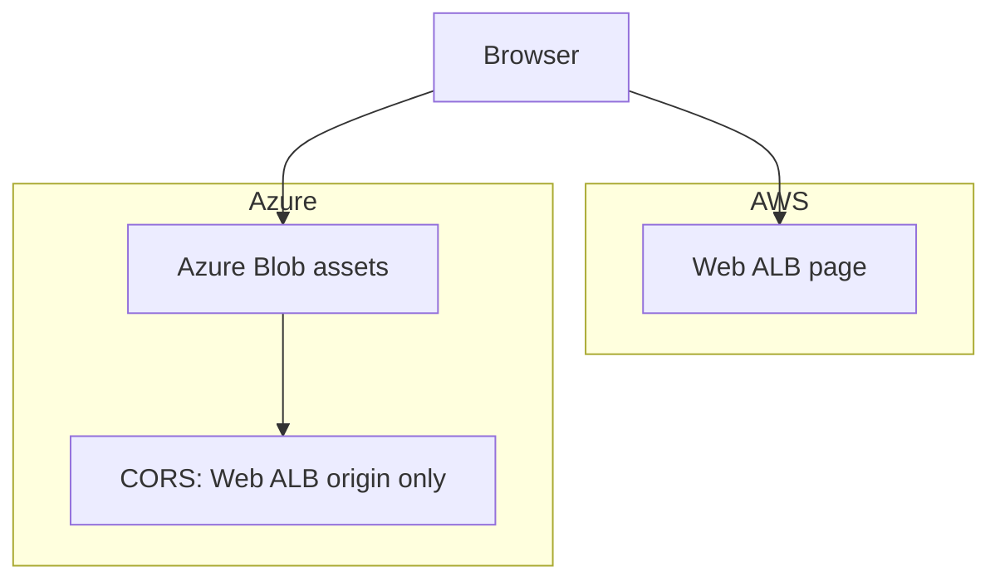

# Week 4 — Multi-Cloud with Azure: Static Assets & CORS (M12)

## Objective

Add a third cloud to `capstone/multicloud/`. Serve the Flashcard Quiz's theme and logo from Azure Blob Storage, and set a CORS rule so only pages from your Web ALB can read them. This is the last piece of the capstone: at the end, the app in your browser uses all three clouds' work.

| | |
|---|---|
| **Builds on** | M10 (the deployed Web ALB), M11 (the multi-cloud root) |
| **Next** | the capstone |
| **Time** | about 1.5 hours |
| **Cloud spend** | under $0.01 (plus the M10 stack for about 15 minutes, for the CORS check) |
| **Capstone requirements** | 14 (multi-cloud root), 16 (assets and CORS) |

## Topics

- Azure Resource Manager: resource groups, storage accounts, blob containers
- Offloading static files from the web servers
- CORS, and why Azure sets it on the blob **service**
- Looking up a resource from another root with a data source

## M12: Multi-Cloud with Azure: Static Assets & CORS

- **Learning Objective:** This guide will help you host public files on Azure and control which web pages may use them. We'll break it down into simple steps.
- **Core Idea:** How can pages from AWS safely load files from Azure?
- **Why It Matters:**
  - **Problem:** Serving static files costs the web servers CPU and bandwidth. And browsers block a page from reading files on another site unless that site allows it.
  - **Solution:** Put the files in Azure Blob Storage, and allow exactly one origin, your Web ALB, with a CORS rule.
- **How It Works:**
  - **Concepts:** Key terms:
    - **Resource group:** the container every Azure resource lives in.
    - **Storage account → container → blob:** the account holds containers, and containers hold files (blobs).
    - **Container access `blob`:** anyone can read a file if they know its URL, but nobody can list the container.
    - **CORS:** tells browsers which *pages* may read a response. It is **not** access control.
  - **Best Practices:**
    - Allow the exact origin (`http://<alb-dns>`), never `*`.
    - Only put truly public files in a public container.
  - **Real-World Example:** Think of it like an S3 bucket behind a CDN, with a CORS policy. But on Azure!
- **Supplemental Reading:**
  - [Azure Resource Manager overview](https://learn.microsoft.com/en-us/azure/azure-resource-manager/management/overview)
  - [Introduction to Blob storage](https://learn.microsoft.com/en-us/azure/storage/blobs/storage-blobs-introduction)
  - [CORS support for Azure Storage](https://learn.microsoft.com/en-us/rest/api/storageservices/cross-origin-resource-sharing--cors--support-for-the-azure-storage-services)
  - [Authenticating with the Azure CLI](https://registry.terraform.io/providers/hashicorp/azurerm/latest/docs/guides/azure_cli)

## Hands-on lab

**What you'll build:** the Flashcard Quiz page comes from AWS, and its theme and logo come from Azure. CORS lets only the Web ALB's pages read them.



**Before you start:** install the Azure CLI and sign in. Terraform reuses this login:
```bash
az login
export ARM_SUBSCRIPTION_ID="$(az account show --query id --output tsv)"
```

### M12 — Azure Blob assets with CORS

**Apply window:** 15 minutes, with the M10 stack up · **Cost:** under $0.01

1. Add the `azurerm` provider to `capstone/multicloud/main.tf`. It goes in `required_providers`, and gets a provider block of its own. Afterwards, run `terraform fmt` to re-align the columns; it tidies spacing and never changes meaning:
   ```hcl
       azurerm = { source = "hashicorp/azurerm", version = "5.7.0" }
   ```
   ```hcl
   provider "azurerm" {
     features {}
     resource_provider_registrations = "none" # sandboxes often forbid registering providers
   }

   variable "azure_location" {
     type    = string
     default = "Southeast Asia"
   }
   ```
2. Copy `app.css` and `logo.svg` from the course's `data/assets/` folder into `capstone/multicloud/assets/`. Then add the Azure resources:
   ```hcl
   variable "lookup_web_alb" {
     description = "true only while the M10 stack is up."
     type        = bool
     default     = false
   }

   # The ALB lives in another root: find it by its predictable name.
   data "aws_lb" "web" {
     count = var.lookup_web_alb ? 1 : 0
     name  = "${local.name_prefix}-web-alb"
   }

   locals {
     web_origin = var.lookup_web_alb ? "http://${data.aws_lb.web[0].dns_name}" : "http://localhost:8080"
   }

   resource "azurerm_resource_group" "assets" {
     name     = "${local.name_prefix}-assets-rg"
     location = var.azure_location
   }

   resource "azurerm_storage_account" "assets" {
     name                            = "tfbcdev${random_string.suffix.result}" # lowercase letters/digits, 3-24 chars
     resource_group_name             = azurerm_resource_group.assets.name
     location                        = azurerm_resource_group.assets.location
     account_tier                    = "Standard"
     account_replication_type        = "LRS"
     min_tls_version                 = "TLS1_2"
     allow_nested_items_to_be_public = true

     # CORS belongs to the account's blob service, not to the container.
     blob_properties {
       cors_rule {
         allowed_origins    = [local.web_origin] # exact origin, never "*"
         allowed_methods    = ["GET", "HEAD", "OPTIONS"]
         allowed_headers    = ["*"]
         exposed_headers    = ["Content-Length", "Content-Type"]
         max_age_in_seconds = 3600
       }
     }
   }

   resource "azurerm_storage_container" "assets" {
     name                  = "assets"
     storage_account_id    = azurerm_storage_account.assets.id
     container_access_type = "blob" # anyone can read a file by its URL; nobody can list
   }

   resource "azurerm_storage_blob" "assets" {
     for_each = { "app.css" = "text/css", "logo.svg" = "image/svg+xml" }

     name                 = each.key
     storage_container_id = azurerm_storage_container.assets.id
     type                 = "Block"
     source               = "${path.module}/assets/${each.key}"
     content_type         = each.value
   }

   output "asset_base_url" {
     value = "${azurerm_storage_account.assets.primary_blob_endpoint}${azurerm_storage_container.assets.name}"
   }

   # Tell the Flashcard app where its assets live. The page asks the API (/api/config),
   # and the API reads this parameter. It's destroyed together with this root.
   resource "aws_ssm_parameter" "assets_base_url" {
     name  = "/tf-bootcamp/dev/assets/base_url"
     type  = "String"
     value = "${azurerm_storage_account.assets.primary_blob_endpoint}${azurerm_storage_container.assets.name}"
   }
   ```
3. With the M10 stack up, re-initialise (a new provider), apply with the lookup on, and test:
   ```bash
   terraform init -backend-config=backend.hcl
   terraform apply -var gcp_project="$(gcloud config get-value project)" -var lookup_web_alb=true
   ASSETS=$(terraform output -raw asset_base_url)
   ORIGIN="http://$(aws elbv2 describe-load-balancers --region ap-southeast-1 --names tf-bootcamp-dev-web-alb --query 'LoadBalancers[0].DNSName' --output text)"
   curl -s -o /dev/null -w '%{http_code} %{content_type}\n' "$ASSETS/app.css"            # expected: 200 text/css
   curl -s -o /dev/null -w '%{http_code}\n' -X OPTIONS -H "Origin: $ORIGIN" \
     -H 'Access-Control-Request-Method: GET' "$ASSETS/app.css"                           # expected: 200
   ```
4. **See it in the app.** Open `web_url` in your browser and reload. The Flashcard Quiz switches to the purple Azure theme, shows the logo, and its footer says **"Styles and logo: Azure Blob ✓ (CORS allowed)"**. The logo is loaded with `fetch()`, a cross-origin read that only works because of your CORS rule.

## Lab exercise

**Public, but not listable.** Can an anonymous user list the container's files? Test it.

<details><summary>Reference solution</summary>

```bash
curl -s -o /dev/null -w '%{http_code}\n' "$ASSETS?restype=container&comp=list"
```
Expected: an error status, not `200`. `container_access_type = "blob"` lets anyone read a file **if they know its URL**, but listing needs `container` access, which the course never grants.
</details>

Then destroy this root first, then the M10 stack:
```bash
terraform destroy -var gcp_project="$(gcloud config get-value project)" -var lookup_web_alb=true
terraform state list   # expected: no output
```

## Next steps

Capstone tasks. **No reference solution.**

**N1 — Prove CORS refuses strangers** (capstone requirement 16)
Repeat the preflight from step 3 with `Origin: http://evil.example`.
- *Done when:* it returns **403**, and you've recorded both results (200 and 403) in `EVIDENCE.md`.

**N2 — Watch CORS block the app** (capstone requirement 16, failure proof)
Temporarily set the allowed origin to something else (for example, apply with `-var lookup_web_alb=false`, so the origin falls back to `http://localhost:8080`), then reload the Flashcard page.
- *Done when:* the footer says **"Azure Blob ✗ (blocked by CORS)"**, and after you re-apply with `-var lookup_web_alb=true` it says **"✓"** again. Screenshot both for `EVIDENCE.md`.

## Checkpoint (self-assessed)

- [ ] `capstone/multicloud` now uses the `aws`, `google` and `azurerm` providers, with no credentials in any file.
- [ ] `app.css` is served anonymously, and the preflight from your Web ALB's origin returns 200.
- [ ] The Flashcard Quiz footer shows "Azure Blob ✓ (CORS allowed)".
- [ ] You destroyed `capstone/multicloud` before `capstone/aws`, and `terraform state list` prints nothing in either.
