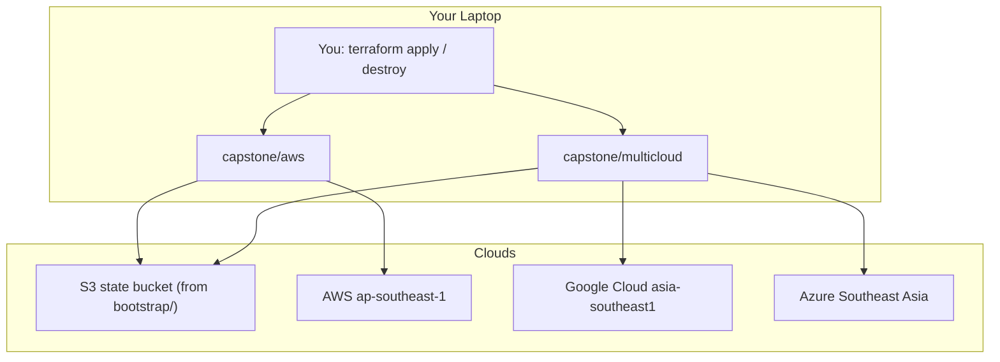
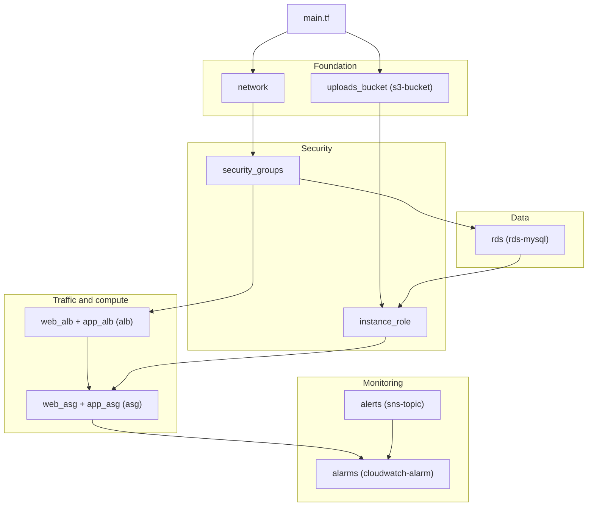

# 3-Tier Terraform Capstone: Flashcard Quiz on AWS, with GCP Backup and Azure Assets

## Project Overview

This capstone brings the whole bootcamp together. With Terraform alone, you provision, prove and tear down a 3-tier application on AWS (Singapore), an off-site database backup in Google Cloud Storage, and static assets on Azure Blob Storage. It's the codebase you built across M1–M12, finished, including every module's Next steps. It runs in personal sandbox accounts, sized to keep cloud spend minimal, and nothing is ever created by hand.

## Provided Application

You'll deploy a pre-built **Terraform Flashcard Quiz**. You don't write application code: the course provides it as EC2 boot scripts (user data) in the [`data/`](../data/) folder.
- **React** frontend, served by Nginx on the Web tier (`data/templates/web.sh.tftpl`)
- **Node.js** API on the App tier, port 8080: `/health`, `/db`, `/cards`, `/answers`, `/stats`, `/config` (`data/templates/app.sh.tftpl`)
- **MySQL 8.4** on Amazon RDS: 10 Terraform flashcards, plus every answer you give (`data/seed.sql` has the same data)
- A theme and logo for Azure Blob Storage (`data/assets/`), a DB dump helper (`data/db-seed-and-dump.sh`), and a deliberately invalid input for a failure proof (`data/bad.tfvars`)

When it's running you can open it in a browser, answer cards, reload and keep your score. The footer shows which App server answered, and whether the Azure assets loaded.

## Architecture

### 1. Code map: your repository

```text
tf-bootcamp/
├── bootstrap/                     ROOT 1 · local state · apply once, NEVER destroy
│   ├── main.tf                      S3 state bucket: versioned, encrypted, locked         (M1)
│   └── budget.tf                    AWS Budget: 40% / 80% actual, 100% forecast           (M9)
│
├── modules/                       CHILD MODULES · one per resource type · no state of their own
│   ├── ec2-instance/                one EC2 instance (the M3 prototype only)              (M3)
│   ├── s3-bucket/                   bucket + public-access block                          (M3)
│   ├── network/                     VPC, subnets, IGW, NAT, routes: grouped on purpose    (M4)
│   ├── security-groups/             every tier's security group, from one map             (M5)
│   ├── iam-instance-role/           role + instance profile + inline policy               (M5)
│   ├── alb/                         load balancer + target group + listener               (M6)
│   ├── asg/                         Launch Template + Auto Scaling group                  (M6)
│   ├── rds-mysql/                   RDS instance, subnet group, generated secret          (M7)
│   ├── sns-topic/                   topic + email subscription                            (M9)
│   └── cloudwatch-alarm/            one alarm                                             (M9)
│
├── capstone/
│   ├── aws/                       ROOT 2 · state key capstone/aws · workspaces dev + prod
│   │   ├── main.tf                  calls the modules, owns SSM runtime config + dashboard
│   │   ├── outputs.tf               web_url · uploads_bucket · db_secret_arn · dashboard_name (M10)
│   │   ├── env/dev.tfvars           environment = "dev" (prod.tfvars: plan only)          (M8)
│   │   └── templates/               boot scripts, copied from the course data/ folder     (M6)
│   └── multicloud/                ROOT 3 · state key capstone/multicloud
│       └── main.tf                  GCS backup bucket (M11) + Azure assets with CORS (M12)
│
└── EVIDENCE.md                    your proof log (graded)
```

- Only the three **roots** have state. You run `terraform` in a root, never in `modules/`.
- **One module per resource type**, named after what it creates. The network is the one exception, because a VPC and its subnets and routes always change together.
- `bootstrap/` is kept. `capstone/aws` and `capstone/multicloud` are destroyed every session.

### 2. How it runs



Both roots keep their state in the one bucket, under different keys, and S3 native locking stops two runs at once. `capstone/multicloud` finds the Web ALB **by name** for its CORS rule, so the two roots stay independent.

### 3. Module wiring inside `capstone/aws`

The root calls each module and passes outputs down. An arrow means "this module's outputs feed that one".



| Module call | Source | Main inputs (from) | Main outputs (to) |
|---|---|---|---|
| `uploads_bucket` | `s3-bucket` | a name | `arn` → `instance_role`; `name` → SSM, outputs |
| `network` | `network` | 2 AZs, `nat_gateway_enabled` | `vpc_id`, `subnet_ids` per tier → almost everything |
| `security_groups` | `security-groups` | VPC ID, **tier map** | `ids` per group → `alb`, `asg`, `rds-mysql` |
| `instance_role` | `iam-instance-role` | policy statements (SSM path, bucket, DB secret) | instance profile → `asg` |
| `web_alb`, `app_alb` | `alb` | subnets, ALB security group, port, health path | target group → `asg`; DNS name → output and SSM; ARN suffix → alarm |
| `web_asg`, `app_asg` | `asg` | AMI, subnets, SG, profile, target group, sizes, boot script | ASG name → alarm, dashboard |
| `rds` | `rds-mysql` | DB subnets, DB security group, sizes | address + secret ARN → SSM; secret ARN → `instance_role` |
| `alerts` | `sns-topic` | email | topic ARN → alarms |
| `alarm_*` (×3) | `cloudwatch-alarm` | metric, dimensions, threshold, topic | — |

Values the servers only need **at boot** go through the root's `runtime_config` map into SSM Parameter Store. That's why the apply order never matters.

### 4. The running system

```text
Browser ──▶ Web ALB ──▶ Web (Nginx + React) ──▶ App ALB ──▶ App (Node.js API) ──▶ RDS MySQL 8.4
   │         public      public subnets    internal    private subnets    private DB subnets
   └──▶ Azure Blob theme + logo (CORS: Web ALB only)

RDS ──(dump on an App server)──▶ S3 uploads bucket ──(copy)──▶ GCS backup bucket (→ COLDLINE at 30 days)
Who may connect to whom:  internet → Web ALB → Web → App ALB → App → DB   (nothing else)
```

`prod` has the same shape with larger sizes, and is checked with `terraform plan` only.

## Learning Objectives

By completing this project, you will:
1. Manage Terraform state safely: local first, then remote in S3 with native locking
2. Structure Terraform as small modules, one per resource type, and reuse them
3. Build a tiered AWS network with a least-privilege security-group chain and IAM
4. Run self-healing compute behind load balancers, with configuration read at boot
5. Keep secrets out of code, and understand where they still live (state)
6. Run several environments from one codebase, with guards that fail safely
7. Monitor the stack and keep its cost visible and bounded
8. Use more than one cloud provider from the same Terraform workflow

## Project Requirements

Each requirement is a condition you can check. Requirements marked **(failure proof)** must also be shown failing *correctly*, with the expected message or status code. Numbers match the rubric and your `EVIDENCE.md`.

### 1. Foundations & State (M1–M3)
- **1. Remote state.** A persistent `bootstrap/` root owns a versioned, encrypted, public-access-blocked state bucket with `prevent_destroy`. Both capstone roots use the S3 backend with `use_lockfile = true` and `encrypt = true`. Exact provider versions are pinned, and `.terraform.lock.hcl` is committed.
- **2. Input validation (failure proof).** `var.environment` accepts only `dev`, `staging` or `prod`. A plan using `data/bad.tfvars` stops at validation.
- **4. No hardcoded lookups.** No AMI ID or Availability Zone name is typed in the code.
- **17. Module structure.** One module per resource type (`ec2-instance`, `s3-bucket`, `security-groups`, `iam-instance-role`, `alb`, `asg`, `rds-mysql`, `sns-topic`, `cloudwatch-alarm`), with `network` as the one grouped module. `alb` and `asg` are each reused for Web and App. Child modules state minimum provider versions only.

### 2. Network & Security (M4–M5)
- **5. Network.** One VPC, six subnets (3 tiers × 2 AZs) built with `for_each`, an Internet Gateway, exactly one NAT behind `nat_gateway_enabled`, and `for_each` route-table associations. The DB route table has no default route; there is an S3 gateway endpoint.
- **6. Security-group chain (failure proof).** All groups come from **one** tier map. The only `0.0.0.0/0` ingress is on the Web ALB, with a comment. Web ← Web ALB, App ALB ← Web, App ← App ALB, DB ← App. The DB group has no egress. A Web server **cannot** open TCP 3306 to RDS.
- **7. Least-privilege IAM.** Servers use an instance profile. Your policy grants only SSM reads under `/<project>/<workspace>/`, the uploads bucket, and `GetSecretValue` on the one DB secret. No `"*"` resources.

### 3. Application Tiers (M6–M7)
- **8. Self-healing compute (failure proof).** Web and App run in Auto Scaling groups from one `asg` module, with IMDSv2, standard CPU credits and a 65% CPU policy on App. A terminated App server is replaced automatically.
- **9. Load balancing.** A public Web ALB (health check `/`) and an internal App ALB (port 8080, `/health`), both from one `alb` module. `web_url` serves the Flashcard Quiz, and `/api/health` returns `{"status":"ok"}`.
- **10. Data tier and secrets.** RDS MySQL **8.4**: single-AZ, private, encrypted. The password is generated by Terraform and stored in Secrets Manager; it never appears in code or plan output. A slow-query parameter group is attached **in place**. `/api/db` returns `"reachable"`, and the quiz loads its 10 cards from RDS and keeps your score.
- **11. Runtime configuration.** The App ALB address, DB endpoint, secret ARN and bucket name reach the servers through SSM Parameter Store at boot. Apply order doesn't matter.

### 4. Environments & Operations (M8–M10)
- **3. Environments (failure proof).** `dev` and `prod` workspaces exist. A plan in `default` fails at a precondition. `prod` plans larger ASGs and RDS than `dev`, and is never applied.
- **12. Alerting and dashboard.** A confirmed SNS email subscription; three alarms from one `cloudwatch-alarm` module (App CPU > 80%, Web ALB 5xx, RDS free storage < 2 GB); a forced alarm delivers an email; a `jsonencode` dashboard.
- **13. Budget.** An account-wide AWS Budget in `bootstrap/`, sized to your sandbox spend, with `ACTUAL` 40% and 80% and `FORECASTED` 100% alerts.
- **18. Terraform-managed lifecycle and hygiene.** Everything is created by Terraform, never by hand. Resources carry the course tags and `<project>-<workspace>-<role>` names. After every session, `terraform destroy` runs in each applied root, and `terraform state list` then prints nothing. Resources are sized to keep spend minimal.

### 5. Multi-Cloud (M11–M12)
- **14. Multi-cloud root.** `capstone/multicloud` is a separate root and state key, with pinned `aws`, `google` and `azurerm` providers, and credentials only from your shell logins.
- **15. Off-site backup.** The GCS bucket enforces uniform access and public access prevention, and moves objects to `COLDLINE` after 30 days. A dump of the quiz database, taken from RDS, is stored in it, with the 10 cards and your answers.
- **16. Static assets and CORS (failure proof).** The theme and logo are served anonymously from Azure Blob, with CORS on the blob service. A preflight from the Web ALB origin returns 200; from any other origin it returns **403**. The quiz footer shows "Azure Blob ✓ (CORS allowed)".

## Getting Started

1. Have these ready: Terraform 1.11 or newer (the course uses 1.16.3), the AWS CLI v2, the Google Cloud CLI, the Azure CLI, Git, and Bash (macOS/Linux, or WSL 2 on Windows). You also need sandbox accounts on all three clouds.
2. Check that your `bootstrap/` root from M1 still exists, with its state bucket and the M9 budget.
3. Start clean: `terraform workspace show` prints `dev`, and `terraform state list` prints nothing in `capstone/aws` or `capstone/multicloud`.
4. Deploy `capstone/aws` exactly as in M10, and wait for healthy targets:
   ```bash
   cd capstone/aws
   terraform plan -var-file=env/dev.tfvars -out=tfplan      # expected: Plan: 75 to add
   terraform apply tfplan
   ```
5. Apply `capstone/multicloud` with the Web ALB lookup on:
   ```bash
   cd ../multicloud
   terraform apply -var gcp_project="$(gcloud config get-value project)" -var lookup_web_alb=true
   ```
6. Open `web_url` in a browser, and play the quiz.
7. Tear down in reverse order, and prove it:
   ```bash
   terraform destroy -var gcp_project="$(gcloud config get-value project)" -var lookup_web_alb=true
   cd ../aws && terraform destroy -var-file=env/dev.tfvars
   terraform state list; terraform -chdir=../multicloud state list      # expected: both print nothing
   ```

## Four-Week Timeline

The capstone grows module by module; each module's **Next steps** are capstone tasks.

### Week 1: Foundations
- Days 1–2: M1 — Terraform fundamentals; local state, then S3 remote state; input validation
- Day 3: M2 — Data sources and iteration; start the tier map
- Days 4–5: M3 — Modules (`ec2-instance`, `s3-bucket`); review and document progress

### Week 2: Network, Security & Compute
- Day 1: M4 — The `network` module
- Day 2: M5 — `security-groups` and `iam-instance-role`
- Days 3–4: M6 — `alb` and `asg`; the quiz page is live (the cards arrive in Week 3)
- Day 5: Catch up on Next steps; troubleshoot

### Week 3: Data & Operations
- Days 1–2: M7 — `rds-mysql` and secrets; the quiz works end to end
- Day 3: M8 — `dev` and `prod` workspaces with guards
- Days 4–5: M9 — `sns-topic`, `cloudwatch-alarm`, dashboard and budget

### Week 4: Deployment, Multi-Cloud & Presentation
- Day 1: M10 — Deploy, verify and destroy the full AWS stack; start `EVIDENCE.md`
- Day 2: M11 — GCP backup bucket; back up your quiz answers
- Day 3: M12 — Azure theme and logo with CORS
- Day 4: The integrated run: happy path, failure proofs, teardown, evidence
- Day 5: Final presentation and live demo

## Evaluation Criteria

The capstone is graded with a **weighted rubric**: Technical Execution **45%** (your code, reviewed before the demo), Functional Demonstration **35%** (the live demo), and Presentation & Defense **20%** (explaining your choices and handling a live "break it" request). On top of the score, a pass/fail **Documentation Gate** applies: if `EVIDENCE.md` is missing, or holds placeholder or copied output instead of your real runs, the capstone is not passed.

### Developing (50–69%)
- The stack applies, but some requirements are missing, or break during the demo
- Modules grouped by layer, or copied instead of reused; CIDR sources between tiers; broad IAM
- Failure proofs missing, or failing for the wrong reason

### Proficient (70–89%) — the target
- All 18 requirements met, and every failure proof fails with the expected message or status
- The Flashcard Quiz works live: cards from RDS, the score survives a reload, the Azure assets load
- Small, single-purpose modules; security groups from one map; least-privilege IAM; no secrets in code
- Clean teardown, sandbox-sized resources throughout, and choices explained with confidence

### Exemplary (90–100%)
- Everything in Proficient, plus work beyond the course (see Optional Features)
- Handles an unrehearsed "break it" request cleanly
- Compares design alternatives with their cost and failure modes

Hard caps, whatever the score: a committed secret caps Technical Execution at 1; resources left running, or created by hand, cap Functional Demonstration at 2.

## Optional Features

These don't add bonus points; they're the kind of work that earns an **Exemplary** score.

1. **Security**
   - Keep the DB password out of state entirely (`manage_master_user_password`)
2. **Testing & Safety**
   - `terraform test` with mocked providers for the validation, the workspace guards and the tier map
   - `moved` blocks for refactors, instead of destroy-and-recreate
3. **Design Exploration** (plan only, never applied)
   - Two NAT Gateways for `prod` via a conditional, with a written cost trade-off

## Deliverables

1. **Repository**
   - `bootstrap/`, `modules/`, `capstone/aws/`, `capstone/multicloud/`, as in the code map above
   - A commit history across the four weeks, not one final commit
   - No secrets, no state files, no `backend.hcl`

2. **Documentation: `EVIDENCE.md`** at the root of your repository, filled in **as you build**:
   - the real output of every happy-path check and every failure proof, with the command that produced it;
   - `terraform output` from both roots;
   - the dump's row counts (10 cards, and your answers), and its listing in GCS;
   - both final `terraform destroy` summaries, and the empty `terraform state list` output, with a timestamp;
   - your spend so far, as a number;
   - a short paragraph, in your own words, on each of: why the state bucket has its own root; why the DB security group needs no egress rule for replies; why CORS isn't a security control; why `random_password` still needs encrypted state.

3. **Presentation (about 15 minutes, live)**

Present in this order, with the stack already applied and healthy:

| # | Show | What it proves | Requirements |
|---|---|---|---|
| 1 | Your repository: the code map, one module per resource type, and `capstone/aws/main.tf` wiring them | Structure and reuse | 1, 17 |
| 2 | `terraform plan` → `No changes` | The code matches what is running | 18 |
| 3 | **The Flashcard Quiz** at `web_url`: flip a card, answer it, reload, the score is kept | Web → App → RDS works end to end | 9, 10 |
| 4 | The quiz footer: *Answered by App server* changes between servers; *Azure Blob ✓* | Load balancing, and cross-cloud assets with CORS | 8, 9, 16 |
| 5 | Terminate an App server, keep answering, then show the ASG replace it | Self-healing | 8 |
| 6 | The GCS bucket: the dump that contains the answers you just gave | Off-site backup | 15 |
| 7 | The failure proofs: `bad.tfvars`, the `default` workspace, Web → DB blocked, CORS 403 | Guardrails fail correctly | 2, 3, 6, 16 |
| 8 | The dashboard, a forced alarm email, the budget | Operations and cost | 12, 13 |
| 9 | `terraform destroy` in both roots, then an empty `terraform state list` | Nothing is left behind | 18 |

   **Failure proofs you must show**, each failing in the *expected* way:
   1. Plan with `data/bad.tfvars` → variable validation error.
   2. Plan in the `default` workspace → precondition error.
   3. From a Web server, open TCP 3306 to RDS → blocked.
   4. Terminate an App server → the ASG replaces it, and the quiz keeps working.
   5. CORS preflight from another origin → HTTP 403 (the quiz footer shows ✗ when the origin is wrong).

   **Rehearse these too.** The facilitator will ask for at least one of them **live**:
   - Plan with `environment = "qa"`, or from the `default` workspace, and explain the error.
   - Set `nat_gateway_enabled = false`, and explain what the plan now refuses to do, and why.
   - Terminate an App server, and explain what the Auto Scaling group and the target group do.
   - Change the CORS origin, and show the quiz footer switch to ✗.
   - Show the one line you'd add to the tier map for a fourth tier, such as a cache on port 6379.

## Support Resources

### Training Materials
The course modules, in order:
1. [M1 — Terraform Fundamentals & Remote State](./01-terraform-fundamentals-remote-state.md)
2. [M2 — Data Sources & Iteration](./02-data-sources-iteration.md)
3. [M3 — Modules](./03-modules.md)
4. [M4 — VPC Network Topology](./04-vpc-network.md)
5. [M5 — Security Groups & IAM](./05-security-groups-iam.md)
6. [M6 — Compute & Load Balancing](./06-compute-load-balancing.md)
7. [M7 — Data Tier & Secrets](./07-data-tier-secrets.md)
8. [M8 — Environments with Workspaces](./08-workspaces-environments.md)
9. [M9 — Observability & FinOps](./09-observability-finops.md)
10. [M10 — Deployment: The Full AWS Stack](./10-deployment-full-aws-stack.md)
11. [M11 — Multi-Cloud with GCP](./11-gcp-gcs-backup.md)
12. [M12 — Multi-Cloud with Azure](./12-azure-assets-cors.md)

### Documentation
- Project files: the [`data/`](../data/) folder (boot scripts, seed data, dump helper, assets, `bad.tfvars`)
- Official documentation:
  * [Terraform language](https://developer.hashicorp.com/terraform/language)
  * [S3 backend](https://developer.hashicorp.com/terraform/language/backend/s3)
  * [AWS provider](https://registry.terraform.io/providers/hashicorp/aws/latest/docs)
  * [Google provider](https://registry.terraform.io/providers/hashicorp/google/latest/docs/guides/provider_reference)
  * [AzureRM provider](https://registry.terraform.io/providers/hashicorp/azurerm/latest/docs)
  * [CORS support for Azure Storage](https://learn.microsoft.com/en-us/rest/api/storageservices/cross-origin-resource-sharing--cors--support-for-the-azure-storage-services)

Remember:
- Focus on Terraform: the application is provided and working; your job is the infrastructure around it
- Everything is created by Terraform, never by hand, and destroyed at the end of every session
- `terraform plan` first, always; read it before you type `yes`
- Build up gradually: each module's Next steps are capstone pieces, so don't leave them all for Week 4
- Record evidence as you go; `EVIDENCE.md` written at the end is thin, and the gate checks it's real
- Rehearse the failure proofs, not just the happy path
- Out of scope: HTTPS or custom domains, Multi-AZ, automated backups, cross-cloud networking, AWS Organizations, billing APIs, paid SaaS, policy-as-code, and CI/CD pipelines
